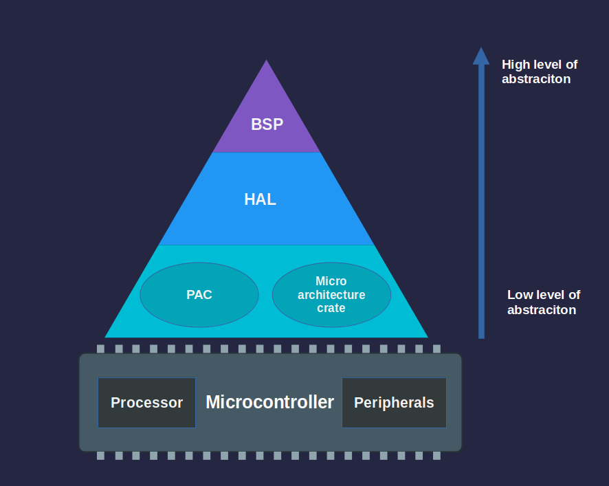

# Abstraction Layers

When working with embedded Rust, you will often come across terms like PAC, HAL, and BSP. These are the different layers that help you interact with the hardware. Each layer offers a different balance between flexibility and ease of use.

Let's start from the highest level of abstraction down to the lowest.
 

 

## Board Support Package (BSP)

A BSP, also referred as Board Support Crate in Rust, tailored to specific development boards.  It combines the HAL with board-specific configurations, providing ready to use interfaces for onboard components like LEDs, buttons, and sensors. This allows developers to focus on application logic instead of dealing with low-level hardware details. Since there is no popular BSP specifically for the ESP32 DevKit v1, we will not be using this approach in this book.

---

## Hardware Abstraction Layer (HAL)

The HAL sits just below the BSP level. If you work with boards like the Raspberry Pi Pico or ESP32 based boards, you'll mostly use the HAL level. 

The HAL builds on top of the PAC and provides simpler, higher-level interfaces to the microcontroller's peripherals. Instead of handling low-level registers directly, HALs offer methods and traits that make tasks like setting timers, setting up serial communication, or controlling GPIO pins easier.

HALs for the microcontrollers usually implement the `embedded-hal` traits, which are standard, platform-independent interfaces for peripherals like GPIO, SPI, I2C, and UART. This makes it easier to write drivers and libraries that work across different hardware as long as they use a compatible HAL.

Throughout this book, we will use the `esp-hal` crate. The same HAL can be used with other ESP32 variants. To switch to a different ESP32 family, simply update the feature flag in the `Cargo.toml` file.
 

---
> NOTE:
> 
> The layers below the HAL are rarely used directly. In most cases, the PAC is accessed through the HAL, not on its own. Unless you are working with a chip that does not have a HAL available, there is usually no need to interact with the lower layers directly. In this book, we will focus on the HAL layer.

## Peripheral Access Crate (PAC)

PACs are the lowest level of abstraction. They are auto-generated crates that provide type-safe access to a microcontroller's peripherals. These crates are typically generated from the manufacturer's SVD (System View Description) file using tools like `svd2rust`. PACs give you a structured and safe way to interact directly with hardware registers.

## Micro architecture crate

This sits alongside the PAC in the abstraction hierarchy. These crates are specific to the processor core architecture (e.g., ARM Cortex or Xtensa) used in your microcontroller. They provide low-level access to core functionality and shared internal peripherals. 

For ESP32, this will be the xtensa-lx and xtensa-lx-rt crates. These handle operations like enabling or disabling interrupts and accessing internal timers. For ARM Cortex-based microcontrollers, such as those in STM32, nRF, or RP2040 families, the equivalent crates are cortex-m and cortex-m-rt. These microarchitecture crates form the foundation that higher-level HALs and BSPs build upon, ensuring compatibility and reuse across chips that share the same core.

## Raw MMIO

Raw MMIO (memory-mapped IO) means directly working with hardware registers by reading and writing to specific memory addresses.  This approach mirrors traditional C-style register manipulation and requires the use of `unsafe` blocks in Rust due to the potential risks involved.  We will not touch this area; I haven't seen anyone using this approach.
