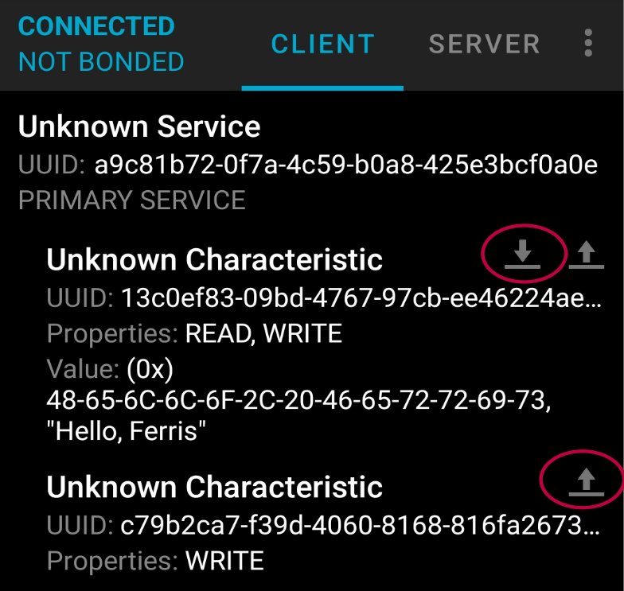

# How to Write Rust Code for Using Bluetooth Low Energy (BLE) on ESP32

Let's create a simple program to demonstrate Bluetooth Low Energy (BLE). We'll define a GATT service with two characteristics:

- One characteristic supports both read and write operations.  
- The other characteristic allows only write operations.  

I have generated UUIDs for these attributes (services and characteristics), and you can use the same ones.

## Connecting to ESP32 Bluetooth

To interact with the ESP32's Bluetooth, we'll use the nRF Connect for Mobile app:  

🔗 [nRF Connect for Mobile](https://www.nordicsemi.com/Products/Development-tools/nRF-Connect-for-mobile)  

This app lets us read and write data provided by the ESP32.


## Generate project using esp-generate
We will enable async (Embassy) support for this project.  To create the project, use the `esp-generate` command. Run the following:

```sh
esp-generate --chip esp32 bluetooth-low-energy
```

This will open a screen asking you to select options. 

- First, select the option "Enable unstable HAL features."
- Select the option "Enable allocations via the esp-alloc crate."
- Now, you can enable "Enable BLE via esp-wifi crate."
- Select the option "Adds embassy framework support".

Just save it by pressing "s" in the keyboard.

 
## Helper Macro for StaticCell

In embedded systems, the StaticCell crate helps initialize variables at runtime while ensuring a static lifetime. We'll define a macro to create global static variables. It takes two arguments: the variable type and its initial value. The uninit function gives a mutable reference to uninitialized memory, where we store the value.

```rust
macro_rules! mk_static {
    ($t:ty,$val:expr) => {{
        static STATIC_CELL: static_cell::StaticCell<$t> = static_cell::StaticCell::new();
        #[deny(unused_attributes)]
        let x = STATIC_CELL.uninit().write(($val));
        x
    }};
}
```

## Initialize Wi-Fi controller

The ESP32 shares a single radio for both Wi-Fi and Bluetooth. In order to initialize Bluetooth, We will use the same Wi-Fi controller that we used for Wi-Fi.
 
```rust
let timer1 = TimerGroup::new(peripherals.TIMG0);
let esp_wifi_ctrl = &*mk_static!(
    EspWifiController<'static>,
    init(
        timer1.timer0,
        Rng::new(peripherals.RNG),
        peripherals.RADIO_CLK,
    )
    .unwrap()
);

```

Let's initialize the Bluetooth connector and set up BLE with the help of the bleps crate.


```rust
let mut bluetooth = peripherals.BT;
let connector = BleConnector::new(init, &mut bluetooth);
let now = || time::now().duration_since_epoch().to_millis();
let mut ble = Ble::new(connector, now);

println!("{:?}", ble.init().await);
```

Let's call this function to set BLE advertising parameters:
```rust
println!("{:?}", ble.cmd_set_le_advertising_parameters().await);
```


## BLE Advertising for Discovery

We will set the BLE advertising data to make the ESP32 discoverable, allowing other devices to find and connect to it. By enabling general discoverable mode, the device will advertise indefinitely until a connection is established. We will also disable Bluetooth Classic (BR/EDR). We are setting the device name to "implRust", but you can choose any name.

```rust
println!(
        "{:?}",
        ble.cmd_set_le_advertising_data(
            create_advertising_data(&[
                AdStructure::Flags(LE_GENERAL_DISCOVERABLE | BR_EDR_NOT_SUPPORTED),
                AdStructure::CompleteLocalName("implRust"),
                // AdStructure::ServiceUuids16(&[Uuid::Uuid16(0x1809)]),
            ])
            .unwrap()
        )
        .await
    );
println!("{:?}", ble.cmd_set_le_advertise_enable(true).await);
```

## Closures for read and write data

We will define three closures: one for handling read requests and two for write operations. The read closure will send a static string "Hello, Ferris" to the client. The write closures allow a client (e.g., a mobile device) to send data to the ESP32, which we will print to the console for demonstration. In a real scenario, we will store the received data for settings or other purposes.

```rust
let sensor_data = b"Hello, Ferris";

let mut read_func = |_offset: usize, data: &mut [u8]| {
    data[0..sensor_data.len()].copy_from_slice(&sensor_data[..]);
    sensor_data.len()
};
let mut write_func = |offset: usize, data: &[u8]| {
    println!("RECEIVED: {} {:?}", offset, data);
};

let mut write_func2 = |offset: usize, data: &[u8]| {
    println!("RECEIVED: {} {:?}", offset, data);
};
```

## Define Service and Characteristics

We will use the `gatt` macro to define a service with two characteristics. We will set the first characteristic to allow both read and write and pass the read and write closures to it. We will set the second characteristic to allow only write and pass the second write closure to it.

```rust
gatt!([service {
    uuid: "a9c81b72-0f7a-4c59-b0a8-425e3bcf0a0e",
    characteristics: [
        characteristic {
            uuid: "13c0ef83-09bd-4767-97cb-ee46224ae6db",
            read: read_func,
            write: write_func,
        },
        characteristic {
            uuid: "c79b2ca7-f39d-4060-8168-816fa26737b7",
            write: write_func2,
        },
    ],
},]);
```

## Run Server

Finally, we will initialize the Attribute Server and start the server by calling the do_work function.

```rust
let mut rng = bleps::no_rng::NoRng;
let mut srv = AttributeServer::new(&mut ble, &mut gatt_attributes, &mut rng);

while srv.do_work().await.is_ok() {}
```


## Clone the existing project
You can clone (or refer) project I created and navigate to the `bluetooth-low-energy` folder.

```sh
git clone https://github.com/ImplFerris/esp32-projects
cd esp32-projects/bluetooth-low-energy/
```


## How to use?
Once you flash the code to the ESP32, open the nRF Connect mobile app. Scan for the Bluetooth name we set (mine is "implRust") and connect to it. The app will show the supported service and characteristics. Tap the down arrow under a characteristic to read data and the up arrow to write data.




If you send(i.e write) data, you will see it in the system console.


## The Full code

```rust
#![no_std]
#![no_main]

use bleps::{
    ad_structure::{
        create_advertising_data, AdStructure, BR_EDR_NOT_SUPPORTED, LE_GENERAL_DISCOVERABLE,
    },
    async_attribute_server::AttributeServer,
    asynch::Ble,
    gatt,
};
use defmt::info;
use embassy_executor::Spawner;
use esp_hal::time;
use esp_hal::timer::timg::TimerGroup;
use esp_hal::{clock::CpuClock, rng::Rng};
use esp_println::{self as _, println};
use esp_wifi::ble::controller::BleConnector;
use esp_wifi::{init, EspWifiController};

#[panic_handler]
fn panic(_: &core::panic::PanicInfo) -> ! {
    loop {}
}

extern crate alloc;

// When you are okay with using a nightly compiler it's better to use https://docs.rs/static_cell/2.1.0/static_cell/macro.make_static.html
macro_rules! mk_static {
    ($t:ty,$val:expr) => {{
        static STATIC_CELL: static_cell::StaticCell<$t> = static_cell::StaticCell::new();
        #[deny(unused_attributes)]
        let x = STATIC_CELL.uninit().write(($val));
        x
    }};
}

#[esp_hal_embassy::main]
async fn main(_spawner: Spawner) {
    // generator version: 0.3.1

    let config = esp_hal::Config::default().with_cpu_clock(CpuClock::max());
    let peripherals = esp_hal::init(config);

    esp_alloc::heap_allocator!(size: 72 * 1024);

    let timer0 = TimerGroup::new(peripherals.TIMG1);
    esp_hal_embassy::init(timer0.timer0);

    info!("Embassy initialized!");

    // let _init = esp_wifi::init(
    //     timer1.timer0,
    //     esp_hal::rng::Rng::new(peripherals.RNG),
    //     peripherals.RADIO_CLK,
    // )
    // .unwrap();

    let timer1 = TimerGroup::new(peripherals.TIMG0);
    let esp_wifi_ctrl = &*mk_static!(
        EspWifiController<'static>,
        init(
            timer1.timer0,
            Rng::new(peripherals.RNG),
            peripherals.RADIO_CLK,
        )
        .unwrap()
    );

    let mut bluetooth = peripherals.BT;

    let connector = BleConnector::new(esp_wifi_ctrl, &mut bluetooth);

    let now = || time::Instant::now().duration_since_epoch().as_millis();
    let mut ble = Ble::new(connector, now);
    println!("Connector created");

    println!("{:?}", ble.init().await);
    println!("{:?}", ble.cmd_set_le_advertising_parameters().await);
    println!(
        "{:?}",
        ble.cmd_set_le_advertising_data(
            create_advertising_data(&[
                AdStructure::Flags(LE_GENERAL_DISCOVERABLE | BR_EDR_NOT_SUPPORTED),
                AdStructure::CompleteLocalName("implRust"),
                // AdStructure::ServiceUuids16(&[Uuid::Uuid16(0x1809)]),
            ])
            .unwrap()
        )
        .await
    );
    println!("{:?}", ble.cmd_set_le_advertise_enable(true).await);

    println!("started advertising");

    let sensor_data = b"Hello, Ferris";

    let mut read_func = |_offset: usize, data: &mut [u8]| {
        data[0..sensor_data.len()].copy_from_slice(&sensor_data[..]);
        sensor_data.len()
    };
    let mut write_func = |offset: usize, data: &[u8]| {
        println!("RECEIVED: {} {:?}", offset, data);
    };

    let mut write_func2 = |offset: usize, data: &[u8]| {
        println!("RECEIVED: {} {:?}", offset, data);
    };

    gatt!([service {
        uuid: "a9c81b72-0f7a-4c59-b0a8-425e3bcf0a0e",
        characteristics: [
            characteristic {
                uuid: "13c0ef83-09bd-4767-97cb-ee46224ae6db",
                read: read_func,
                write: write_func,
            },
            characteristic {
                uuid: "c79b2ca7-f39d-4060-8168-816fa26737b7",
                write: write_func2,
            },
        ],
    },]);

    let mut rng = bleps::no_rng::NoRng;
    let mut srv = AttributeServer::new(&mut ble, &mut gatt_attributes, &mut rng);

    while srv.do_work().await.is_ok() {}
}
```
