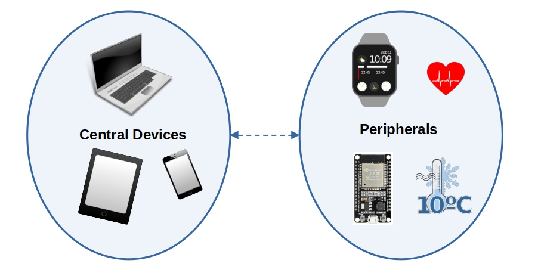

# Generic Access Profile (GAP)

GAP (Generic Access Profile) is a set of rules that control how Bluetooth Low Energy (BLE) devices discover, connect, and communicate with each other.

## BLE Communication Types

BLE supports two main ways to communicate: **connected communication** and **broadcast communication**.

**Connected Communication :** Two devices form a direct connection, allowing them to send and receive data both ways. For example, a smartwatch connects to a phone and continuously shares data like heart rate, notifications, and step count.

**Broadcast Communication:** A device sends data to all nearby devices without making a direct connection. For example, a Bluetooth beacon in a store broadcasts promotional messages to all phones in range.


## Device Roles

Imagine these roles like in real-world human communication. Just as people interact in different ways depending on their roles in a conversation, Bluetooth Low Energy (BLE) devices have specific roles.

**📢 Broadcaster (connection-less)**: Sends out information (advertisements) but cannot be connected to.  
For example, a beacon in a shopping mall continuously sends discount offers to nearby smartphones. The phones can receive the offers but cannot connect to the beacon.  

**📡 Observer (connection-less)**: Listens for Bluetooth advertisements but cannot connect to other devices.  
For example, a smartphone app scans for beacons to detect nearby stores but does not connect to them.  

**📱 Central (connection-oriented)**: This device searches for other devices, connects to them, or reads their advertisement data. It usually has more processing power and resources. It can handle multiple connections at the same time.  

For example, a smartphone connects to a smartwatch, a fitness tracker, and wireless earbuds simultaneously.  

**⌚ Peripheral (connection-oriented)**: This device broadcasts advertisements and accepts connection requests from central devices. 
For example, a fitness tracker advertises itself so a smartphone can find and connect to it for syncing health data.  




## BLE Peripheral Discovery Modes & Advertisement Flags

A BLE peripheral can be in different discovery modes, affecting how it is detected by central devices. These modes are set using advertisement flags in the advertising packet.


### Discovery Modes  

1. **Non-Discoverable**  
   - Default mode when no advertising is active or when a connection is established.  
   - Cannot be discovered or connected to.  

2. **Limited-Discoverable**
   - Discoverable **for a limited time** to save power.  
   - If no connection is made, the device goes idle.  

3. **General-Discoverable**
   - Advertises **indefinitely** until a connection is established.  

### Advertisement Flags  

These flags indicate the discovery mode and BLE support level. They are combined using bitwise OR (`|`):  

| Bit  | Flag (in [`bleps`](https://github.com/bjoernQ/bleps) crate) | Description |
|------|--------------------------------|------------------------------------------------|
| 0    | `AD_FLAG_LE_LIMITED_DISCOVERABLE` | Limited discoverable mode (temporary advertising). |
| 1    | `LE_GENERAL_DISCOVERABLE` | General discoverable mode (advertises indefinitely). |
| 2    | `BR_EDR_NOT_SUPPORTED` | Set when the device **does not support** (or dont want to) Bluetooth Classic (BR/EDR). |
| 3    | `SIMUL_LE_BR_CONTROLLER` | Set if the device can use both Bluetooth Low Energy (LE) and Classic Bluetooth at the same time (Controller level).|
| 4    | `SIMUL_LE_BR_HOST` | Set if the device can run both Bluetooth Low Energy (LE) and Classic Bluetooth at the same time (Host level). |
| 5-7  | Reserved | Not used. |

Example Usage

```rust
ble.cmd_set_le_advertising_data(
    create_advertising_data(&[
        // Flags
        AdStructure::Flags(LE_GENERAL_DISCOVERABLE | BR_EDR_NOT_SUPPORTED)
        // Other advertisement data
    ]).unwrap()
).await
```

This configures the peripheral to advertise indefinitely (LE_GENERAL_DISCOVERABLE) while indicating that it does not support Bluetooth Classic (BR_EDR_NOT_SUPPORTED).
