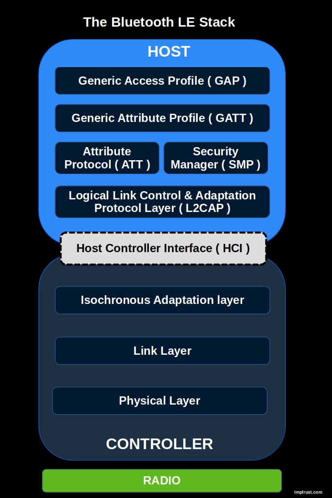

# BLE

To work with Bluetooth Low Energy, we need to understand several key concepts. I'll keep it simple and cover just enough to get you started without overwhelming you with too many details. So, buckle up, and let's jump in.

## BLE Stack
The image below illustrates the Bluetooth Low Energy (BLE) protocol stack.  The BLE stack is the foundation of communication between BLE devices. We won't go into the Controller (lower layers) in detail, as it's not essential for our purpose. However, understanding key concepts in the Host part, such as GAP and GATT, is important.

### GAP => How devices connect and communicate

GAP (Generic Access Profile) defines how BLE devices advertise, connect, and establish communication. It covers device roles (e.g., central, peripheral), connection parameters, and security modes. GAP is responsible for how devices find each other and initiate communication.

### GATT => How devices exchange and structure data

GATT (Generic Attribute Profile) defines how BLE devices exchange data. It organizes data in a hierarchy of services and characteristics, allowing clients (e.g., a smartphone app) to read, write, and subscribe to updates from a BLE peripheral (e.g., a sensor).

## Rust crates

There are two main Rust crates available for working with Bluetooth Low Energy (BLE):

1. [Bleps](https://github.com/bjoernQ/bleps/): A lightweight BLE peripheral stack designed primarily for testing, demos, and personal projects. It is not intended to meet certification standards. The official repository recommends using the `Trouble` crate if you plan to work with asynchronous code.

2. [Trouble (or TrouBLE)](https://embassy.dev/trouble/): A Rust-based implementation of a BLE Host, with the long-term goal of achieving qualification. In the BLE specification, the Host operates as the upper layer of the Host Controller Interface (HCI), while the Controller forms the lower layer.

## References
If you want deeper understanding, you can refer the following resources
- [Download The Bluetooth Low Energy Primer](https://www.bluetooth.com/bluetooth-resources/the-bluetooth-low-energy-primer/)
- [Bluetooth Low Energy Fundamentals](https://academy.nordicsemi.com/courses/bluetooth-low-energy-fundamentals/)
