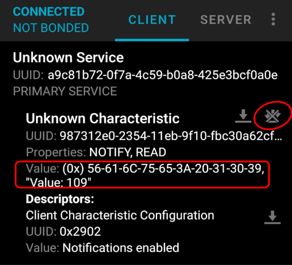

# Sending notifications

In the previous example, we included a characteristic with only read and write capabilities. However, in some scenarios, you need to notify the client whenever the data changes.  

For example, in a heart rate monitor, the device should automatically send updates when the heart rate changes, rather than requiring the client to repeatedly read the value.

We will use a slightly modified version of the official esp-hal example to demonstrate the notification capability. In this exercise, we will generate a random number between 60 and 110. If the number is greater than 100, we will send a notification.

## Define Service and Characteristics

```rust
let sensor_data = b"Value: 80";

let mut read_func = |_offset: usize, data: &mut [u8]| {
    data[0..sensor_data.len()].copy_from_slice(&sensor_data[..]);
    sensor_data.len()
};

gatt!([service {
    uuid: "a9c81b72-0f7a-4c59-b0a8-425e3bcf0a0e",
    characteristics: [characteristic {
        name: "my_characteristic",
        uuid: "987312e0-2354-11eb-9f10-fbc30a62cf38",
        notify: true,
        read: read_func,
    }],
},]);
```


## Notifier

We will define a closure that runs a loop until the random number is greater than 100. we will define a helper function (scale_random_u32) to ensure the random number stays within the range of 60 to 100. Whenever the number is greater than 100, we will send a notification with the value.

```rust
let mut notifier = || {
    // TODO how to check if notifications are enabled for the characteristic?
    // maybe pass something into the closure which just can query the characteristic
    // value probably passing in the attribute server won't work?

    async {
        let mut val;

        loop {
            val = scale_random_u32(rng.clone().random());
            if val >= 100 {
                break;
            }
            Timer::after_millis(500).await;
        }
        let mut data: String<64> = String::new();
        write!(data, "Value: {}", val).unwrap();

        NotificationData::new(my_characteristic_handle, data.as_bytes())
    }
};

const fn scale_random_u32(rand_val: u32) -> u32 {
    let min = 60;
    let max = 110;
    min + (rand_val % (max - min + 1))
}

```

## Start the server
In the previous example, we used the `do_work` function. For this exercise, we will use the `run` method which accepts the notifier closure.

```rust
srv.run(&mut notifier).await.unwrap();
```


## Clone the existing project
You can clone (or refer) project I created and navigate to the `ble-notification` folder.

```sh
git clone https://github.com/ImplFerris/esp32-projects
cd esp32-projects/ble-notification/
```


## How to use?
Once you flash the code to the ESP32, open the nRF Connect mobile app. Scan for the Bluetooth name we set (mine is "implRust") and connect to it. The app will show the supported service and characteristics. Tap the icon with three down arrow under a characteristic to subscribe for the notification and observe the value change.




## The Full Code

```rust
#![no_std]
#![no_main]

use bleps::{
    ad_structure::{
        create_advertising_data, AdStructure, BR_EDR_NOT_SUPPORTED, LE_GENERAL_DISCOVERABLE,
    },
    async_attribute_server::AttributeServer,
    asynch::Ble,
    attribute_server::NotificationData,
    gatt,
};
use core::fmt::Write;
use embassy_executor::Spawner;
use embassy_time::Timer;
use esp_alloc as _;
use esp_backtrace as _;
use esp_hal::{prelude::*, rng::Rng, time, timer::timg::TimerGroup};
use esp_println::println;
use esp_wifi::{ble::controller::BleConnector, init, EspWifiController};
use heapless::String;

extern crate alloc;

macro_rules! mk_static {
    ($t:ty,$val:expr) => {{
        static STATIC_CELL: static_cell::StaticCell<$t> = static_cell::StaticCell::new();
        #[deny(unused_attributes)]
        let x = STATIC_CELL.uninit().write(($val));
        x
    }};
}

#[main]
async fn main(_spawner: Spawner) {
    let peripherals = esp_hal::init({
        let mut config = esp_hal::Config::default();
        config.cpu_clock = CpuClock::max();
        config
    });

    esp_alloc::heap_allocator!(72 * 1024);

    esp_println::logger::init_logger_from_env();
    let timg0 = TimerGroup::new(peripherals.TIMG0);

    let rng = Rng::new(peripherals.RNG);

    let init = &*mk_static!(
        EspWifiController<'static>,
        init(timg0.timer0, rng, peripherals.RADIO_CLK,).unwrap()
    );

    let timg1 = TimerGroup::new(peripherals.TIMG1);
    esp_hal_embassy::init(timg1.timer0);

    let mut bluetooth = peripherals.BT;

    let connector = BleConnector::new(init, &mut bluetooth);

    let now = || time::now().duration_since_epoch().to_millis();
    let mut ble = Ble::new(connector, now);
    println!("Connector created");

    println!("{:?}", ble.init().await);
    println!("{:?}", ble.cmd_set_le_advertising_parameters().await);
    println!(
        "{:?}",
        ble.cmd_set_le_advertising_data(
            create_advertising_data(&[
                AdStructure::Flags(LE_GENERAL_DISCOVERABLE | BR_EDR_NOT_SUPPORTED),
                AdStructure::CompleteLocalName("implRust"),
                // AdStructure::ServiceUuids16(&[Uuid::Uuid16(0x1809)]),
            ])
            .unwrap()
        )
        .await
    );
    println!("{:?}", ble.cmd_set_le_advertise_enable(true).await);

    println!("started advertising");

    let sensor_data = b"Value: 80";

    let mut read_func = |_offset: usize, data: &mut [u8]| {
        data[0..sensor_data.len()].copy_from_slice(&sensor_data[..]);
        sensor_data.len()
    };

    gatt!([service {
        uuid: "a9c81b72-0f7a-4c59-b0a8-425e3bcf0a0e",
        characteristics: [characteristic {
            name: "my_characteristic",
            uuid: "987312e0-2354-11eb-9f10-fbc30a62cf38",
            notify: true,
            read: read_func,
        }],
    },]);

    let mut no_rng = bleps::no_rng::NoRng;
    let mut srv = AttributeServer::new(&mut ble, &mut gatt_attributes, &mut no_rng);

    let mut notifier = || {
        // TODO how to check if notifications are enabled for the characteristic?
        // maybe pass something into the closure which just can query the characteristic
        // value probably passing in the attribute server won't work?

        async {
            let mut val;

            loop {
                val = scale_random_u32(rng.clone().random());
                if val >= 100 {
                    break;
                }
                Timer::after_millis(500).await;
            }
            let mut data: String<64> = String::new();
            write!(data, "Value: {}", val).unwrap();

            NotificationData::new(my_characteristic_handle, data.as_bytes())
        }
    };

    srv.run(&mut notifier).await.unwrap();
}

const fn scale_random_u32(rand_val: u32) -> u32 {
    let min = 60;
    let max = 110;
    min + (rand_val % (max - min + 1))
}
```
