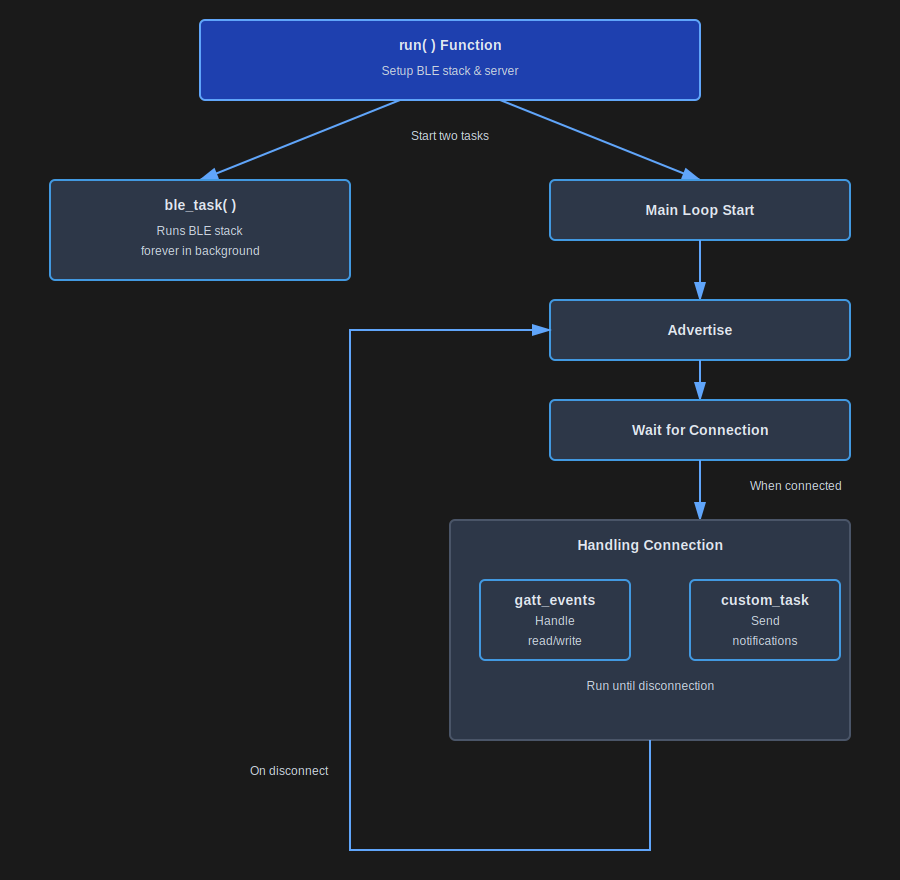
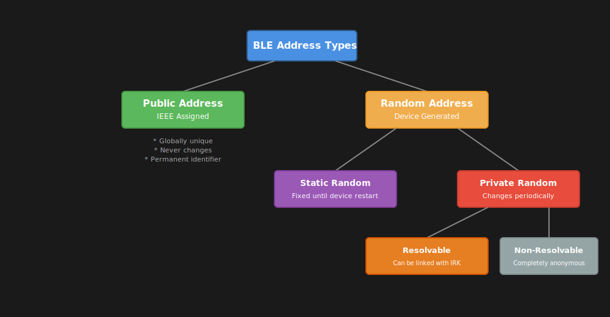

# Running BLE Stack

Here, we define the `run` function, which sets up and starts the BLE stack on our ESP32.


## Overall flow





```rust
/// Run the BLE stack.
pub async fn run<C>(controller: C)
where
    C: Controller,
{
    // Using a fixed "random" address can be useful for testing. In real scenarios, one would
    // use e.g. the MAC 6 byte array as the address (how to get that varies by the platform).
    let address: Address = Address::random([0xff, 0x8f, 0x1a, 0x05, 0xe4, 0xff]);
    info!("Our address = {:?}", address);

    let mut resources: HostResources<DefaultPacketPool, CONNECTIONS_MAX, L2CAP_CHANNELS_MAX> =
        HostResources::new();
    let stack = trouble_host::new(controller, &mut resources).set_random_address(address);
    let Host {
        mut peripheral,
        runner,
        ..
    } = stack.build();

    info!("Starting advertising and GATT service");
    let server = Server::new_with_config(GapConfig::Peripheral(PeripheralConfig {
        name: "implRust",
        appearance: &appearance::power_device::GENERIC_POWER_DEVICE,
    }))
    .unwrap();

    let _ = join(ble_task(runner), async {
        loop {
            match advertise("impl Rust", &mut peripheral, &server).await {
                Ok(conn) => {
                    // set up tasks when the connection is established to a central, so they don't run when no one is connected.
                    let a = gatt_events_task(&server, &conn);
                    let b = custom_task(&server, &conn, &stack);
                    // run until any task ends (usually because the connection has been closed),
                    // then return to advertising state.
                    select(a, b).await;
                }
                Err(e) => {
                    let e = defmt::Debug2Format(&e);
                    panic!("[adv] error: {:?}", e);
                }
            }
        }
    })
    .await;
}
```

Let's break down this function and understand each step.  The function takes one argument called "controller", which must implement the `Controller` trait provided by Trouble crate.

## Setting Up the BLE Host

Let's create the BLE Host instance.  For that, we first need to define the BLE address. 

### BLE Address

Every BLE device has a unique Bluetooth Device Address, which is a 48-bit number that works like a MAC address.



There are two main types of BLE addresses:

**Public Address**: A public address is a permanent, worldwide-unique code given to a device by its manufacturer. It never changes and is registered with the IEEE. Only one device can have each address, and getting one requires paying a fee.

**Random Address**: A random address is used more often because you don't need to register it with the IEEE, and you can set it up yourself. 

The random addresses can be further classified into

- *Static*: Stays the same until you restart the device
- *Private (dynamic)*: Changes over time to protect your privacy. Can be either traceable (with an Identity Resolving Key) or completely anonymous. Random addresses help to protect privacy by hiding the device's real identity.

```rust
// Using a fixed "random" address can be useful for testing. In real scenarios, one would
// use e.g. the MAC 6 byte array as the address (how to get that varies by the platform).
let address: Address = Address::random([0xff, 0x8f, 0x1a, 0x05, 0xe4, 0xff]);
info!("Our address = {:?}", address);
```

### Initialize BLE Host

Let's initialize the BLE Host by providing the controller and resource configuration. Then, we set the random address that the host will use. Finally, we call the build method on the stack, which gives us the BLE Peripheral and runner.

```rust

let mut resources: HostResources<DefaultPacketPool, CONNECTIONS_MAX, L2CAP_CHANNELS_MAX> =
    HostResources::new();
let stack = trouble_host::new(controller, &mut resources).set_random_address(address);
let Host {
    mut peripheral,
    runner,
    ..
} = stack.build();
```

### Initialize GATT Server

The `gatt_server` macro initializes various components for the `Server` struct, including support for the builder method new_with_config.

In this example, we configure the device to operate as a [Peripheral](../ble/gap.html#device-roles) and assign it the name "implRust". You can change this to any name you like.

```rust
let server = Server::new_with_config(GapConfig::Peripheral(PeripheralConfig {
    name: "implRust",
    appearance: &appearance::power_device::GENERIC_POWER_DEVICE,
}))
.unwrap();
```

## Tasks

Once the server is configured, we need to run two concurrent tasks: the BLE stack task and our application logic. The join method allows both tasks to run simultaneously.

```rust
let _ = join(ble_task(runner), async {
    loop {
        match advertise("impl Rust", &mut peripheral, &server).await {
            Ok(conn) => {
                // set up tasks when the connection is established to a central, so they don't run when no one is connected.
                let a = gatt_events_task(&server, &conn);
                let b = custom_task(&server, &conn, &stack);
                // run until any task ends (usually because the connection has been closed),
                // then return to advertising state.
                select(a, b).await;
            }
            Err(e) => {
                let e = defmt::Debug2Format(&e);
                panic!("[adv] error: {:?}", e);
            }
        }
    }
})
.await;
```

We will shortly define and look into the `advertise` function. The function returns a `Result` with either a GATT connection or a BLE host error. If we successfully obtain a connection, we spawn two connection-specific tasks:

- gatt_events_task: Handles incoming GATT requests (reads, writes) from the connected central device
- custom_task: Runs our application-specific logic during the connection

The `select` function runs both tasks concurrently and completes when either task finishes; typically when the connection is lost. Once this happens, the loop returns to the advertising state, making the device discoverable again for new connections.

## BLE Stack Task

This task runs continuously in the background alongside other BLE tasks to keep the Bluetooth stack active

```rust
async fn ble_task<C: Controller, P: PacketPool>(mut runner: Runner<'_, C, P>) {
    loop {
        if let Err(e) = runner.run().await {
            let e = defmt::Debug2Format(&e);
            panic!("[ble_task] error: {:?}", e);
        }
    }
}
```
