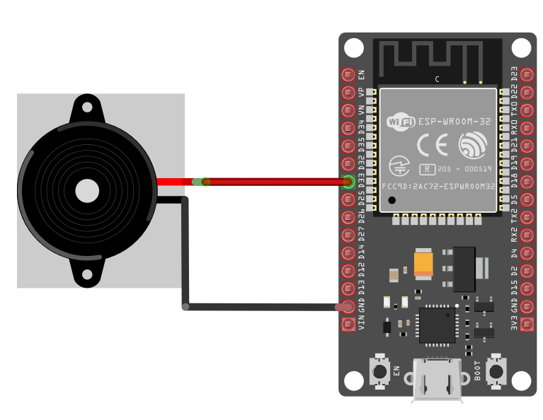

## Connecting Buzzer with ESP32

The buzzer has two pins:  Positive(Signal), Ground; The positive side of the buzzer is typically marked with a **+** symbol and is the longer pin, while the negative side (ground) is the shorter pin, similar to an LED. However, some passive buzzers may allow for either pin to be connected to ground or signal, depending on the specific model. 

By the way, I used an active buzzer in my experiment. A passive buzzer is recommended if you plan to play different sounds, as it provides a better tone.

<table style="margin-bottom:20px">
  <thead>
    <tr>
      <th>ESP32 Pin</th>
      <th style="width: 250px; margin: 0 auto;">Wire</th>
      <th>Buzzer Pin</th>
      <th>Notes</th>
    </tr>
  </thead>
  <tbody>
    <tr>
      <td>GPIO 33</td>
      <td style="text-align: center; vertical-align: middle; padding: 0;">
        

          

          

        

      </td>
      <td>Positive Pin</td>
      <td>Receives PWM signals to produce sound.</td>
    </tr>
    <tr>
      <td>GND</td>
      <td style="text-align: center; vertical-align: middle; padding: 0;">
        

          

          

        

      </td>
      <td>Ground Pin</td>
      <td>Connects to ground.</td>
    </tr>
  </tbody>
</table>

 