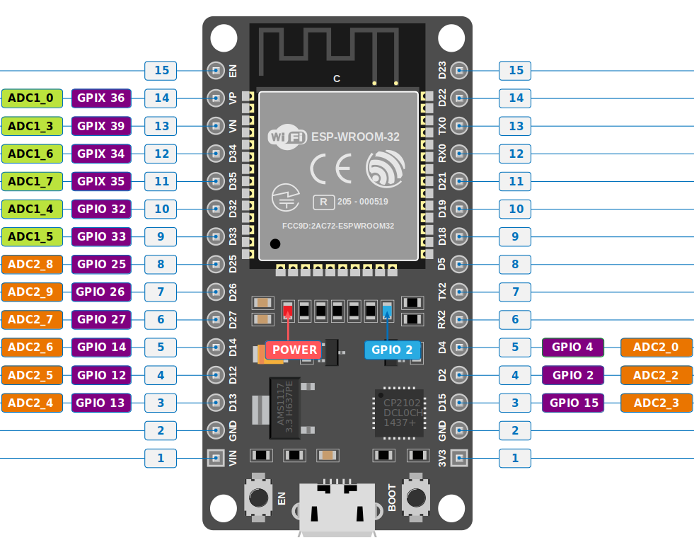

## Analog to Digital Converter (ADC) in ESP32

The ESP32 comes with two 12-bit SAR ADCs and supports up to 18 measurement channels. However, the devkit we are using has only 15 ADC pins, so it supports only 15 channels.

The first one (ADC1) provides 8 channels, which are mapped to GPIO32 through GPIO39. The second one (ADC2) offers 10 channels, mapped to GPIO0, GPIO2, GPIO4, GPIO12 through GPIO15, and GPIO25 through GPIO27.

You can further read about the ADC in ESP32 in the [technical reference manual](https://www.espressif.com/sites/default/files/documentation/esp32_technical_reference_manual_en.pdf#page=639&zoom=100,76,1020).

    <i class="fa fa-warning"></i>
    

        <b class="alert-title">Wi-Fi and ADC2</b>
        
If you are using Wi-Fi on the ESP32, you can't use ADC2 pins since they are used by the Wi-Fi module. You can only use ADC1 pins.

    

### ADC Pins in ESP32 Devkit V1

### ADC Vref and Attenuation in ESP32

The ADC needs a reference voltage to compare with the input voltage, in order to calculate digital values (ranging from 0 to 4095 since it is a 12-bit ADC) of the input voltage. This reference voltage, called Vref (Voltage Reference), helps the ADC map input voltages into this range.

The ESP32 uses a Vref of approximately 1.1V. This means it can only map input voltages between 0V and 1.1V. But what happens when the input voltage is higher than 1.1V? That's where attenuation comes into play.

Attenuation, in simple terms, means reducing something. In our case, it helps map higher input voltages into the range of Vref. This way, the ADC can map voltages greater than 1.1V into the 0 to 4095 range.

In `esp-hal`, this is represented as enum `Attenuation`; we need to configure to use the ADC in the code.

The ESP32 supports four levels of attenuation:

| **Attenuation Level** | **Enum in esp-hal**         | **Measurable input voltage range** |
|-----------------------|------------------------------|-----------------------------------|
| 0 dB                  | Attenuation::Attenuation0dB   | 100 mV ~ 950 mV                  |
| 2.5 dB                | Attenuation::Attenuation2p5dB | 100 mV ~ 1250 mV                 |
| 6 dB                  | Attenuation::Attenuation6dB   | 150 mV ~ 1750 mV                 |
| 11 dB                 | Attenuation::Attenuation11dB  | 150 mV ~ 2450 mV                 |

The ADC in the ESP32 is known to have non-linearity issues. However, since most of our exercises do not require high accuracy, we won't get into these details.
 
## Reference
- [Espressif API Reference(old)](https://docs.espressif.com/projects/esp-idf/en/v4.4/esp32s3/api-reference/peripherals/adc.html)
