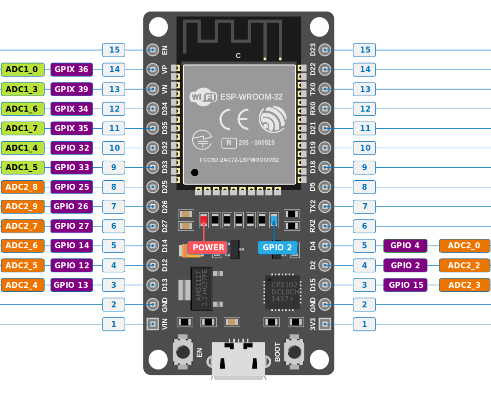

{{#title Analog to Digital Converter (ADC) in ESP32}}

# Analog to Digital Converter (ADC) in ESP32

Now that we understand how an ADC works, let's look at the ADC in the original ESP32 and see how to use it with Rust.

The original ESP32 has two 12-bit SAR ADCs and supports up to 18 ADC channels. The ESP32 DevKit V1 board we are using exposes 15 of these ADC pins.

## ADC Pins in ESP32 DevKit V1

The first ADC, called **ADC1**, provides 8 channels mapped to GPIO32 through GPIO39.  The second ADC, called **ADC2**, provides 10 channels mapped to GPIO0, GPIO2, GPIO4, GPIO12 through GPIO15, and GPIO25 through GPIO27.

> [!NOTE]
> **ADC2 and Wi-Fi**
>
> There is an important limitation when using ADC2.  The Wi-Fi hardware uses ADC2, so ADC2 cannot be used while Wi-Fi is active. If your project uses Wi-Fi and the ADC at the same time, use the ADC1 pins.

The following diagram shows the ADC pins available on the ESP32 DevKit V1:

[](../images/ESP32-DevKit-V1-Pinout-Diagram-adc-pins.png)


## Vref and Attenuation

The original ESP32 has an ADC reference voltage of approximately `1.1 V`, not `3.3 V` or the supply voltage. As we saw earlier, the ADC uses the reference voltage to determine the digital value. But what if we want to measure a voltage higher than this?

The ESP32 can reduce the input voltage before it reaches the ADC. This reduction is called **attenuation**. It allows the ADC to measure a higher input voltage range.

The original ESP32 provides four attenuation settings:

| Attenuation | Measurable input voltage range |
| --- | ---: |
| 0 dB | 00 mV ~ 950 mV |
| 2.5 dB | 100 mV ~ 1250 mV |
| 6 dB | 150 mV ~ 1750 mV |
| 11 dB | 150 mV ~ 2450 mV |

The ESP32 ADC has some other limitations that are important when we need accurate voltage measurements, including reference voltage variation, noise, and calibration. We will not go into those details here. For more details, see the [ESP-IDF ADC documentation](https://docs.espressif.com/projects/esp-idf/en/v4.4/esp32/api-reference/peripherals/adc.html).

## Configuring the ADC in Rust

In `esp-hal`, we configure the ADC using `AdcConfig`. We also select the attenuation for the ADC pin when enabling it.

For example:

```rust
let adc_pin = peripherals.GPIO4;

let mut adc2_config = AdcConfig::new();
let mut pin = adc2_config.enable_pin(adc_pin, Attenuation::_11dB);

let mut adc2 = Adc::new(peripherals.ADC2, adc2_config);
```

Here, we configure GPIO4 as an ADC2 input and select 11 dB attenuation.

## Reading an ADC Value

Once the ADC is configured, we can read the value from the pin:

```rust
let adc_value: u16 = nb::block!(adc2.read_oneshot(&mut pin)).unwrap();
esp_println::println!("{}", adc_value);
```

The ADC returns a digital value rather than a voltage. Since the original ESP32 ADC is 12-bit, the ADC can produce values from 0 to 4095.
