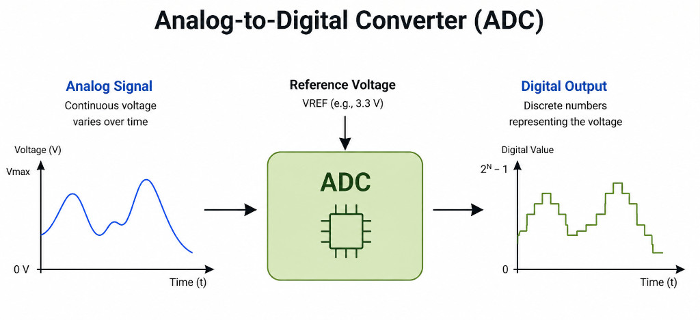

{{#title ADC Explained for ESP32 | impl Rust for ESP32 Book}}

# ADC (Analog to Digital Converter)

When working with embedded systems, you often need to interact with the physical world through sensors. Sensors and their associated circuits can convert physical quantities such as temperature, pressure, light, sound, and acceleration into electrical signals, often voltages. These signals can vary continuously, while the microcontroller processes digital data. So, how do we bridge the gap between the analog world and the digital world?

> [!TIP]
> **Analog vs Digital:** If you are not sure what analog and digital mean, SparkFun has a nice article explaining the difference. You can check it out [here](https://learn.sparkfun.com/tutorials/analog-vs-digital/all).

One approach is to use an Analog-to-Digital Converter (ADC). An ADC converts an analog voltage into a digital number.

    
    
ADC Illustration

For example, suppose a sensor produces a voltage between 0 V and 3.3 V. An ADC can convert that voltage into a number that our Rust program can read.  Later, we will use the ADC with sensors such as an LDR to measure ambient light and a thermistor to measure temperature.

## How Does an ADC Measure Voltage?

To convert an analog voltage into a digital number, an ADC needs a known voltage as a reference. This is called the **reference voltage**, or `Vref`.

The ADC compares the input voltage with this reference and determines where the input voltage falls within the reference range. It then produces a digital number that represents the input voltage.

Different types of ADCs use different methods to do this conversion. The details depend on the type of ADC and are beyond the scope of this book.

> [!TIP]
> If you want to learn more about how comparators use the reference voltage (Vref) to help an ADC determine the input voltage, check out this video: [Comparators: The Building Blocks of Analog to Digital Converters (ADC)](https://youtu.be/CQapmDx5oV0)

For example, suppose the reference voltage is `3.3 V`, and the input voltage is `1.5 V`. The input voltage is approximately 45% of the reference voltage:

\\[
\frac{1.5}{3.3} \approx 0.455
\\]

So, in an ideal ADC, this input would correspond to approximately 45% of the available digital range.

There is one more important detail we need to consider when working with the ESP32. We will cover it later in this chapter. For now, this gives us a simplified idea of how an ADC works.

## ADC Resolution

The ADC does not give us a percentage of the input voltage. Instead, it gives us a digital number within a fixed range.  The size of this range depends on something called **ADC resolution**. It is expressed in bits.

For example, an 8-bit ADC has 256 (i.e., `2^8`) possible digital values. These values range from 0 to 255.

Similarly:

* A 10-bit ADC produces values from 0 to 1023 (1024 possible values).
* A 12-bit ADC produces values from 0 to 4095 (4096 possible values).

The original ESP32 has 12-bit ADCs. You can also configure the ADC to use fewer bits.

## Quantization

The input voltage can change continuously, but the ADC can only produce a fixed number of digital values. This means that nearby input voltages may be represented by the same digital value.

This process of mapping a continuous voltage to one of the available digital values is called **quantization**.

For example, suppose a 12-bit ADC has an input range of `0 V` to `3.3 V`. It can produce 4096 different values, from 0 to 4095.

Now imagine two input voltages that are very close to each other, such as `1.500 V` and `1.501 V`. The ADC may produce the same digital value for both because there are only a finite number of values available to represent the entire voltage range.

This means that the digital value is an approximation of the actual input voltage. The difference between the actual voltage and the voltage represented by the digital value is called **quantization error**.

A higher-resolution ADC has more available values, so it can represent the input voltage more closely and reduce the quantization error.
