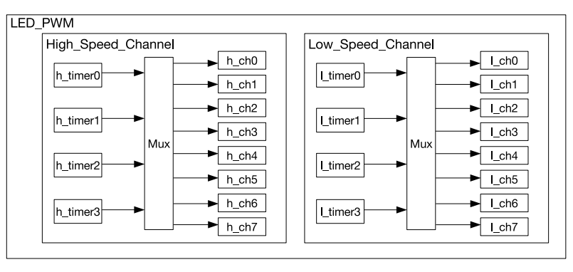

# LED PWM Controller(LEDC)

The ESP32 has LED PWM Controller(LEDC) that generates PWM signals for controlling LEDs(example, dimming effect). However, its functionality isn't limited to LEDs;you can use it for other applications as well.  If you are not familiar with PWM(Pulse Width Modulation), i recommend you to check intro to the PWM [here](./index.md). 

The LEDC includes 16 independent PWM generators and supports a maximum PWM duty cycle resolution of 20 bits. The 16 PWM channels further classified into two types: 8 high speed channel and 8 low speed channels.

    <i class="fa fa-info"></i>
    

        <b class="alert-title">High vs Low Speed channels</b>
        
High-speed channels use hardware to automatically adjust the PWM duty cycle in a glitch-free manner, ensuring smooth operation. In contrast, low-speed channels rely on software to manually adjust the duty cycle.

    

The PWM controller can automatically increase or decrease the duty cycle gradually, allowing for smooth fades without using the processor. 

## Clock Source
A clock source in a microcontroller is like the heartbeat of the system. It gives the microcontroller a regular "tick", which helps it keep track of time and coordinate all its tasks. In the ESP32, you can use different clock sources to manage the timers.

Image is taken from the ESP32 technical reference manual

There are four high-speed clock modules available, which can be assigned to the high-speed channels. The high-speed timer modules in the ESP32 can be clocked by sources such as REF_TICK or APB_CLK. In the esp-hal Rust library, these timers are represented by the timer::Number enum, which includes `Timer0`, `Timer1`, `Timer2`, and `Timer3`.

There are also four low-speed clock modules available, which can be assigned to the low-speed channels. These low-speed timers can be clocked from either REF_TICK or SLOW_CLOCK. The SLOW_CLOCK source can be either the APB_CLK (80 MHz) or the 8 MHz internal oscillator, with the selection between these sources managed by the LEDC_APB_CLK_SEL setting.

The esp-hal also defines two enums: one for the high-speed clock source (`HSClockSource`) and another for the low-speed clock source (`LSClockSource`). Currently, both enums have a single entry, `APBClk`.

For more details, refer to page 390 of the [ESP32 Technical Reference Manual](https://www.espressif.com/sites/default/files/documentation/esp32_technical_reference_manual_en.pdf#ledpwm).

## Calculating PWM Duty Resolution

When working with PWM signals in embedded systems, one important aspect to understand is how to calculate the **duty resolution** based on the clock frequency and division factor. The duty resolution determines how finely you can control the duty cycle of a PWM signal.

These are the formulas taken from the ESP32 technical reference manual but the variable names are simplified.

### Formula for PWM Signal Frequency

The frequency of the PWM signal \\( f_{\text{pwm}} \\) can be calculated using the following formula:

\\[
f_{\text{pwm}} = \frac{f_{\text{LEDC\_CLK}}}{\text{clock_divider} \cdot 2^{\text{res_bits}}}
\\]

Where:
- \\( f_{\text{LEDC\_CLK}} \\) is the frequency of the clock source for the PWM timer (e.g., APB_CLK, RC_FAST_CLK, REF_TICK).
- \\( \text{clock_divider} \\) is the division factor for the clock source.
- \\( \text{res_bits} \\) is the duty resolution in bits.

### PWM Duty Resolution Formula
This is the formula derived from the previous formula to calculate the desired duty resolution.
\\[
\text{res_bits} = \log_2 \left( \frac{f_{\text{LEDC\_CLK}}}{f_{\text{pwm}} \cdot \text{clock_divider}} \right)
\\]
 
This formula gives the duty resolution in bits, which represents the number of discrete levels available for the duty cycle of the PWM signal.

### Calculating the Highest Resolution

The **highest resolution** is achieved when the clock divisor (\\( \text{clock_divider} \\)) is set to 1, meaning no division is applied to the clock. It is calculated as:

\\[
\text{Highest Resolution} = \log_2 \left( \frac{f_{\text{LEDC\_CLK}}}{f_{\text{pwm}} \cdot 1} \right)
\\]

This calculation gives the maximum number of bits that can be used for the duty cycle at a given clock frequency and PWM signal frequency.

#### Example:

For a 1 kHz PWM signal with an APB_CLK of 80 MHz:

\\[
\text{Highest Resolution} = \log_2 \left( \frac{80,000,000}{1,000 \cdot 1} \right) = \log_2(80,000) \approx 16
\\]

Thus, the highest resolution for a 1 kHz PWM signal using an 80 MHz clock is **16 bits**.

### Calculating the Lowest Resolution
The division factor ranges from 1 ∼ 1023, as per the datasheet. The **lowest resolution** is calculated when the clock divisor is at its maximum value. In this case, the clock divisor is \\( 1023 + \frac{255}{256} \\). The lowest resolution is calculated as:

\\[
\text{Lowest Resolution} = \log_2 \left( \frac{f_{\text{LEDC\_CLK}}}{f_{\text{pwm}} \cdot \left( 1023 + \frac{255}{256} \right)} \right)
\\]

This calculation gives the minimum number of bits required for the duty cycle control at the specified PWM signal frequency.

#### Example:

For the same 1 kHz PWM signal with the APB_CLK at 80 MHz:

\\[
\text{Lowest Resolution} = \log_2 \left( \frac{80,000,000}{1,000 \cdot 1023.996} \right) = \log_2 \left( \frac{80,000,000}{1,023,996} \right) \approx 6.28
\\]

Thus, the lowest resolution for a 1 kHz PWM signal using an 80 MHz clock is **7 bits**.

### Commonly-used PWM Frequencies and Resolutions

This table is from the datasheet, summarizes the highest and lowest resolutions for common PWM frequencies with different clock sources:

| **Clock Source** | **PWM Frequency** | **Highest Resolution (bits)** | **Lowest Resolution (bits)** |
|------------------|-------------------|-------------------------------|------------------------------|
| **APB_CLK (80 MHz)** | 1 kHz            | 16                            | 7                            |
| **APB_CLK (80 MHz)** | 5 kHz            | 13                            | 4                            |
| **APB_CLK (80 MHz)** | 10 kHz           | 12                            | 3                            |
| **RC_FAST_CLK (8 MHz)** | 1 kHz          | 12                            | 3                            |
| **RC_FAST_CLK (8 MHz)** | 2 kHz          | 11                            | 2                            |
| **REF_TICK (1 MHz)** | 1 kHz            | 9                             | 1                            |

