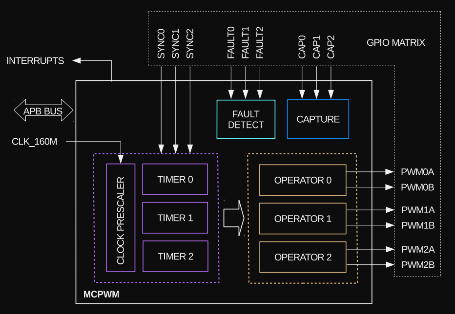

# Motor Control Pulse Width Modulator (MCPWM)

The ESP32 has two PWM peripherals: [LED Controller](./led-pwm-controller.md) and MCPWM. In this chapter, we will introduce the MCPWM.

MCPWM is designed for motor and power control. The ESP32 features two MCPWM units: MCPWM0 and MCPWM1. The diagram below provides an overview of a single MCPWM module.
 


Each MCPWM has prescaler(clock divider), three timers, three operators, fault handler and a capture module.  

## Prescaler
The prescaler is used to reduce the base clock frequency before it's applied to the PWM signal. The MCPWM is driven by a clock with a frequency of 160 MHz, meaning it ticks 160 million times per second. This clock serves as the base frequency for the MCPWM module.  However, the prescaler modifies this base frequency by dividing it, effectively reducing the clock frequency that the PWM signal uses.

To calculate the duration of each clock cycle, we take the inverse of the frequency, which gives us:

\\[
\text{Period} = \frac{1}{160 \times 10^6}  \text{ s} = 0.00000000625  \text{ s} = 6.25 \text{ ns}
\\]

This means each clock cycle lasts 6.25 nanoseconds (ns). 

The PWM_CLK_PRESCALE register(8 bits) in the ESP32 allows you to adjust this base clock by dividing it. Once the prescaler is applied to the base clock, it effectively reduces the clock frequency. The resulting PWM period is calculated using the following formula:

\\[
\text{PWM Clock Period} = 6.25 \text{ns} \times (\text{Prescaler Value} + 1)
\\]

**Example:**

Let's say you set the prescaler value to 159.

\\[
\text{PWM Clock Period} = 6.25 \text{ ns} \times (159 + 1) = 6.25   \text{ ns} \times 160 = 1000 \text{ ns}
\\]

To calculate the PWM frequency, we take the inverse of the period:

\\[
\text{PWM Frequency} = \frac{1}{\text{PWM Clock Period}} = \frac{1}{1000 \text{ ns}} = 1  \text{ MHz}
\\]

Thus, with a prescaler value of 159, the PWM signal will have a period of 1000 ns and a frequency of 1 MHz.

With a maximum prescaler value of 255 (since it's an 8-bit value), you can achieve the PWM frequency of:

\\[
\text{PWM Frequency} = \frac{1}{6.25 \text{ ns} \times (255 + 1)} = \frac{1}{1600 \text{ ns}} = 625 \text{ KHz}
\\]


### In esp-hal

The `PeripheralClockConfig` struct in esp-hal is responsible for the clock configuration of the MCPWM. It offers two functions to initialize with a prescaler or a frequency.

```rust
// This functions automatically calculate the prescaler to achieve the 1MHz
let clock_cfg = PeripheralClockConfig::with_frequency(1.MHz()).unwrap();
```

## Timer
The timer is responsible for counting up to a specified value (referred to as the "period"), at which point it resets and starts counting again.  This helps control the timing or frequency of the output signal. Each timer has an 8-bit clock prescaler.

It has 16-bit counter that can operate in three modes: In esp-hal, this is represented as enum PwmWorkingMode. 
- **PwmWorkingMode::Increase** : couting up, where the timer starts at zero and counts upwards to the period value before resetting. 
- **PwmWorkingMode::Decrease** : counting down, where the timer starts at the period value and counts down to zero before resetting
- **PwmWorkingMode::UpDown** : counting up-down, where the timer alternates between counting up and counting down, creating a symmetrical cycle.

### In esp-hal

The esp-hal has a `TimerClockConfig` struct which you can initialize via the clock config instance. You need to call the `timer_clock_with_frequency` function (or the timer_clock_with_prescaler) with arguments:
1. The number of ticks in the period 
2. The pwm working mode
3. The target frequency 

**Example:**

To achieve a 50 Hz frequency (20 ms or 0.02 s) with a base clock frequency of 1 MHz (assuming we initialized clock_cfg with 1 MHz), we need to calculate the cycle count for the period of 0.02 s (20 ms) at 1 MHz. The calculation will be:


\\[
\text{Counts} = 1,000,000 \text{ Hz} \times 0.02 \text{ s} = 20,000
\\]

So, we can then call the function to initialize the PWM timer:

```rust
let timer_clock_cfg = clock_cfg
    .timer_clock_with_frequency(19_999, PwmWorkingMode::Increase, 50.Hz())
    .unwrap();
```

We are passing 19,999 instead of 20,000 because the function internally increments it by 1, resulting in 20,000.

## Operator
The PWM operator generates the desired output waveform using the timing references from the PWM timer. Each PWM operator features two outputs: PWMxA and PWMxB, with configurable dead-time for both rising and falling edges.

We have configured the MCPWM0 peripheral and selected operator0 to use the PWMxA output.
```rust
let mut mcpwm = McPwm::new(peripherals.MCPWM0, clock_cfg);
let mut pwm_pin = mcpwm
.operator0
.with_pin_a(peripherals.GPIO33, PwmPinConfig::UP_ACTIVE_HIGH);
```

Here, the UP_ACTIVE_HIGH sets the UP_ACTIVE_HIGH for the PWM action and SYNC_ON_ZERO for the PWM update method. So, what this means? The output signal will be set High when the timer count is less than the timestamp value. Then, the new timestamp will be applied when the timer reaches zero.

### set_timestamp function in esp-hal

The set_timestamp function sets the time at which the PWM signal should change. When the timer reaches the value passed to this function, it updates the PWM signal according to the configured PwmUpdateMethod. In our example, we have configured UP_ACTIVE_HIGH in the operator, so the output will stay High until the timer reaches the timestamp value. Once the timestamp is reached, the signal will go Low for the rest of the PWM cycle.

For example, if we set the timestamp value to 500, the signal will remain High until the timer count reaches 500. Once it reaches 500, the signal will be Low for the remaining count of 19,500 (20,000 - 500).

```rust
pwm_pin.set_timestamp(500);
```

## LEDC vs MCPWM

LEDC (LED Controller) is designed for controlling LEDs but can also be used for doing general PWM tasks, making it ideal for basic applications like LED dimming or simple motor control.

MCPWM (Motor Control PWM) is specifically built for motor control, with advanced features like dead time insertion and fault handling, making it better suited for precise and complex motor control.

Typical use cases of MCPWM peripheral as per the API Reference document:
- Digital motor control, e.g., brushed/brushless DC motor, RC servo motor
- Switch mode-based digital power conversion
- Power DAC, where the duty cycle is equivalent to a DAC analog value
- Calculate external pulse width, and convert it into other analog values like speed, distance
- Generate Space Vector PWM (SVPWM) signals for Field Oriented Control (FOC)

For controlling a hobby servo motor like the SG90, LEDC is simple and sufficient, but MCPWM can also be used.

## Reference

- [MCPWM API Reference ](https://docs.espressif.com/projects/esp-idf/en/v4.4/esp32/api-reference/peripherals/mcpwm.html), latest [API Reference](https://docs.espressif.com/projects/esp-idf/en/stable/esp32/api-reference/peripherals/mcpwm.html)
- For more details, refer to page 417 of the [ESP32 Technical Reference Manual](https://www.espressif.com/sites/default/files/documentation/esp32_technical_reference_manual_en.pdf#mcpwm)
- [ESP32 MCPWM as SPWM generator](https://yopiediy.xyz/esp32-mcpwm-as-spwm-generator/)
