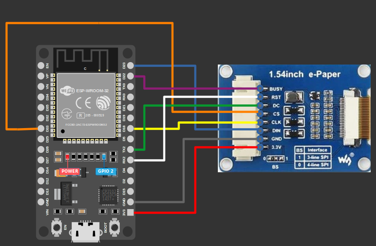

# Circuit

## e-Paper Display Pinout

- **VCC**: Power supply (3.3V or 5V) to power the display.  
- **GND**: Ground  
- **DIN (MOSI)**: SPI data line for sending information from the microcontroller to the display.  
- **CLK (SCK)**: Synchronizes data transmission over SPI.  
- **CS (Chip Select, Active Low)**: Enables or disables SPI communication. When LOW, the display is active.  
- **DC (Data/Command Select)**: Determines whether the data being sent is pixel data (HIGH) or a command (LOW).  
- **RST (Reset, Active Low)**: Resets the display when pulled LOW and then HIGH. Essential for initialization.  
- **BUSY**: Indicates whether the display is currently processing (HIGH) or ready to receive new commands (LOW).  

## Connecting e-Paper display with ESP32

 
<table style="margin-bottom:20px">
  <thead>
    <tr>
      <th>E-Paper Pin</th>
      <th style="width: 250px; margin: 0 auto;">Wire</th>
      <th>ESP32 Pin</th>
    </tr>
  </thead>
  <tbody>
    <tr>
      <td>VCC</td>
      <td style="text-align: center; vertical-align: middle; padding: 0;">
        

          

          

        

      </td>
      <td>3.3V</td>
    </tr>
    <tr>
      <td>GND</td>
      <td style="text-align: center; vertical-align: middle; padding: 0;">
        

          

          

        

      </td>
      <td>GND</td>
    </tr>
    <tr>
      <td>DIN (MOSI)</td>
      <td style="text-align: center; vertical-align: middle; padding: 0;">
        

          

          

        

      </td>
      <td>GPIO23</td>
    </tr>
    <tr>
      <td>CLK (SCK)</td>
      <td style="text-align: center; vertical-align: middle; padding: 0;">
        

          

          

        

      </td>
      <td>GPIO18</td>
    </tr>
    <tr>
      <td>CS</td>
      <td style="text-align: center; vertical-align: middle; padding: 0;">
        

          

          

        

      </td>
      <td>GPIO33</td>
    </tr>
    <tr>
      <td>DC</td>
      <td style="text-align: center; vertical-align: middle; padding: 0;">
        

          

          

        

      </td>
      <td>GPIO17 (TX2 in Devkit)</td>
    </tr>
    <tr>
      <td>RST</td>
      <td style="text-align: center; vertical-align: middle; padding: 0;">
        

          

          

        

      </td>
      <td>GPIO16 (Rx2 in Devkit)</td>
    </tr>
    <tr>
      <td>BUSY</td>
      <td style="text-align: center; vertical-align: middle; padding: 0;">
        

          

          

        

      </td>
      <td>GPIO22</td>
    </tr>
  </tbody>
</table>

