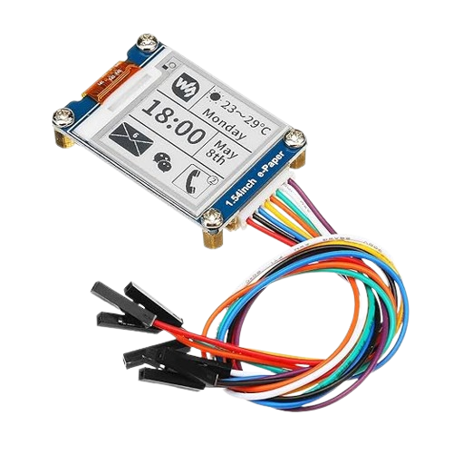

# e-Ink (e-Paper) Display Module

e-Ink, also known as e-Paper (or electronic paper) display, is one of the most fascinating display modules I've come across. You write text or images to the display using a microcontroller, then unplug it-and the display continues to show whatever you sent without needing a power source. Seriously, no wires, no batteries, nothing! Yes, you heard that right. It feels like a magic.

## Where is the e-Ink displays Used? 
You may have seen an e-ink display before without even realizing it. Start looking-you might spot them everywhere around you!

e-Ink is most famously used in e-readers like the Amazon Kindle, where its paper-like display offers a comfortable reading experience and extended battery life. In retail stores, paper tags are being replaced by e-Ink displays, making updates much more efficient. You'll also find e-Ink in bus stop schedules, airport signs, room signs, smart home devices, indoor digital signs, menu boards, and patient door and care signs.

## Meet the hardware
There are many variants available that differ in display size and supported colors. Some displays are black and white, while others offer tri-color or multi-color options. 

We will use a Waveshare 1.54-inch e-Ink display module that uses an SPI interface. The display has a resolution of 200 x 200 and shows images in black and white.

For this project, we recommend purchasing the 1.54-inch black and white display module (v2.1).  This version is the most affordable, making it accessible to everyone, and it also boasts a faster refresh rate compared to color variants. Following along will be easier if you use the exact variant.

That said, you're welcome to choose any size or color display; the core concepts will remain similar. 

## Resources

- [1.5inch e-Paper V2 Datasheet](https://files.waveshare.com/upload/e/e5/1.54inch_e-paper_V2_Datasheet.pdf)
- [1.54inch e-Paper Module Manual](https://www.waveshare.com/wiki/1.54inch_e-Paper_Module_Manual)
