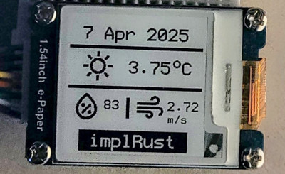

# Let the fun begin

In the `main` function, we will perform the usual setup steps like initializing the Wi-Fi stack, SPI device, and creating an instance of the `Dashboard` we defined earlier.

One important thing to note is that we allocate memory for the `dram2` using `esp_alloc::heap_allocator!(#[link_section = ".dram2_uninit"] size: 64000);`. This is crucial because the mbedtls requires additional heap memory. Without this allocation, you will encounter memory allocation failures when sending the API request.

```rust
#[esp_hal_embassy::main]
async fn main(spawner: Spawner) {
    // generator version: 0.3.1

    let config = esp_hal::Config::default().with_cpu_clock(CpuClock::max());
    let peripherals = esp_hal::init(config);

    esp_alloc::heap_allocator!(size: 80 * 1024);
    esp_alloc::heap_allocator!(#[link_section = ".dram2_uninit"] size: 64000);

    let timer0 = TimerGroup::new(peripherals.TIMG1);
    esp_hal_embassy::init(timer0.timer0);

    info!("Embassy initialized!");

    let timer1 = TimerGroup::new(peripherals.TIMG0);
    let rng = Rng::new(peripherals.RNG);
    let esp_wifi_ctrl = &*lib::mk_static!(
        EspWifiController<'static>,
        esp_wifi::init(timer1.timer0, rng.clone(), peripherals.RADIO_CLK,).unwrap()
    );

    // Configure and Start Wi-Fi tasks
    let stack = lib::wifi::start_wifi(esp_wifi_ctrl, peripherals.WIFI, rng, &spawner).await;

    // Initialize SPI
    let spi = Spi::new(
        peripherals.SPI2,
        SpiConfig::default()
            .with_frequency(Rate::from_mhz(4))
            .with_mode(SpiMode::_0),
    )
    .unwrap()
    //CLK
    .with_sck(peripherals.GPIO18)
    //DIN
    .with_mosi(peripherals.GPIO23);
    let cs = Output::new(peripherals.GPIO33, Level::Low, OutputConfig::default());
    let mut spi_dev = ExclusiveDevice::new(spi, cs, Delay);

    // Initialize Display
    let busy_in = Input::new(
        peripherals.GPIO22,
        InputConfig::default().with_pull(Pull::None),
    );
    let dc = Output::new(peripherals.GPIO17, Level::Low, OutputConfig::default());
    let reset = Output::new(peripherals.GPIO16, Level::Low, OutputConfig::default());
    let epd = Epd1in54::new(&mut spi_dev, busy_in, dc, reset, &mut Delay, None).unwrap();

    let mut app = Dashboard::new(stack, epd, spi_dev);
    app.start(peripherals.SHA, peripherals.RSA).await;
}
```


## Clone the existing project
You can also clone (or refer) project I created and navigate to the `wifi-webfetch` folder.

```sh
git clone https://github.com/ImplFerris/esp32-epaper-weather/
cd esp32-epaper-weather
```

### How to run?

We will need to pass the Wi-Fi name (SSID), Wi-Fi password, and Open Weather API key as environment variables when flashing the program onto the ESP32.

```sh
SSID=YOUR_WIFI_NAME PASSWORD=YOUR_WIFI_PASSWORD API_KEY=OPEN_WEATHER_KEY  cargo run --release
```

If everything goes successfully, the e-paper display will flicker briefly to clear and render the content, and you should see the weather data displayed.


