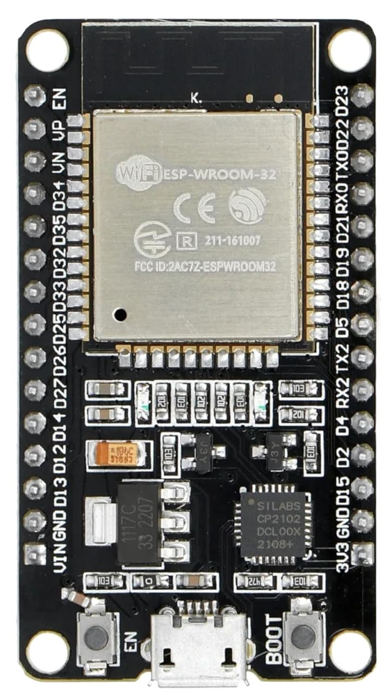

# ESP32 Variants

If you're new and searching for what ESP32 to buy, you might feel overwhelmed by the many choices and variants. In this section, we'll explore these variants and help you decide which one to choose.

## Brief on ESP32 Family

The ESP32 family, a series of low cost and low power System on a Chip (SoC) microcontrollers created by Espressif. ESP32 is the successor to the ESP8266 and has since expanded with various new variants. 

## Which one to choose?

There are several variants in the ESP32 family.
- ESP32
- ESP32 S Series(ESP32-S2, ESP32-S3)
- ESP32 C Series(ESP32-C3, ESP32-C6, ESP32-C5)
- ESP32 H Series(ESP32-H2) 
- ESP32-P Series(ESP32-P4)

If you are choosing for a specific project or building a product, use the product comparison tables above to find the one best fit for your needs.  You can find a full list of these models and their specs on the Espressif [Product Comparison page](https://products.espressif.com/#/product-comparison). 

For a simple overview of the most common ESP32 models and their main features, check out [this table](https://done.land/components/microcontroller/families/esp/esp32/) on Done.land website.

## Why ESP32 DevKit v1?

**Confession time:** I wasn't aware of the many variants available when I first wanted to try out the ESP32. I searched on an e-commerce website, and most of the results showed ESP32-WROOM-32 with different vendor names. I just went with one of them. Later, I discovered there are other variants. However, at the time of writing this, most of them are either not easily accessible where I live or more expensive than this variant. This remains one of the popular choices for now.

So for this book, we'll keep it simple and choose the popular and affordable one "**ESP32 DevKit V1**" , perfect for development and learning.

## How to find?
If you search on an e-commerce website, you'll most likely find it listed under a name like "ESP32 Development Board (ESP-WROOM-32)" which should have WiFi Bluetooth Dual Core (30 PIN) in specs. 

You can compare the specifications and board pins with this.

### Specs
The ESP32 is a dual-core 32-bit processor equipped with Wi-Fi and Bluetooth, perfect for creating wireless IoT applications.

The following are basic specs for the ESP32:
- Processor: Xtensa 32-bit LX6
- Number of Cores: 2
- Clock Frequency: 240MHz
- Flash Memory: 4 MB
- ROM: 448 KB  (read-only programs essential for the operation of the ESP32)
- SRAM: 520 KB (to store data and instructions)
- ADC: 12-bit SAR ADC, 18 channels, 6 Input Pins
- UARTs: 3
- SPIs: 2
- I2Cs: 3
- Wi-Fi: IEEE 802.11 b/g/n/e/i (802.11n up to 150 Mbps)
- Bluetooth: v4.2 BR/EDR and Bluetooth Low Energy (BLE)
- Operation Voltage: 2.3-3.6V
- Deep Sleep: 100uA

## Reference
- [Buyers Guide](https://eitherway.io/posts/esp32-buyers-guide/)
- [Chip Series Comparison](https://docs.espressif.com/projects/esp-idf/en/v5.0/esp32s3/hw-reference/chip-series-comparison.html)
- [ESP32 Guide 2024 Video](https://www.youtube.com/watch?v=u5unB24lhC4)
