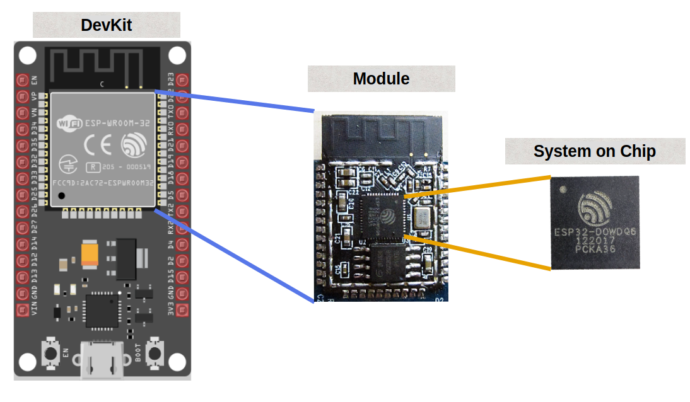

# ESP32 Family

If you're new and searching for what ESP32 to buy, you might feel overwhelmed by the many choices and variants. In this section, we'll explore these variants.

The ESP32 family, a series of low cost and low power System on a Chip (SoC) microcontrollers created by Espressif. ESP32 is the successor to the ESP8266 and has since expanded with various new variants. 

## System on Chip(SoC) variants

The ESP32 family consists of the following commonly used SoC variants:

- ESP32
- ESP32 S Series(ESP32-S2, ESP32-S3)
- ESP32 C Series(ESP32-C3, ESP32-C6, ESP32-C5)
- ESP32 H Series(ESP32-H2) 
- ESP32-P Series(ESP32-P4)

If you are choosing for a specific project or building a product, use the product comparison tables above to find the one best fit for your needs.  You can find a full list of these models and their specs on the Espressif [Product Comparison page](https://products.espressif.com/#/product-comparison). 

For a simple overview of the most common ESP32 models and their main features, check out [this table](https://done.land/components/microcontroller/families/esp/esp32/) on Done.land website.

## System on Chip (SoC) vs Module vs Development Board (Devkit)

The ESP32 comes in three distinct forms: **System on Chip (SoC)**, **Module**, and **Development Boards (Devkits)**. Each serves a specific purpose and is suited to different stages of development or integration.

### System on Chip (SoC)

The SoC is the core and most fundamental form of the ESP32. A System on Chip integrates essential components of an electronic system or computer into a single Integrated Circuit (IC). In the case of the ESP32 SoC, it includes:

- **CPU**  
- **Wi-Fi and Bluetooth**  
- **ROM and SRAM**  
- **Additional peripherals**  

**Use Case**:  
SoCs are primarily intended for integration into custom hardware designs. They are ideal for manufacturers who want to embed ESP32 functionality into their products. However, since the SoC alone is not pre-certified for regulatory compliance, you will need to obtain certifications (e.g., FCC, CE) when designing custom hardware for wireless communication.

---

### Module

Modules build upon the SoC and provide a more user-friendly, ready-to-use solution. Common examples of ESP32 modules include the popular **WROOM** and **WROVER** series. For instance, the **ESP32-WROOM-32** is widely used and recognizable as the metallic-cased square component on many development boards.

#### **Why Choose a Module?**
- **Pre-Certification**: Modules are pre-certified for regulatory compliance, saving time and effort.  
- **Integrated Components**: They include PCB antennas, a crystal oscillator, and a flash memory chip.  
- **Shielded Design**: Modules come with an EMI shield to reduce electromagnetic interference.  

**Use Case**:  
Modules are designed for integration into custom PCBs and are perfect for applications that require fewer external components and less effort compared to using a raw SoC.

---

### Development Board (Devkit)

Development boards simplify the use of ESP32 modules for prototyping and development. They include additional components to make the ESP32 module easier to work with for beginners and experienced developers alike.

#### **Key Features of Development Boards**:
- **USB Interface**: Enables easy programming and debugging.  
- **Voltage Regulators**: Provides stable operation for the ESP32.  
- **Pin Breakouts**: Makes ESP32 pins accessible for connecting external components like sensors and displays.  
- **Boot and Reset Buttons**: Provides control over module operations.  

**Use Case**:  
Devkits are ideal for rapid prototyping and experimentation. Popular examples include the **ESP32 DevKit v1** and **ESP32-S3-DevkitC**, which are widely used by developers and hobbyists.

---
## Why ESP32 DevKit v1?

**Confession time:** I wasn't aware of the many variants available when I first wanted to try out the ESP32. I searched on an e-commerce website, and most of the results showed ESP32-WROOM-32 with different vendor names. I just went with one of them. Later, I discovered there are other variants. However, at the time of writing this, most of them are either not easily accessible where I live or more expensive than this variant. This remains one of the popular choices for now.

So for this book, we'll keep it simple and choose the popular and affordable one "**ESP32 DevKit V1**" , perfect for development and learning.

## How to find?
If you search on an e-commerce website, you'll most likely find it listed under a name like "ESP32 Development Board (ESP-WROOM-32)" which should have WiFi Bluetooth Dual Core (30 PIN) in specs. 

You can compare the specifications and board pins with this.

### Specs
The ESP32 is a dual-core 32-bit processor equipped with Wi-Fi and Bluetooth, perfect for creating wireless IoT applications.

The following are basic specs for the ESP32:
- Processor: Xtensa 32-bit LX6
- Number of Cores: 2
- Clock Frequency: 240MHz
- Flash Memory: 4 MB
- ROM: 448 KB  (read-only programs essential for the operation of the ESP32)
- SRAM: 520 KB (to store data and instructions)
- ADC: 12-bit SAR ADC, 18 channels, 6 Input Pins
- UARTs: 3
- SPIs: 2
- I2Cs: 3
- Wi-Fi: IEEE 802.11 b/g/n/e/i (802.11n up to 150 Mbps)
- Bluetooth: v4.2 BR/EDR and Bluetooth Low Energy (BLE)
- Operation Voltage: 2.3-3.6V
- Deep Sleep: 100uA

## Reference
- [Buyers Guide](https://eitherway.io/posts/esp32-buyers-guide/)
- [Chip Series Comparison](https://docs.espressif.com/projects/esp-idf/en/v5.0/esp32s3/hw-reference/chip-series-comparison.html)
- [ESP32 Guide 2024 Video](https://www.youtube.com/watch?v=u5unB24lhC4)
