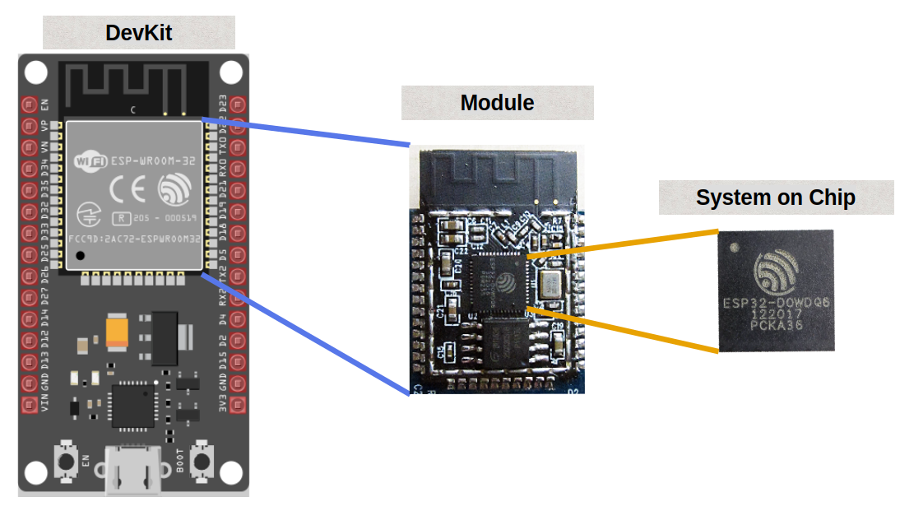
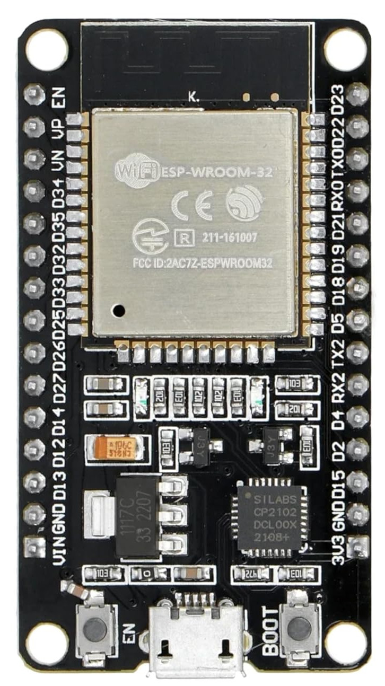

{{#title ESP32 Variants Guide for Beginners: SoC, Module, and DevKit Explained}}

# ESP32 Family

If you're new and searching for what ESP32 to buy, you might feel overwhelmed by the many choices and variants. In this section, we'll explore these variants.

The ESP32 family is a series of low-cost, low-power System on Chip (SoC) microcontrollers created by Espressif. The ESP32 is the successor to the ESP8266 and has since expanded into many different variants.

## System on Chip (SoC) Variants

The ESP32 family consists of the following commonly used SoC variants:

- ESP32
- ESP32 S Series (ESP32-S2, ESP32-S3)
- ESP32 C Series (ESP32-C3, ESP32-C6, ESP32-C5)
- ESP32 H Series (ESP32-H2) 
- ESP32-P Series (ESP32-P4)

If you are choosing for a specific project or building a product, use the product comparison tables above to find the one best fit for your needs.  You can find a full list of these models and their specs on the Espressif [Product Comparison page](https://products.espressif.com/#/product-comparison). 

For a simple overview of the most common ESP32 models and their main features, check out [this table](https://done.land/components/microcontroller/families/esp/esp32/) on Done.land website.

## System on Chip (SoC) vs Module vs Development Board (Devkit)

The ESP32 comes in three distinct forms: **System on Chip (SoC)**, **Module**, and **Development Boards (Devkits)**. Each serves a specific purpose and is suited to different stages of development or integration.

### System on Chip (SoC)

The SoC is the core and most fundamental form of the ESP32. A System on Chip integrates essential components of an electronic system or computer into a single Integrated Circuit (IC). An ESP32 SoC typically integrates components such as:

- CPU
- ROM and SRAM
- Peripherals
- Wireless connectivity, depending on the model

**Use Case**:  
SoCs are primarily intended for integration into custom hardware designs. They are ideal for manufacturers who want to embed ESP32 functionality into their products. However, when using the SoC directly in a custom hardware design, you are responsible for the RF design and regulatory compliance of the resulting product.

---

### Module

Modules build upon the SoC and provide a more user-friendly, ready-to-use solution. Common examples of ESP32 modules include the popular **WROOM** and **WROVER** series. For instance, the **ESP32-WROOM-32** is widely used and recognizable as the metallic-cased square component on many development boards.

#### **Why Choose a Module?**
- **Regulatory Compliance:** Many ESP32 modules have already been tested and certified for specific configurations. Using a certified module can make regulatory compliance easier, but it does not automatically make the entire product certified. 
- **Integrated Components**: Modules include many of the components needed to use the ESP32, such as flash memory, a crystal oscillator, and RF components. Depending on the module, they may also include an onboard PCB antenna.
- **Shielded Design**: Many modules include a metal RF shield over the RF and other components.  

**Use Case**:  
Modules are designed for integration into custom PCBs and are perfect for applications that require fewer external components and less effort compared to using a raw SoC.

---

### Development Board (Devkit)

Development boards simplify the use of ESP32 modules for prototyping and development. They include additional components to make the ESP32 module easier to work with for beginners and experienced developers alike.

#### **Key Features of Development Boards**:
- **USB Interface**: Provides a convenient way to power and program the board.  
- **Voltage Regulators**: Provide a suitable supply voltage for the ESP32.  
- **Pin Breakouts**: Makes ESP32 pins accessible for connecting external components like sensors and displays.  
- **Boot and Reset Buttons**: Provides control over module operations.  

**Use Case**:  
Devkits are ideal for rapid prototyping and experimentation. Popular examples include the **ESP32 DevKit v1** and **ESP32-S3-DevkitC**, which are widely used by developers and hobbyists.

---
## Why ESP32 DevKit v1?

**Confession time:** I wasn't aware of the many variants available when I first wanted to try out the ESP32. I searched on an e-commerce website, and most of the results showed ESP32-WROOM-32 with different vendor names. I just went with one of them. Later, I discovered there are other variants. However, at the time of writing, most of them are either not easily accessible where I live or more expensive than this variant. This remains one of the popular choices for now.

So for this book, we'll keep it simple and choose the popular and affordable one "**ESP32 DevKit V1**" , perfect for development and learning.

## How to find?

If you search on an e-commerce website, you'll most likely find it listed under a name such as "ESP32 Development Board (ESP-WROOM-32)". Look for a board using the ESP32-WROOM-32 module with the 30-pin layout shown below.

You can compare the specifications and board pins with this.

### Specs
The ESP32 is a dual-core 32-bit processor equipped with Wi-Fi and Bluetooth, perfect for creating wireless IoT applications.

The following are basic specifications of the ESP32-WROOM-32 used on this development board:
- Processor: Xtensa 32-bit LX6
- Number of Cores: 2
- Clock Frequency: 240MHz
- Flash Memory: 4 MB
- ROM: 448 KB  (read-only programs essential for the operation of the ESP32)
- SRAM: 520 KB (to store data and instructions)
- ADC: Two 12-bit SAR ADCs, 18 channels
- UARTs: 3
- SPIs: 4
- I2Cs: 2
- Wi-Fi: IEEE 802.11 b/g/n/e/i (802.11n up to 150 Mbps)
- Bluetooth: v4.2 BR/EDR and Bluetooth Low Energy (BLE)
- Operation Voltage: 2.3-3.6V
- Deep Sleep: 100uA

## Reference
- [Buyers Guide](https://eitherway.io/posts/esp32-buyers-guide/)
- [Chip Series Comparison](https://docs.espressif.com/projects/esp-idf/en/v5.0/esp32s3/hw-reference/chip-series-comparison.html)
