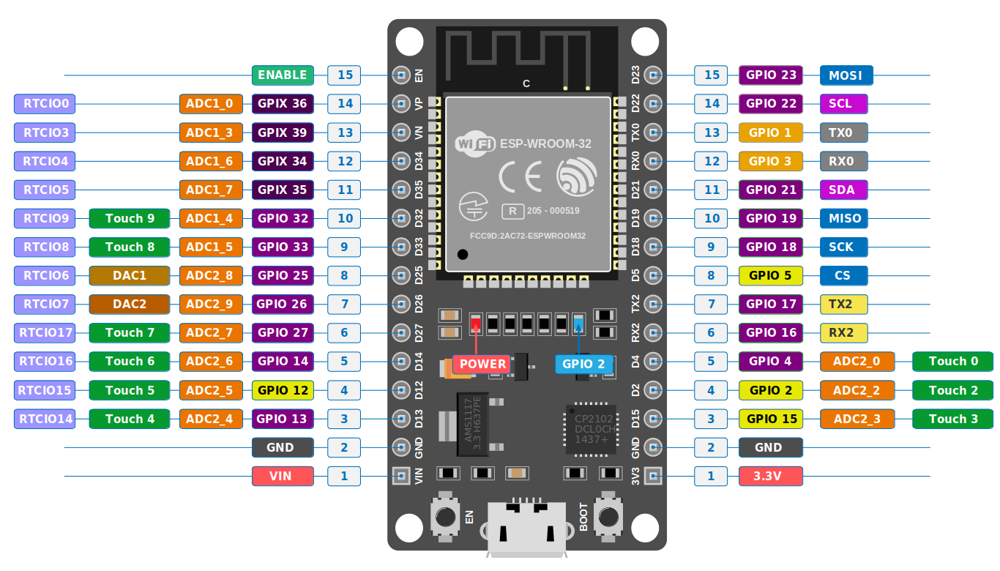

# ESP32 Pinout

License: [CC-BY-SA 4.0](https://creativecommons.org/licenses/by-sa/4.0/deed.en)

The above pinout diagram is derivative from the original diagram created by the CircuitState website. They also have provided detailed explanations for each pin. You can check it out [here](https://www.circuitstate.com/pinouts/doit-esp32-devkit-v1-wifi-development-board-pinout-diagram-and-reference/).

Disclaimer: This book is not affiliated with nor associated with CircuitState. I am including this diagram as i found it helpful during my research. 

## Keypoints

- **Input-Only GPIOs:** GPIO pins 34, 35, 36, and 39 are input-only and cannot be used as output pins. In the pinout diagram, these pins are labeled with a "GPIX" prefix and marked with an "X" to indicate output is not allowed. Whenever possible, prefer using the pins highlighted in purple on the diagram.

- **Flashing and Debugging:** GPIO 1 (Tx) and GPIO 3 (Rx) are designated for flashing and debugging purposes.

- **ADC Pins:** Pins labeled as `ADC1_[Number]` are associated with ADC1, while those labeled as `ADC2_[Number]` are associated with ADC2.
