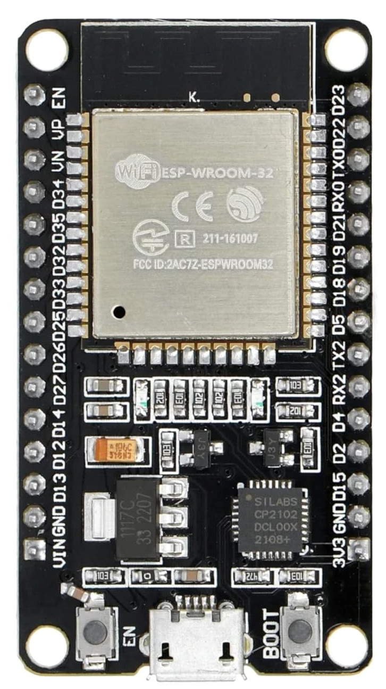

# Intro

In this book, we use the ESP32 DevKit v1 with Rust to build simple and fun projects. The ESP32 is a popular microcontroller for IoT applications, and we take a hands-on approach to help you learn by doing. You will explore how to turn on an LED when the room gets darker using an LDR, use an ultrasonic sensor to detect when something is close, control an LED through Wi-Fi, draw images/text on an OLED display, play songs and alarm sound with a buzzer, control a servo motor, and more.

We'll use Rust's `no_std` environment. While it's possible to program the ESP32 in a std environment, I feel it's better to start with no_std, as it enables you to apply the same logic when working with other microcontrollers.

## Prerequisites
If you haven't already read the ["The Rust on ESP Book"](https://docs.esp-rs.org/book/introduction.html), I highly recommend doing so first. While this book will cover some aspects of setting up the development environment and basic concepts, it will not go into as much detail to avoid unnecessary repetition, as these topics are already thoroughly explained in the official book.

I also recommend you to read ["The Embedded Rust book"](https://docs.rust-embedded.org/book/intro/index.html) - An introductory book about using the Rust on "Bare Metal" embedded systems.

## Meet the Hardware
We will be using one of the development board "ESP32 DevKit V1", which comes with built-in Wi-Fi and Bluetooth capabilities, along with an integrated RF module

## Datasheets
For detailed technical information, specifications, and guidelines, refer to the official datasheets:
- [ESP32 Datasheet](https://www.espressif.com/sites/default/files/documentation/esp32_datasheet_en.pdf)
- [Technical Reference Manual](https://www.espressif.com/sites/default/files/documentation/esp32_technical_reference_manual_en.pdf)
- [ESP32-WROOM-32 Datasheet](https://www.espressif.com/sites/default/files/documentation/esp32-wroom-32_datasheet_en.pdf)

## Breadboard
The ESP32 devkit is slightly wider than usual. If you use a standard breadboard, you might struggle to fit the board, as I did. To solve this, I bought two mini breadboards, placed the ESP32 between them, and connected each side.

In the picture, the bottom section shows how I connected the ESP32 to the two breadboards. The top section just displays the breadboards before any connections were made.

## License

The "impl Rust for ESP32" book(this project) is distributed under the following licenses:

* The code samples and free-standing Cargo projects contained within this book are licensed under the terms of both the [MIT License] and the [Apache License v2.0].
* The written prose contained within this book is licensed under the terms of the Creative Commons [CC-BY-SA v4.0] license.
 
[MIT License]: https://opensource.org/licenses/MIT
[Apache License v2.0]: http://www.apache.org/licenses/LICENSE-2.0
[CC-BY-SA v4.0]: https://creativecommons.org/licenses/by-sa/4.0/legalcode

## Support this project

You can support this book by starring this project on [GitHub](https://github.com/ImplFerris/esp32-book) or sharing this book with others 😊

### Disclaimer: 
The experiments and projects shared in this book have worked for me, but results may vary. I'm not responsible for any issues or damage that may occur while you're experimenting. Please proceed with caution and take necessary safety precautions.

