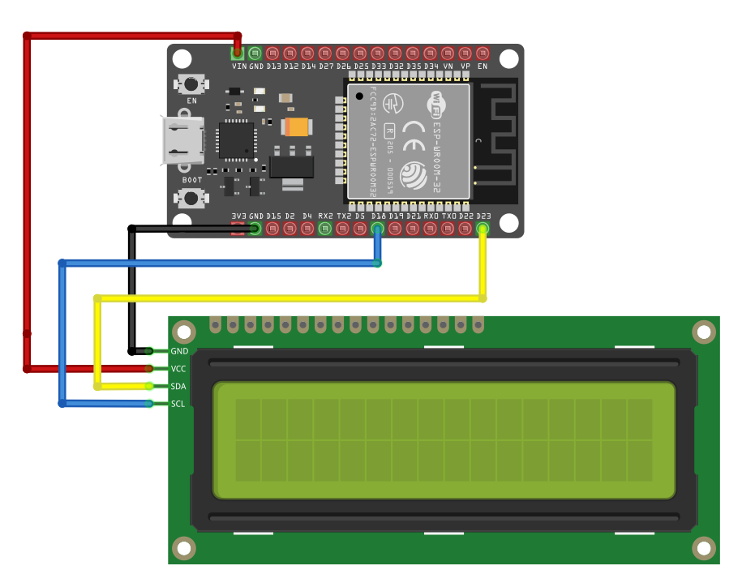

# Circuit

## Connecting LCD Display (LCD1602) to the Raspberry Pi Pico

We will be using parallel interface in 4bit mode. Remaining Pins like D0 to D3 won't be connected.

<table>
  <thead>
    <tr>
      <th style="width: 250px;">LCD Pin</th>
      <th style="width: 250px; text-align: center;">Wire</th>
      <th>ESP32 Pin</th>
      <th>Notes</th>
    </tr>
  </thead>
  <tbody>
    <tr>
      <td>GND</td>
      <td style="text-align: center; vertical-align: middle; padding: 0;">
        

          

          

        

      </td>
      <td>GND</td>
      <td>Ground</td>
    </tr>
    <tr>
      <td>VCC</td>
      <td style="text-align: center; vertical-align: middle; padding: 0;">
        

          

          

        

      </td>
      <td>Vin</td>
      <td>5V Power Supply</td>
    </tr>
    <tr>
      <td>SCL</td>
      <td style="text-align: center; vertical-align: middle; padding: 0;">
        

          

          

        

      </td>
      <td>GPIO 18</td>
      <td>Connects the clock signal (SCL) for I2C communication.</td>
    </tr>
    <tr>
      <td>SDA</td>
      <td style="text-align: center; vertical-align: middle; padding: 0;">
        

          

          

        

      </td>
      <td>GPIO 23</td>
      <td>Connects the data signal (SDA) for I2C communication.</td>
    </tr>
  </tbody>
</table>
 

If you've seen the circuit in the Pico book, you’ll notice how many pins are required for the parallel interface, making the wiring congested. Using I2C variant simplifies the setup and makes it much easier.
