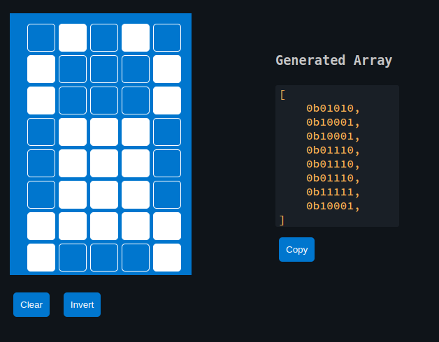

## Ferris on LCD Display

Let's create Ferris (my attempt to make it look like a crab; if you have a better design, feel free to send a pull request) using a single character. In fact, we can combine 4 or 6 adjacent grids to display a single symbol. Creativity is up to you, and you can improve it however you like.

We'll use the custom character generator from the previous page to create this symbol. This will give us the byte array that we can use.



Note that the previous crate hd44780-driver doesn't support custom characters(at the time of writing this chapter). To handle this, we can use the liquid_crystal crate, which allows us to work with custom characters.

## Generate project using esp-generate
We will enable async (Embassy) support for this project.  To create the project, use the `esp-generate` command. Run the following:

```sh
esp-generate --chip esp32 lcd-custom
```

This will open a screen asking you to select options. 

- First, select the option "Enable unstable HAL features.". Only after this, you will be able to select the embassy framework support
- Select the option "Adds embassy framework support."

Just save it by pressing "s" in the keyboard.

## Update Cargo.toml

```toml
liquid_crystal = "0.2.0"
```

## Imports

First add the necessary imports:

```rust
// I2C
use esp_hal::i2c::master::Config as I2cConfig; // for convenience, importing as alias
use esp_hal::i2c::master::I2c;
use esp_hal::time::Rate;

// HD44780 Driver
use liquid_crystal::prelude::*;
use liquid_crystal::LiquidCrystal;
use liquid_crystal::I2C;
```

### Initialize I2C

```rust
let i2c_bus = I2c::new(
        peripherals.I2C0,
        // I2cConfig is alias of esp_hal::i2c::master::I2c::Config
        I2cConfig::default().with_frequency(Rate::from_khz(400)),
    )
    .unwrap()
    .with_scl(peripherals.GPIO18)
    .with_sda(peripherals.GPIO23)
    .into_async();
```

### Initialize the LCD interface

```rust
let mut i2c_interface = I2C::new(i2c_bus, 0x27);
let mut lcd = LiquidCrystal::new(&mut i2c_interface, Bus4Bits, LCD16X2);
lcd.begin(&mut Delay);
```

### Our generated byte array for the custom character

```rust
const FERRIS: [u8; 8] = [
    0b01010, 0b10001, 0b10001, 0b01110, 0b01110, 0b01110, 0b11111, 0b10001,
];
// Define the character
lcd.custom_char(&mut Delay, &FERRIS, 0);
```

### Displaying the character

Displaying the character is straightforward. You just need to use the CustomChar enum and pass the index of the custom character. We've defined only one custom character, which is at position 0.

```rust
lcd.write(&mut Delay, CustomChar(0));
// normal text
lcd.write(&mut Delay, Text(" implRust!"));
```

## Clone the existing project

You can clone (or refer) project I created and navigate to the `lcd-custom` folder.

```sh
git clone https://github.com/ImplFerris/esp32-projects
cd esp32-projects/lcd-custom/
```

## The Full code 

```rust
#![no_std]
#![no_main]
#![deny(
    clippy::mem_forget,
    reason = "mem::forget is generally not safe to do with esp_hal types, especially those \
    holding buffers for the duration of a data transfer."
)]

use defmt::info;
use embassy_executor::Spawner;
use embassy_time::Delay;
use embassy_time::{Duration, Timer};
use esp_hal::clock::CpuClock;
use esp_hal::timer::timg::TimerGroup;
use esp_println as _;

// I2C
use esp_hal::i2c::master::Config as I2cConfig; // for convenience, importing as alias
use esp_hal::i2c::master::I2c;
use esp_hal::time::Rate;

// HD44780 Driver
use liquid_crystal::I2C;
use liquid_crystal::LiquidCrystal;
use liquid_crystal::prelude::*;

#[panic_handler]
fn panic(_: &core::panic::PanicInfo) -> ! {
    loop {}
}

// This creates a default app-descriptor required by the esp-idf bootloader.
// For more information see: <https://docs.espressif.com/projects/esp-idf/en/stable/esp32/api-reference/system/app_image_format.html#application-description>
esp_bootloader_esp_idf::esp_app_desc!();

const FERRIS: [u8; 8] = [
    0b01010, 0b10001, 0b10001, 0b01110, 0b01110, 0b01110, 0b11111, 0b10001,
];

#[esp_rtos::main]
async fn main(spawner: Spawner) -> ! {
    // generator version: 1.0.0

    let config = esp_hal::Config::default().with_cpu_clock(CpuClock::max());
    let peripherals = esp_hal::init(config);

    let timg0 = TimerGroup::new(peripherals.TIMG0);
    esp_rtos::start(timg0.timer0);

    info!("Embassy initialized!");

    let _ = spawner;

    let i2c_bus = I2c::new(
        peripherals.I2C0,
        // I2cConfig is alias of esp_hal::i2c::master::I2c::Config
        I2cConfig::default().with_frequency(Rate::from_khz(400)),
    )
    .unwrap()
    .with_scl(peripherals.GPIO18)
    .with_sda(peripherals.GPIO23)
    .into_async();

    let mut i2c_interface = I2C::new(i2c_bus, 0x27);
    let mut lcd = LiquidCrystal::new(&mut i2c_interface, Bus4Bits, LCD16X2);
    lcd.begin(&mut Delay);

    // Define the character
    lcd.custom_char(&mut Delay, &FERRIS, 0);

    lcd.write(&mut Delay, CustomChar(0));
    lcd.write(&mut Delay, Text(" implRust!"));

    loop {
        info!("Hello world!");
        Timer::after(Duration::from_secs(1)).await;
    }
}
````
