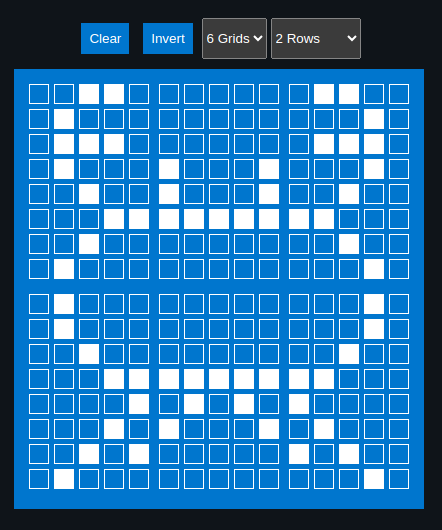

## Multi Custom character

In this exercise, we'll display the Ferris image generated with the help of the multi generator. I will not be repeating the project creation steps here. You can either follow the previous chapter steps or just clone the previous chapter project and work on top of that.

I have created the Ferris image using 6 adjacent grids with the generator from the previous page. Here’s the Rust code to utilize those byte arrays.



### Generated Byte array for the characters
```rust
const SYMBOL1: [u8; 8] = [
    0b00110, 0b01000, 0b01110, 0b01000, 0b00100, 0b00011, 0b00100, 0b01000,
];

const SYMBOL2: [u8; 8] = [
    0b00000, 0b00000, 0b00000, 0b10001, 0b10001, 0b11111, 0b00000, 0b00000,
];

const SYMBOL3: [u8; 8] = [
    0b01100, 0b00010, 0b01110, 0b00010, 0b00100, 0b11000, 0b00100, 0b00010,
];

const SYMBOL4: [u8; 8] = [
    0b01000, 0b01000, 0b00100, 0b00011, 0b00001, 0b00010, 0b00101, 0b01000,
];

const SYMBOL5: [u8; 8] = [
    0b00000, 0b00000, 0b00000, 0b11111, 0b01010, 0b10001, 0b00000, 0b00000,
];

const SYMBOL6: [u8; 8] = [
    0b00010, 0b00010, 0b00100, 0b11000, 0b10000, 0b01000, 0b10100, 0b00010,
];
```

### Declare them as character
```rust
lcd.custom_char(&mut Delay, &SYMBOL1, 0);
lcd.custom_char(&mut Delay, &SYMBOL2, 1);
lcd.custom_char(&mut Delay, &SYMBOL3, 2);
lcd.custom_char(&mut Delay, &SYMBOL4, 3);
lcd.custom_char(&mut Delay, &SYMBOL5, 4);
lcd.custom_char(&mut Delay, &SYMBOL6, 5);
```

### Display
Let’s write the first 3 grids into the first row, then the second half into the second row of the LCD display.

```rust
lcd.set_cursor(&mut Delay, 0, 4)
    .write(&mut Delay, CustomChar(0))
    .write(&mut Delay, CustomChar(1))
    .write(&mut Delay, CustomChar(2));

lcd.set_cursor(&mut Delay, 1, 4)
    .write(&mut Delay, CustomChar(3))
    .write(&mut Delay, CustomChar(4))
    .write(&mut Delay, CustomChar(5));
```


## Clone the existing project
You can clone (or refer) project I created and navigate to the `lcd-custom-multi` folder.

```sh
git clone https://github.com/ImplFerris/esp32-projects
cd esp32-projects/lcd-custom-multi/
```


## The Full code

```rust
#![no_std]
#![no_main]
#![deny(
    clippy::mem_forget,
    reason = "mem::forget is generally not safe to do with esp_hal types, especially those \
    holding buffers for the duration of a data transfer."
)]

use defmt::info;
use embassy_executor::Spawner;
use embassy_time::Delay;
use embassy_time::{Duration, Timer};
use esp_hal::clock::CpuClock;
use esp_hal::timer::timg::TimerGroup;
use esp_println as _;

// I2C
use esp_hal::i2c::master::Config as I2cConfig; // for convenience, importing as alias
use esp_hal::i2c::master::I2c;
use esp_hal::time::Rate;

// HD44780 Driver
use liquid_crystal::I2C;
use liquid_crystal::LiquidCrystal;
use liquid_crystal::prelude::*;

#[panic_handler]
fn panic(_: &core::panic::PanicInfo) -> ! {
    loop {}
}

// This creates a default app-descriptor required by the esp-idf bootloader.
// For more information see: <https://docs.espressif.com/projects/esp-idf/en/stable/esp32/api-reference/system/app_image_format.html#application-description>
esp_bootloader_esp_idf::esp_app_desc!();

const SYMBOL1: [u8; 8] = [
    0b00110, 0b01000, 0b01110, 0b01000, 0b00100, 0b00011, 0b00100, 0b01000,
];

const SYMBOL2: [u8; 8] = [
    0b00000, 0b00000, 0b00000, 0b10001, 0b10001, 0b11111, 0b00000, 0b00000,
];

const SYMBOL3: [u8; 8] = [
    0b01100, 0b00010, 0b01110, 0b00010, 0b00100, 0b11000, 0b00100, 0b00010,
];

const SYMBOL4: [u8; 8] = [
    0b01000, 0b01000, 0b00100, 0b00011, 0b00001, 0b00010, 0b00101, 0b01000,
];

const SYMBOL5: [u8; 8] = [
    0b00000, 0b00000, 0b00000, 0b11111, 0b01010, 0b10001, 0b00000, 0b00000,
];

const SYMBOL6: [u8; 8] = [
    0b00010, 0b00010, 0b00100, 0b11000, 0b10000, 0b01000, 0b10100, 0b00010,
];

#[esp_rtos::main]
async fn main(spawner: Spawner) -> ! {
    // generator version: 1.0.0

    let config = esp_hal::Config::default().with_cpu_clock(CpuClock::max());
    let peripherals = esp_hal::init(config);

    let timg0 = TimerGroup::new(peripherals.TIMG0);
    esp_rtos::start(timg0.timer0);

    info!("Embassy initialized!");

    let _ = spawner;

    let i2c_bus = I2c::new(
        peripherals.I2C0,
        // I2cConfig is alias of esp_hal::i2c::master::I2c::Config
        I2cConfig::default().with_frequency(Rate::from_khz(400)),
    )
    .unwrap()
    .with_scl(peripherals.GPIO18)
    .with_sda(peripherals.GPIO23)
    .into_async();

    let mut i2c_interface = I2C::new(i2c_bus, 0x27);
    let mut lcd = LiquidCrystal::new(&mut i2c_interface, Bus4Bits, LCD16X2);
    lcd.begin(&mut Delay);

    // Define the characters
    lcd.custom_char(&mut Delay, &SYMBOL1, 0);
    lcd.custom_char(&mut Delay, &SYMBOL2, 1);
    lcd.custom_char(&mut Delay, &SYMBOL3, 2);
    lcd.custom_char(&mut Delay, &SYMBOL4, 3);
    lcd.custom_char(&mut Delay, &SYMBOL5, 4);
    lcd.custom_char(&mut Delay, &SYMBOL6, 5);

    lcd.set_cursor(&mut Delay, 0, 4)
        .write(&mut Delay, CustomChar(0))
        .write(&mut Delay, CustomChar(1))
        .write(&mut Delay, CustomChar(2));

    lcd.set_cursor(&mut Delay, 1, 4)
        .write(&mut Delay, CustomChar(3))
        .write(&mut Delay, CustomChar(4))
        .write(&mut Delay, CustomChar(5));

    loop {
        Timer::after(Duration::from_secs(1)).await;
    }
}
```
