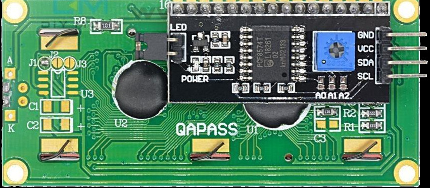

## Pin Layout

The I2C variant of LCD module has a total of 4 pins.

 

<table border="1" style="border-collapse: collapse; width: 100%; text-align: center;">
  <thead>
    <tr>
      <th>Pin</th>
      <th>Label</th>
      <th>Description</th>
    </tr>
  </thead>
  <tbody>
    <tr>
      <td>1</td>
      <td>VCC</td>
      <td>Power supply (typically 5V)</td>
    </tr>
    <tr>
      <td>2</td>
      <td>GND</td>
      <td>Ground</td>
    </tr>
    <tr>
      <td>3</td>
      <td>SDA</td>
      <td>Serial Data Line for I2C communication</td>
    </tr>
    <tr>
      <td>4</td>
      <td>SCL</td>
      <td>Serial Clock Line for I2C communication</td>
    </tr>
  </tbody>
</table>

