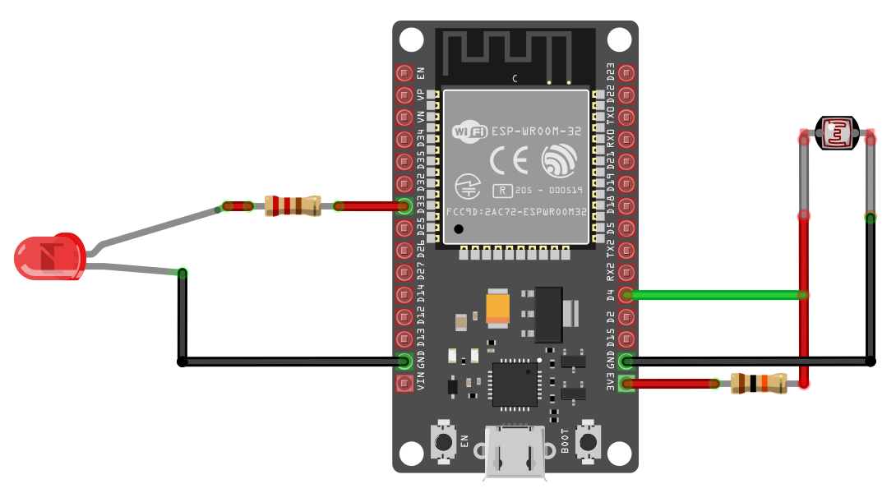

## Turn on LED(or Lamp) in low Light with Pico 

In this exercise, we'll control an LED based on ambient light levels. The goal is to automatically turn on the LED in low light conditions. 

You can try this in a closed room by turning the room light on and off. When you turn off the room-light, the LED should turn on, given that the room is dark enough, and turn off again when the room-light is switched back on. Alternatively, you can adjust the sensitivity threshold or cover the light sensor (LDR) with your hand or some object to simulate different light levels.

Note: You may need to adjust the ADC threshold based on your room's lighting conditions and the specific LDR you are using.

## Hardware Requirements

- **LED** – Any standard LED (choose your preferred color).
- **LDR (Light Dependent Resistor)** – Used to detect light intensity.
- **Resistors**
  - **330Ω** – For the LED to limit current and prevent damage. (You might have to choose based on your LED)
  - **10kΩ** – For the LDR, forming a voltage divider in the circuit. 
- **Jumper Wires** – For connecting components on a breadboard or microcontroller.

## Circuit to connect LED, LDR with ESP32

**Connecting LDR with ESP32**:

1. **One side of the LDR** is connected to Ground
2. The **other side of the LDR** is connected to **GPIO 4 (ADC2)** (i.e. D4 in the Devkit)
3. A **resistor** is connected in series with the LDR to create a voltage divider between the LDR and **3v3**. 

**Connecting LED with ESP32**:

This is the usual setup we have done before. You have to connect the cathode (short leg) of the LED to the ground. Then you have to connect the anode (long leg) in series with a 330 Ohm resistor to GPIO 33 (i.e D33 on the Devkit).

