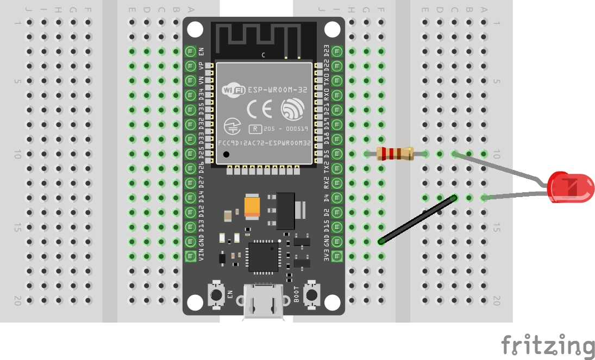

# Using external LED

You can do the same fading effect with external LED. 

## Hardware Requirements

- External LED
- Resistor (330 Ohms)
- Jumper wires (optional)
- Breadboard (optional) - You might need two breadboards to fit the ESP32 devkit properly, as it's quite wide. I bought two small breadboards and placed one side of the ESP32 on each.


## Circuit
- Connect the anode (longer leg) of the external LED to ESP32's GPIO 5 through the 330-ohm resistor
- Connect the cathode (shorter leg) of the LED  to the ground (GND) pin of the ESP32
<br/><br/>



## Code changes

In the code, all you have to do is change the GPIO number from 2 to 5.

```rust
let led = peripherals.GPIO5;
```

## High speed channel

There's no fun in just changing one line. Let's use high-speed channel this time. To do that, we have to pass `HighSpeed` struct and update the clock source to use the `HSClockSource` enum.

```rust
let ledc = Ledc::new(peripherals.LEDC);

let mut hstimer0 = ledc.timer::<HighSpeed>(timer::Number::Timer0);
hstimer0
    .configure(timer::config::Config {
        duty: timer::config::Duty::Duty5Bit,
        clock_source: timer::HSClockSource::APBClk,
        frequency: Rate::from_khz(24),
    })
    .unwrap();
```


## Clone the existing project
You can also clone (or refer) project I created and navigate to the `led-highfader` folder.

```sh
git clone https://github.com/ImplFerris/esp32-projects
cd esp32-projects/led-highfader
```

## The Full code

```rust
#![no_std]
#![no_main]
#![deny(
    clippy::mem_forget,
    reason = "mem::forget is generally not safe to do with esp_hal types, especially those \
    holding buffers for the duration of a data transfer."
)]

use esp_hal::clock::CpuClock;
use esp_hal::gpio::DriveMode;
use esp_hal::main;
use esp_hal::time::Rate;

// For LEDC
use esp_hal::ledc::channel::ChannelIFace;
use esp_hal::ledc::timer::TimerIFace;
use esp_hal::ledc::{HighSpeed, Ledc, channel, timer};

#[panic_handler]
fn panic(_: &core::panic::PanicInfo) -> ! {
    loop {}
}

// This creates a default app-descriptor required by the esp-idf bootloader.
// For more information see: <https://docs.espressif.com/projects/esp-idf/en/stable/esp32/api-reference/system/app_image_format.html#application-description>
esp_bootloader_esp_idf::esp_app_desc!();

#[main]
fn main() -> ! {
    // generator version: 1.0.0

    let config = esp_hal::Config::default().with_cpu_clock(CpuClock::max());
    let peripherals = esp_hal::init(config);

    // let led = peripherals.GPIO2;
    let led = peripherals.GPIO5;

    let ledc = Ledc::new(peripherals.LEDC);

    let mut hstimer0 = ledc.timer::<HighSpeed>(timer::Number::Timer0);
    hstimer0
        .configure(timer::config::Config {
            duty: timer::config::Duty::Duty5Bit,
            clock_source: timer::HSClockSource::APBClk,
            frequency: Rate::from_khz(24),
        })
        .unwrap();

    let mut channel0 = ledc.channel(channel::Number::Channel0, led);
    channel0
        .configure(channel::config::Config {
            timer: &hstimer0,
            duty_pct: 10,
            drive_mode: DriveMode::PushPull,
        })
        .unwrap();

    loop {
        channel0.start_duty_fade(0, 100, 1000).unwrap();
        while channel0.is_duty_fade_running() {}
        channel0.start_duty_fade(100, 0, 1000).unwrap();
        while channel0.is_duty_fade_running() {}
    }
}
```
