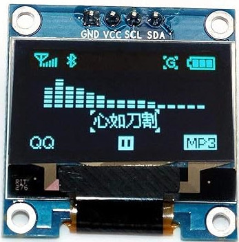

# OLED Display with ESP32

So far, we've been printing output to the system console. While that's fine for debugging, it's not ideal for real-world use cases. If you're reading sensor data, like temperature, or need to show messages to a user (or yourself), a display is the way to go. Options like LCD and OLED are commonly used. 

OLED displays consume less power and offer better performance than LCDs since they don't require a backlight. They provide high contrast and superior image quality compared to LCDs. In this section, we'll learn how to use an OLED display module with the ESP32. 

## Meet the Hardware

OLED, short for Organic Light-Emitting Diode, is a popular display module. These displays come in various sizes and can support different colors. They communicate using either the I²C or SPI protocol.

For this exercise, we'll use a 0.96-inch OLED monochrome module with a resolution of 128 x 64. It operates at 3.3V. We can communicate using I2C communication protocol.

Note: Most of the time, OLED displays come with pin headers included but not soldered. Soldering is a valuable skill to learn, but it requires care and preparation. Before attempting it, watch plenty of tutorials and do your research. It may feel challenging at first, but with practice, it gets easier. If you're not comfortable soldering yet, consider looking for a pre-soldered version of the display, though it may cost slightly more.

### SSD1306

The SSD1306 is the integrated controller chip that powers many small OLED displays including the module we are going to use(0.96-inch 128x64 module).  This controller handles the communication between the ESP32 and the OLED panel, enabling the display to show text, graphics, and more.

**DataSheet:**  You can find the datasheet for SSD1306 [here](https://cdn-shop.adafruit.com/datasheets/SSD1306.pdf).
