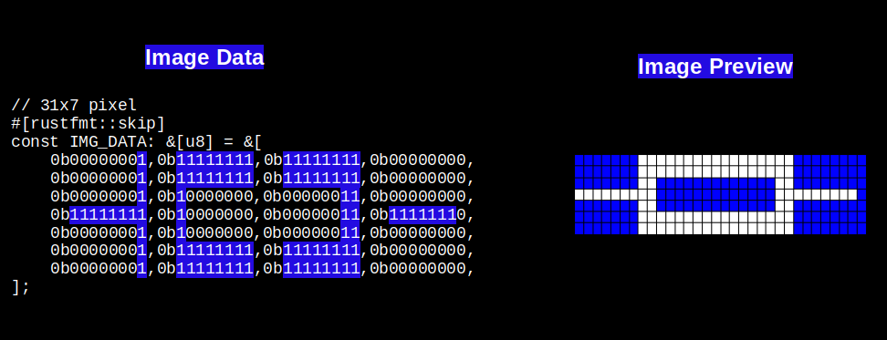

## Using Multiple Bytes to Represent Wider Pixel Widths

In the previous example, we kept it simple by using an 8-pixel wide image, allowing each row to be represented by a single byte. However, in real scenarios, we might need more pixels. So, how do we represent them? We can use multiple bytes to represent wider pixel widths. But, hold on;if we do that, how will the system differentiate between columns and rows?

This is exactly why we need to specify the exact width in the embedded graphics crate. By specifying the width, the system knows how many array entries to use to represent the width. Based on this width size (and the image format), the system can then determine the height.

For example, let's consider an image with a resolution of 31x7 pixels. The width is 31 pixels, and each pixel is represented by 1 bit. To represent the 31 pixels in terms of bytes, we need to calculate how many bytes are required. Since a byte is 8 bits, we divide the total number of pixels (31) by 8. This gives us 3 full bytes to represent 24 pixels, and we need an additional byte to store the remaining 7 pixels. Therefore, 4 bytes are required to represent the 31 pixels.



The embedded graphics crate uses this snippet internally to calculate the height. We won't be including this code in our own, but I’m showing it here for reference to demonstrate how it works internally:

```rust
let height = data.len() / bytes_per_row(width, C::Raw::BITS_PER_PIXEL);
//...
//...
const fn bytes_per_row(width: u32, bits_per_pixel: usize) -> usize {
    (width as usize * bits_per_pixel + 7) / 8
}
```
Here, the length of the data is 28 (array entries), the bits per pixel is 1, and the image width is 31. If you apply the logic, you'll get bytes_per_row as 4 and the height as 7.

You can run the following code here itself or in the Rust Playground to understand the logic behind it:
```rust
// 31x7 pixel
#[rustfmt::skip]
const IMG_DATA: &[u8] = &[
    // 1st row
    0b00000001,0b11111111,0b11111111,0b00000000,
    // 2nd row
    0b00000001,0b11111111,0b11111111,0b00000000,
    //3rd row
    0b00000001,0b10000000,0b00000011,0b00000000,
    //4th row
    0b11111111,0b10000000,0b00000011,0b11111110,
    //5th row
    0b00000001,0b10000000,0b00000011,0b00000000,
    //6th row
    0b00000001,0b11111111,0b11111111,0b00000000,
    //7th row
    0b00000001,0b11111111,0b11111111,0b00000000,
];

const fn bytes_per_row(width: u32, bits_per_pixel: usize) -> usize {
    (width as usize * bits_per_pixel + 7) / 8
}

fn main(){
    const BITS_PER_PIXEL: usize = 1;
    let width = 31;
    let data = IMG_DATA;
    
    println!("Bytes Per Row:{}", bytes_per_row(width,BITS_PER_PIXEL));
    let height = data.len() / bytes_per_row(width, BITS_PER_PIXEL);
    println!("Height: {}", height);
}
```

