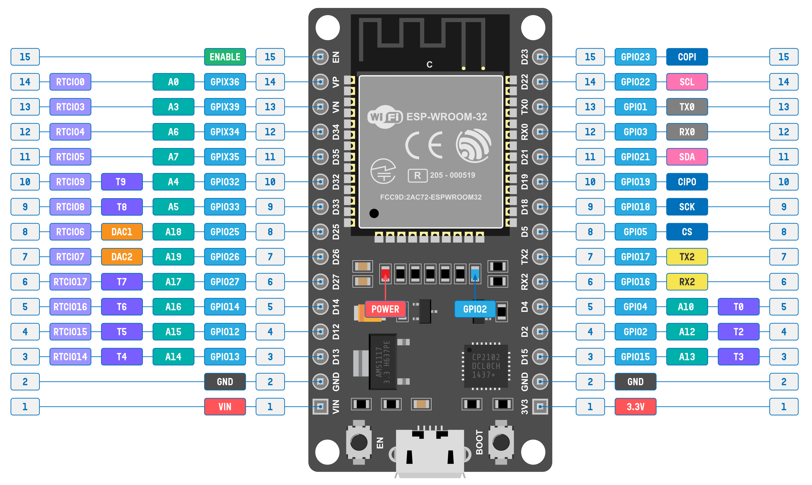

# ESP32 Pinout

Credit: [CC-BY-SA 4.0](https://www.circuitstate.com/pinouts/doit-esp32-devkit-v1-wifi-development-board-pinout-diagram-and-reference/)

The above pinout diagram is created by the CircuitState website. They have provided detailed explanations for each pin. You can check it out [here](https://www.circuitstate.com/pinouts/doit-esp32-devkit-v1-wifi-development-board-pinout-diagram-and-reference/).

Disclaimer: This book is not affiliated with nor associated with CircuitState. I am including this diagram as i found it helpful during my research. 
