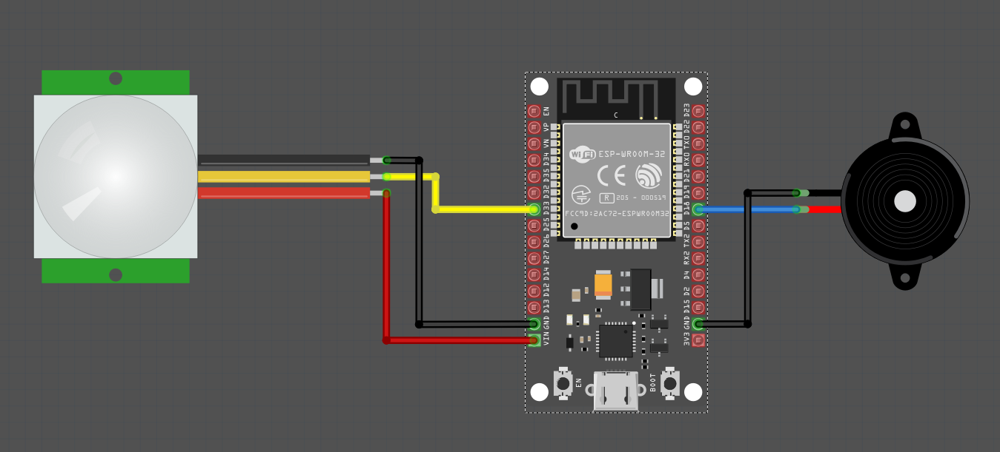

# Building a Simple Burglar Alarm with ESP32, PIR Sensor, and Rust

Let’s make a simple burglar alarm that activates the buzzer for a short time before turning it off.  We also turn on the on-board LED, which is connected to GPIO2. Feel free to adjust it to suit your needs!

## Hardware requirements

- Active Buzzer 
- PIR Sensor
- Jumper wires

## Circuit

The PIR sensor connection is the same as before (see [circuit](./circuit.md)). We connect the middle output pin of the sensor to GPIO 33.

### Buzzer Pin Connection: 
<table style="margin-bottom:20px">
  <thead>
    <tr>
      <th>ESP32 Pin</th>
      <th style="width: 250px; margin: 0 auto;">Wire</th>
      <th>Buzzer Pin</th>
    </tr>
  </thead>
  <tbody>
    <tr>
      <td>GPIO 18</td>
      <td style="text-align: center; vertical-align: middle; padding: 0;">
        <div class="wire blue" style="width: 200px; margin: 0 auto;">
          <div class="male-left"></div>
          <div class="male-right"></div>
        </div>
      </td>
      <td>Positive Pin</td>
    </tr>
    <tr>
      <td>GND</td>
      <td style="text-align: center; vertical-align: middle; padding: 0;">
        <div class="wire black" style="width: 200px; margin: 0 auto;">
          <div class="male-left"></div>
          <div class="male-right"></div>
        </div>
      </td>
      <td>Negative Pin</td>
    </tr>
  </tbody>
</table>





## Buzzer and LED Pins

We'll set up GPIO 18 as an Output pin with an initial Low state for the active buzzer. The onboard LED, connected to GPIO 2, will also be configured as an Output pin with an initial Low state.

```rust
let mut buzzer_pin = Output::new(peripherals.GPIO18, Level::Low);
let mut led = Output::new(peripherals.GPIO2, Level::Low);
```

## The Logic

The logic is similar to the previous code. However, this time, instead of just printing a message when motion is detected (i.e., when the sensor pin is High), we'll turn the buzzer and LED on for a brief moment and then turn them off.

```rust
loop {
    if sensor_pin.is_high() {
        buzzer_pin.set_high();
        led.set_high();
        delay.delay(100.millis());
        buzzer_pin.set_low();
        led.set_low();
    }
    delay.delay(100.millis());
}
```


## Clone the existing project
You can clone (or refer) project I created and navigate to the `burglar-alarm` folder.

```sh
git clone https://github.com/ImplFerris/esp32-projects
cd esp32-projects/burglar-alarm
```


## The Full code

```rust
#![no_std]
#![no_main]

use esp_backtrace as _;
use esp_hal::delay::Delay;
use esp_hal::gpio::{Input, Level, Output, Pull};
use esp_hal::prelude::*;

#[entry]
fn main() -> ! {
    let peripherals = esp_hal::init({
        let mut config = esp_hal::Config::default();
        config.cpu_clock = CpuClock::max();
        config
    });

    esp_println::logger::init_logger_from_env();

    let sensor_pin = Input::new(peripherals.GPIO33, Pull::Down);

    let mut buzzer_pin = Output::new(peripherals.GPIO18, Level::Low);
    let mut led = Output::new(peripherals.GPIO2, Level::Low);

    let delay = Delay::new();
    loop {
        if sensor_pin.is_high() {
            buzzer_pin.set_high();
            led.set_high();
            delay.delay(100.millis());
            buzzer_pin.set_low();
            led.set_low();
        }
        delay.delay(100.millis());
    }
}
```
