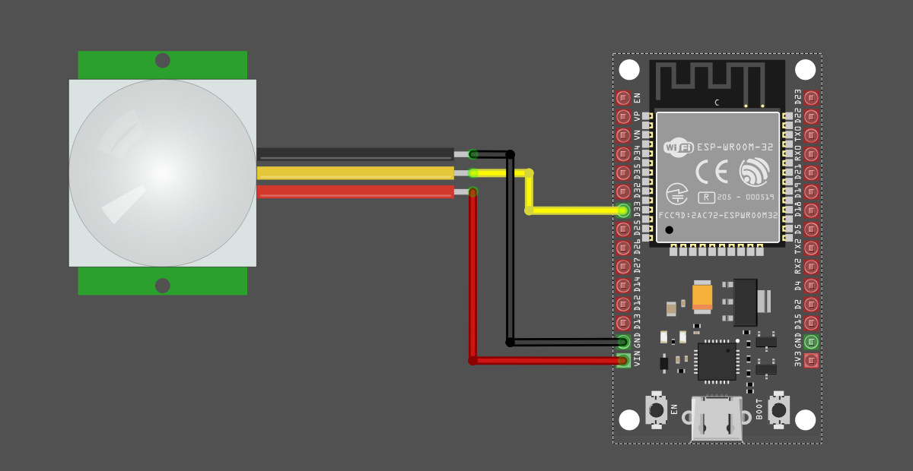

## HC-SR501 Pinout

The output pin is easy to spot since it's right in the middle.

If you're unsure which pin is Ground and which is VCC, you can remove the white dome to check.  You can also identify it by looking for the pin next to the protection diode-that's the VCC pin.

## Connecting PIR Sensor with ESP32

The sensor operates at 5V, but the ESP32 GPIO pins are 3.3V tolerant. The PIR sensor module outputs 3.3V when motion is detected, so it can be directly connected to the GPIO without any issues. Otherwise, you will need a voltage divider to reduce the voltage to 3.3V.  

<table style="margin-bottom:20px">
  <thead>
    <tr>
      <th>ESP32 Pin</th>
      <th style="width: 250px; margin: 0 auto;">Wire</th>
      <th>PIR Sensor Pin</th>
    </tr>
  </thead>
  <tbody>
    <tr>
      <td>GPIO 33</td>
      <td style="text-align: center; vertical-align: middle; padding: 0;">
        

          

          

        

      </td>
      <td>OUT (middle pin)</td>
    </tr>
    <tr>
      <td>5V</td>
      <td style="text-align: center; vertical-align: middle; padding: 0;">
        

          

          

        

      </td>
      <td>VCC</td>
    </tr>
    <tr>
      <td>GND</td>
      <td style="text-align: center; vertical-align: middle; padding: 0;">
        

          

          

        

      </td>
      <td>GND</td>
    </tr>
  </tbody>
</table>
 

