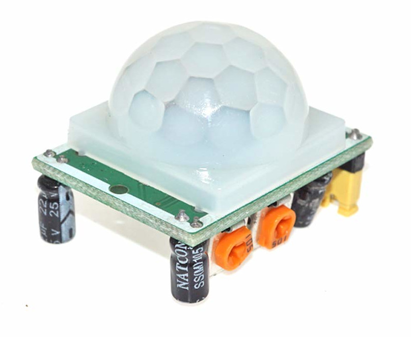

# PIR Sensor

Ever walked into a room and had the lights turn on automatically? That's probably a PIR sensor at work.

In earlier chapter, we used an [ultrasonic sensor](../ultrasonic/index.md) to check if a person or object was near the sensor. It works by sending ultrasonic waves and measuring the distance to an object.  The PIR sensor, however, works differently; instead of measuring distance, it detects motion.

The PIR sensor is called "passive" Infrared because it does not emit any infrared radiation; instead, it only detects changes in infrared radiation from the environment. It senses heat emitted by people, animals, and other warm objects. When movement occurs within its detection area, the sensor picks up the change and sends a signal. This makes it useful for automatic lighting, burglar alarms, and other motion-detection systems.

## Meet the Hardware

We will use the **HC-SR501** PIR sensor module. It has an onboard pyroelectric sensor that helps to detect movement, and a dome-shaped Fresnel lens that helps to increase the range of detection.  It can work with a power supply of 5V to 12V.

The PIR sensor module comes with three pins: one for power, one for output (middle pin), and one for ground. It's easy to use because it provides a simple output. By default, the signal stays LOW, when no motion is detected. But the moment someone moves within its range, the output jumps to HIGH, signaling motion detection.

## Resources

The PIR sensor module is built around the BISS0001 controller. Here are some datasheets related to the BISS0001 controller.

- [https://cdn-learn.adafruit.com/assets/assets/000/010/133/original/BISS0001.pdf](https://cdn-learn.adafruit.com/assets/assets/000/010/133/original/BISS0001.pdf)
- [http://www.sc-tech.cn/en/BISS0001.pdf](http://www.sc-tech.cn/en/BISS0001.pdf)

If you want to learn how PIR sensors work internally, you can check out this guide:  
[How PIRs Work](https://learn.adafruit.com/pir-passive-infrared-proximity-motion-sensor/how-pirs-work).  We won't cover this in the book since it's beyond scope of this book. Our focus is simply on detecting motion and sending the signal to the ESP32.  
