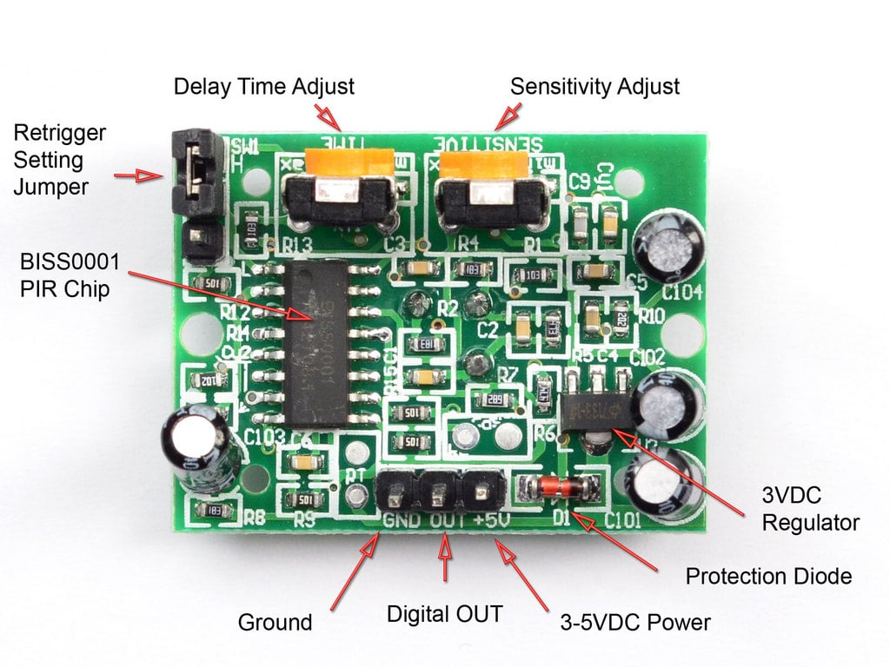
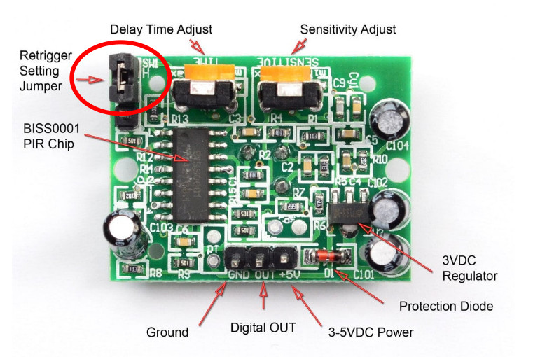

## Adjusting the PIR Sensor Settings  

Image Credit: <a href="https://learn.adafruit.com/pir-passive-infrared-proximity-motion-sensor/overview">Adafruit</a>

The PIR sensor module comes with two built-in potentiometers that allow you to fine-tune its behavior: Delay Time and Sensitivity. These small adjustment knobs let you control how the sensor responds to motion, making it more adaptable to different environments and applications.  

### Delay Time (Output Duration)  
This setting determines how long the sensor’s output remains HIGH after detecting motion. A longer delay is useful for applications like automatic lighting, where you want the light to stay on for a while after movement is detected.  

- **Turn clockwise** to increase the duration (up to ~200 seconds).  
- **Turn counterclockwise** to decrease the duration (down to ~5 seconds).  

### Sensitivity (Detection Range)
This setting controls how far the sensor can detect motion. Higher sensitivity allows the sensor to pick up movement from a greater distance, while lower sensitivity reduces the detection range to prevent false triggers in small areas.  

- **Turn clockwise** to extend the range (up to ~7 meters).  
- **Turn counterclockwise** to shorten the range (down to ~3 meters).  

**Note:**

To be frank, the code we're about to write is very simple. The most challenging part for me was figuring out the direction. I knew it was clockwise (and counterclockwise), but I wasn't sure if the sensor should point up or down. The key is to hold the sensor with the dome side facing up, and then follow the clockwise and counterclockwise instructions from there.

## Jumper Setting

Aside from the pot knobs, you've got jumper settings to tweak. They let you switch between two modes: Retriggering and Non-Retriggering.

### Retriggering Mode (H)
In this mode, the output stays HIGH as long as motion is detected. If more motion happens before the timer ends, it resets. Perfect for situations like lights turning on when someone's in the room and staying on as long as there's movement.

### Non-Retriggering Mode (L)
Here, the output stays HIGH once motion is detected but won't trigger again until the delay time is up. Perfect for things like counting people as they pass through a door, where you need each detection to be a separate event.

### How to Set the Jumper
To switch modes, just move the jumper (the small black/yellow box - yes, you can remove it and place it between two pins) to the H pins for Retriggering or the L pins for Non-Retriggering
