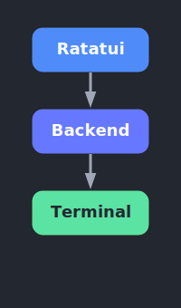
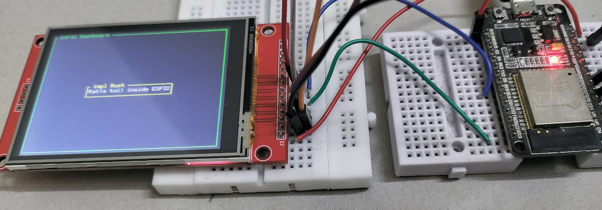

# Hello, Rat (Using the `ili9341` crate)

In this chapter, we'll write a simple program to get started with Ratatui. We will only show the basics here to see how it works.

## Prerequisites

- You'll need a TFT Display for this chapter. If you haven't completed the [TFT Display chapter](../../tft-display/index.md), I recommend finishing that first and then coming back here. Since the circuit connections between the TFT Display and ESP32 are already explained there, we won't repeat those instructions here.​

- Ratatui has a nice [tutorial to get started](https://ratatui.rs/tutorials/hello-ratatui/) for building TUI apps. If you already know Ratatui, this exercise is pretty simple - just gluing things together. If you're new, check out the official Ratatui tutorials later to get familiar with the basics and build better UIs.


## Generate project using esp-generate

To create the project, use the `esp-generate` command. Run the following:

```sh
esp-generate --chip esp32 hello-rat
```

This will open a screen asking you to select options. Ratatui requires heap allocation, so we will enable "unstable" and "alloc" features. 

- First, select the option "Enable unstable HAL features."
- Select the option "Enable allocations via the esp-alloc crate."

Optionally, you can enable the logging feature also

- So, scroll to "Flashing, logging and debugging (espflash)" and hit Enter.
- Then, Select "Use defmt to print messages".

Just save it by pressing "s" in the keyboard.

## Dependencies

First, let's update the Cargo.toml file with the dependencies we need to control the TFT display. We've already gone over these earlier in the TFT display section. 

```toml
embedded-hal-bus = { version = "0.3" }
display-interface-spi = "0.5"
ili9341 = "0.6.0"
embedded-graphics = "0.8.1"
```

> Note: while this example uses the `ili9341` crate for interacting with the TFT Display, you can use `mousefood` with any display driver crate that implements the embedded-graphics traits.

Now, let's add the ratatui and mousefood crates, which let us use ratatui in an embedded environment. 

```toml
mousefood = { git = "https://github.com/j-g00da/mousefood", rev = "cc9f8fe372f09342537bc31a1355f77f2693d70b", default-features = false, features = [
  "fonts",
] }
ratatui = { version = "0.30.0-alpha.5", default-features = false }
```

For no_std support, you'll need the latest mousefood code from GitHub and a compatible ratatui alpha version for now. 

## Imports

Let's bring in all the necessary crates and modules for setting up and controlling our TFT display. We'll import everything for graphics rendering with `embedded-graphics`, SPI communication through `esp-hal`, and the `ili9341` display driver. Finally, we'll include the ratatui related imports.

```rust
// Embedded Graphics related
use embedded_graphics::pixelcolor::Rgb565;
use embedded_graphics::prelude::*;

// ESP32 SPI + Display Driver bridge
use esp_hal::delay::Delay;
use esp_hal::spi::master::Config as SpiConfig;
use esp_hal::spi::master::Spi;
use esp_hal::spi::Mode as SpiMode;
use esp_hal::time::Rate; // For specifying SPI frequency
use display_interface_spi::SPIInterface;
use embedded_hal_bus::spi::ExclusiveDevice;
use ili9341::{DisplaySize240x320, Ili9341, Orientation};

// For managing GPIO state
use esp_hal::gpio::{Level, Output, OutputConfig};

// For ratatui
use mousefood::{EmbeddedBackend, EmbeddedBackendConfig};
use ratatui::layout::{Constraint, Flex, Layout};
use ratatui::widgets::{Block, Paragraph, Wrap};
use ratatui::{style::*, Frame, Terminal};
```

## Initialize TFT Display Driver

Let's initialize the TFT display by first setting up the SPI interface, then creating and configuring the display instance.

```rust
// Initialize SPI
  let spi = Spi::new(
      peripherals.SPI2,
      SpiConfig::default()
          .with_frequency(Rate::from_mhz(60))
          .with_mode(SpiMode::_0),
  )
  .unwrap()
  //CLK
  .with_sck(peripherals.GPIO18)
  //DIN
  .with_mosi(peripherals.GPIO23);
  let cs = Output::new(peripherals.GPIO15, Level::Low, OutputConfig::default());
  let dc = Output::new(peripherals.GPIO2, Level::Low, OutputConfig::default());
  let reset = Output::new(peripherals.GPIO4, Level::Low, OutputConfig::default());

  let spi_dev = ExclusiveDevice::new_no_delay(spi, cs).unwrap();
  let interface = SPIInterface::new(spi_dev, dc);

  let mut display = Ili9341::new(
      interface,
      reset,
      &mut Delay::new(),
      Orientation::Landscape,
      DisplaySize240x320,
  )
  .unwrap();
  display.clear(Rgb565::BLACK).unwrap();
```

## Backends in Ratatui

Ratatui doesn't directly communicate with your screen. Instead, it uses an intermediary called a "backend" to handle all the low-level terminal operations. Think of the backend as a translator between Ratatui's high-level drawing commands and the actual terminal or display hardware.

Ratatui supports different backends, which makes it flexible enough to work in various environments. By default, it uses Crossterm as its backend for traditional terminal emulators. However, this isn't applicable for embedded systems. We need a backend that works in embedded environments. That's where mousefood crates comes in, it provide us Embedded Backend.

This backend allows Ratatui to render to LCD screens on microcontrollers, e-ink displays, small OLED screens, and any other display hardware that has support for the embedded-graphics library.



You can find more details on the Ratatui backends [here](https://ratatui.rs/concepts/backends/).

To make Ratatui use the mousefood Embedded Backend, you first initialize the EmbeddedBackend with a mutable reference to your display and default configuration, like this:

```rust
let backend = EmbeddedBackend::new(&mut display, EmbeddedBackendConfig::default());
```

Then, you create the Ratatui Terminal with this backend:

```rust
let mut terminal = Terminal::new(backend).unwrap();
```

## Draw Function

We will define the draw function which sets up the layout and visual elements of our UI frame. We begin by creating an outer green-bordered block titled "ESP32 Dashboard" that surrounds the entire interface. Within this block, we organize the layout first vertically and then horizontally to structure the content areas. 

We then create a paragraph widget displaying the text "Rat(a tui) inside ESP32,".  We wrap this paragraph in a yellow-bordered block titled " impl Rust " and render it at the centered position we defined with our layouts.

```rust
fn draw(frame: &mut Frame) {

    let outer_block = Block::bordered()
        .border_style(Style::new().green())
        .title(" ESP32 Dashboard ");
    frame.render_widget(outer_block, frame.area());

    let vertical_layout = Layout::vertical([Constraint::Length(3)])
        .flex(Flex::Center)
        .split(frame.area());

    let horizontal_layout = Layout::horizontal([Constraint::Length(25)])
        .flex(Flex::Center)
        .split(vertical_layout[0]);

    let text = "Rat(a tui) inside ESP32";
    let paragraph = Paragraph::new(text.dark_gray())
        .wrap(Wrap { trim: true })
        .centered();

    let bordered_block = Block::bordered()
        .border_style(Style::new().yellow())
        .title(" impl Rust ");

    frame.render_widget(paragraph.block(bordered_block), horizontal_layout[0]);
}
```

## Rendering

We finally call Ratatui's draw method, passing our draw function to render the UI to the display.

```rust
loop {
  terminal.draw(draw).unwrap();
}
```

## The Full code

```rust
#![no_std]
#![no_main]
#![deny(
    clippy::mem_forget,
    reason = "mem::forget is generally not safe to do with esp_hal types, especially those \
    holding buffers for the duration of a data transfer."
)]

use esp_hal::clock::CpuClock;
use esp_hal::main;
use esp_println as _;

// Embedded Graphics related
use embedded_graphics::pixelcolor::Rgb565;
use embedded_graphics::prelude::*;

// ESP32 SPI + Display Driver bridge
use display_interface_spi::SPIInterface;
use embedded_hal_bus::spi::ExclusiveDevice;
use esp_hal::delay::Delay;
use esp_hal::spi::Mode as SpiMode;
use esp_hal::spi::master::Config as SpiConfig;
use esp_hal::spi::master::Spi;
use esp_hal::time::Rate; // For specifying SPI frequency
use ili9341::{DisplaySize240x320, Ili9341, Orientation};

// For managing GPIO state
use esp_hal::gpio::{Level, Output, OutputConfig};

// For ratatui
use mousefood::{EmbeddedBackend, EmbeddedBackendConfig};
use ratatui::layout::{Constraint, Flex, Layout};
use ratatui::widgets::{Block, Paragraph, Wrap};
use ratatui::{Frame, Terminal, style::*};

#[panic_handler]
fn panic(_: &core::panic::PanicInfo) -> ! {
    loop {}
}

extern crate alloc;

// This creates a default app-descriptor required by the esp-idf bootloader.
// For more information see: <https://docs.espressif.com/projects/esp-idf/en/stable/esp32/api-reference/system/app_image_format.html#application-description>
esp_bootloader_esp_idf::esp_app_desc!();

#[main]
fn main() -> ! {
    // generator version: 0.6.0

    let config = esp_hal::Config::default().with_cpu_clock(CpuClock::max());
    let peripherals = esp_hal::init(config);

    esp_alloc::heap_allocator!(#[unsafe(link_section = ".dram2_uninit")] size: 98767);

    // Initialize SPI
    let spi = Spi::new(
        peripherals.SPI2,
        SpiConfig::default()
            .with_frequency(Rate::from_mhz(60))
            .with_mode(SpiMode::_0),
    )
    .unwrap()
    //CLK
    .with_sck(peripherals.GPIO18)
    //DIN
    .with_mosi(peripherals.GPIO23);
    let cs = Output::new(peripherals.GPIO15, Level::Low, OutputConfig::default());
    let dc = Output::new(peripherals.GPIO2, Level::Low, OutputConfig::default());
    let reset = Output::new(peripherals.GPIO4, Level::Low, OutputConfig::default());

    let spi_dev = ExclusiveDevice::new_no_delay(spi, cs).unwrap();
    let interface = SPIInterface::new(spi_dev, dc);

    let mut display = Ili9341::new(
        interface,
        reset,
        &mut Delay::new(),
        Orientation::Landscape,
        DisplaySize240x320,
    )
    .unwrap();
    display.clear(Rgb565::BLACK).unwrap();

    let backend = EmbeddedBackend::new(&mut display, EmbeddedBackendConfig::default());
    let mut terminal = Terminal::new(backend).unwrap();

    loop {
        terminal.draw(draw).unwrap();
    }
}

fn draw(frame: &mut Frame) {
    let outer_block = Block::bordered()
        .border_style(Style::new().green())
        .title(" ESP32 Dashboard ");
    frame.render_widget(outer_block, frame.area());

    let vertical_layout = Layout::vertical([Constraint::Length(3)])
        .flex(Flex::Center)
        .split(frame.area());

    let horizontal_layout = Layout::horizontal([Constraint::Length(25)])
        .flex(Flex::Center)
        .split(vertical_layout[0]);

    let text = "Rat(a tui) inside ESP32";
    let paragraph = Paragraph::new(text.dark_gray())
        .wrap(Wrap { trim: true })
        .centered();

    let bordered_block = Block::bordered()
        .border_style(Style::new().yellow())
        .title(" impl Rust ");

    frame.render_widget(paragraph.block(bordered_block), horizontal_layout[0]);
}
```


## Clone the existing project
You can clone (or refer) project I created and navigate to the `hello-rat` folder.

```sh
git clone https://github.com/ImplFerris/esp32-projects
cd hello-rat/
```

## Flash the program

Run the following command from your project folder to build and flash the program to your ESP32:

```rust
cargo run --release
```

You should now see the Ratatui interface displayed on your Display.




