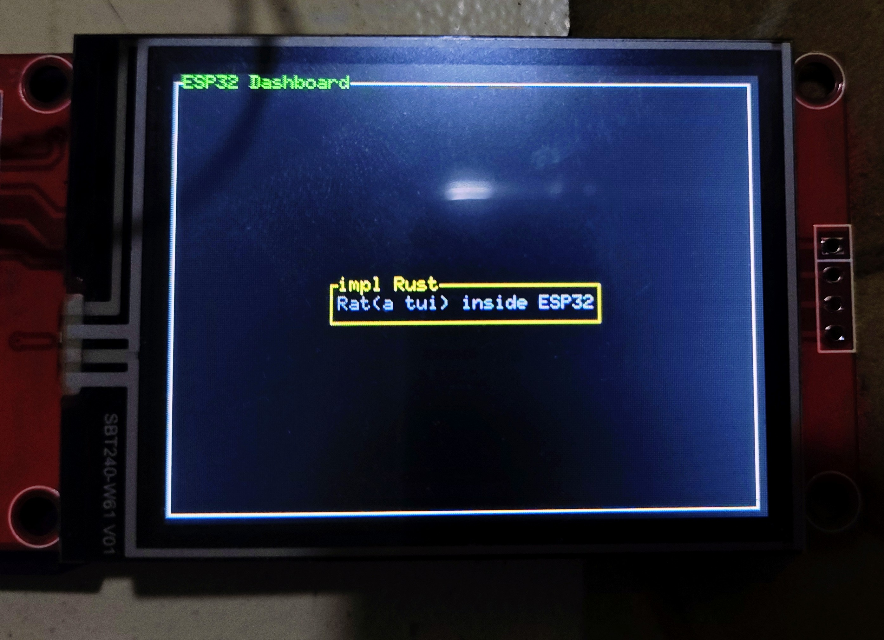

# Using `mipidsi` crate 

This tutorial shows how to use the newer `mipidsi` crate with the TFT and ESP32.

The `mipidsi` crate is a unified crate for multiple displays and also supports `ili9341`.

## Setup

The setup is same as the previous program except for a few changes to the `Cargo.toml`.

### `Cargo.toml` dependencies

```toml
embedded-hal-bus = "0.3.0"
embedded-graphics = "0.8.1"
mipidsi = "0.9.0"
static_cell = "2.1.1"
```

The `static_cell` crate is used to provide a safe way to allocate heap memory or for dynamic memory management.

This is essential because the SPI buffer needs to exist for the entire program duration but cannot be initialized until runtime when the peripherals are set up.


#### `mousefood` and `ratatui`

Add the following `mousefood` and `ratatui` versions to `Cargo.toml`

```toml
mousefood = { git = "https://github.com/j-g00da/mousefood", rev = "cc9f8fe372f09342537bc31a1355f77f2693d70b", default-features = false, features = [
  "fonts",
] }
ratatui = { version = "0.30.0-alpha.5", default-features = false }

```

## Imports

```rust
use static_cell::StaticCell;
use embedded_hal_bus::spi::ExclusiveDevice;
use esp_backtrace as _;

// ESP Stuff
use esp_hal::{
  delay::Delay,
  spi::{
    master::{
      Config as SpiConfig,
      Spi
    },
    Mode as SpiMode,
  },
  time::Rate,
  gpio::{
    Level,
    Output,
    OutputConfig
  },
  clock::CpuClock,
  main
};

// Embedded graphics stuff
use embedded_graphics::pixelcolor::Rgb565;
use embedded_graphics::prelude::*;

// TFT Screen stuff
use mipidsi::{Builder, models::ILI9342CRgb565, interface::SpiInterface, options::{Orientation, Rotation}};

// Mousefood stuff
use mousefood::{EmbeddedBackend, EmbeddedBackendConfig};
use ratatui::{layout::{Constraint, Flex, Layout}, widgets::{Block, Paragraph, Wrap}};
use ratatui::{style::*, Frame, Terminal};
```

There are a few configuration variables to be used here
This code is after the imports

```rust
extern crate alloc;
esp_bootloader_esp_idf::esp_app_desc!();

static SPI_BUFFER: StaticCell<[u8; 512]> = StaticCell::new();
```

## Initialize the TFT Display driver

```rust
let spi = Spi::new(
  peripherals.SPI2,
  SpiConfig::default()
    .with_frequency(Rate::from_mhz(60))
    .with_mode(SpiMode::_0)
)
  .unwrap()
  .with_sck(peripherals.GPIO18)
  .with_mosi(peripherals.GPIO23);

let cs = Output::new(peripherals.GPIO5, Level::Low, OutputConfig::default());
let dc = Output::new(peripherals.GPIO2, Level::Low, OutputConfig::default());
let reset = Output::new(peripherals.GPIO4, Level::Low, OutputConfig::default());

let buffer = SPI_BUFFER.init([0; 512]);

let spi_dev = ExclusiveDevice::new_no_delay(spi, cs).unwrap();
let interface = SpiInterface::new(spi_dev, dc, buffer);

let mut display = Builder::new(
  ILI9342CRgb565,
  interface
)
  .reset_pin(reset)
  .init(&mut Delay::new())
  .unwrap();

// CRITICAL: Set orientation BEFORE clearing and creating backend
display.set_orientation(
  Orientation::default().rotate(Rotation::Deg270)
).unwrap();

// Clear with the new orientation
display.clear(Rgb565::BLACK).unwrap();
```

> Here the `ILI9342CRgb565` driver is used instead of the `ili9341` driver due to compatibility issues.
> In case of display issues you can switch `ILI9342CRgb565` to `ILI9341Rgb565`

## Creating the Backend

To create the backend you use the  `mousefood` embedded backend

```rust
let backend = EmbeddedBackend::new(&mut display, EmbeddedBackendConfig::default());
```

Then , you create the `ratatui` terminal which uses this backend

```rust
let mut terminal = Terminal::new(backend).unwrap();
```

## Draw Function

This function draws the visual elements of the TUI.


```rust
fn draw(frame: &mut Frame) {
    let outer_block = Block::bordered()
        .title_style(Style::new().green())
        .title("ESP32 Dashboard");

    frame.render_widget(outer_block, frame.area());

    let vertical_layout = Layout::vertical([Constraint::Length(3)])
        .flex(Flex::Center)
        .split(frame.area());

    let horizontal_layout = Layout::horizontal([Constraint::Length(25)])
        .flex(Flex::Center)
        .split(vertical_layout[0]);

    let text = "Rat(a tui) inside ESP32";
    let paragraph = Paragraph::new(text.dark_gray())
        .wrap(Wrap { trim: true })
        .centered();

    let bordered_block = Block::bordered()
        .border_style(Style::new().yellow())
        .title("impl rust");

    frame.render_widget(paragraph.block(bordered_block), horizontal_layout[0]);

}
```

## Rendering

In the main function, after defining the `terminal`

```rust
loop {
  terminal.draw(draw).unwrap();
}
```


## The Full Code

```rust
#![no_std]
#![no_main]
#![deny(
    clippy::mem_forget,
    reason = "mem::forget is generally not safe to do with esp_hal types, especially those \
    holding buffers for the duration of a data transfer."
)]

use static_cell::StaticCell;
use embedded_hal_bus::spi::ExclusiveDevice;
use esp_backtrace as _;

// ESP Stuff
use esp_hal::{
    delay::Delay,
    spi::{
        master::{
            Config as SpiConfig,
            Spi
        },
        Mode as SpiMode,
    },
    time::Rate,
    gpio::{
        Level,
        Output,
        OutputConfig
    },
    clock::CpuClock,
    main
};

// Embedded graphics stuff
use embedded_graphics::pixelcolor::Rgb565;
use embedded_graphics::prelude::*;

// TFT Screen stuff
use mipidsi::{Builder, models::ILI9342CRgb565, interface::SpiInterface, options::{Orientation, Rotation}};

// Mousefood stuff
use mousefood::{EmbeddedBackend, EmbeddedBackendConfig};
use ratatui::{layout::{Constraint, Flex, Layout}, widgets::{Block, Paragraph, Wrap}};
use ratatui::{style::*, Frame, Terminal};

extern crate alloc;
esp_bootloader_esp_idf::esp_app_desc!();

static SPI_BUFFER: StaticCell<[u8; 512]> = StaticCell::new();

#[main]
fn main() -> ! {
    esp_println::logger::init_logger_from_env();

    let config = esp_hal::Config::default().with_cpu_clock(CpuClock::max());
    let peripherals = esp_hal::init(config);

    esp_alloc::heap_allocator!(#[unsafe(link_section = ".dram2_uninit")] size: 98767);

    let spi = Spi::new(
        peripherals.SPI2,
        SpiConfig::default()
            .with_frequency(Rate::from_mhz(60))
            .with_mode(SpiMode::_0)
    )
        .unwrap()
        .with_sck(peripherals.GPIO18)
        .with_mosi(peripherals.GPIO23);

    let cs = Output::new(peripherals.GPIO5, Level::Low, OutputConfig::default());
    let dc = Output::new(peripherals.GPIO2, Level::Low, OutputConfig::default());
    let reset = Output::new(peripherals.GPIO4, Level::Low, OutputConfig::default());

    let buffer = SPI_BUFFER.init([0; 512]);

    let spi_dev = ExclusiveDevice::new_no_delay(spi, cs).unwrap();
    let interface = SpiInterface::new(spi_dev, dc, buffer);

    let mut display = Builder::new(
        ILI9342CRgb565,
        interface
    )
        .reset_pin(reset)
        .init(&mut Delay::new())
        .unwrap();

    // CRITICAL: Set orientation BEFORE clearing and creating backend
    display.set_orientation(
        Orientation::default().rotate(Rotation::Deg270)
    ).unwrap();
    
    // Clear with the new orientation
    display.clear(Rgb565::BLACK).unwrap();

    // Now create the backend with the properly oriented display
    let backend = EmbeddedBackend::new(&mut display, EmbeddedBackendConfig::default());
    let mut terminal = Terminal::new(backend).unwrap();

    loop {
        terminal.draw(draw).unwrap();
    }
}

fn draw(frame: &mut Frame) {
    let outer_block = Block::bordered()
        .title_style(Style::new().green())
        .title("ESP32 Dashboard");

    frame.render_widget(outer_block, frame.area());

    let vertical_layout = Layout::vertical([Constraint::Length(3)])
        .flex(Flex::Center)
        .split(frame.area());

    let horizontal_layout = Layout::horizontal([Constraint::Length(25)])
        .flex(Flex::Center)
        .split(vertical_layout[0]);

    let text = "Rat(a tui) inside ESP32";
    let paragraph = Paragraph::new(text.dark_gray())
        .wrap(Wrap { trim: true })
        .centered();

    let bordered_block = Block::bordered()
        .border_style(Style::new().yellow())
        .title("impl rust");

    frame.render_widget(paragraph.block(bordered_block), horizontal_layout[0]);

}

```

## Clone the existing project

You can clone (or refer) project I created and navigate to the `hello-rat-2` folder.

```bash
git clone https://github.com/ImplFerris/esp32-projects
cd hello-rat-2/
```

## Flash the program

Run the following command from your project folder (Containing the `Cargo.toml`) to flash the program to the ESP32

```bash
cargo run --release
```



