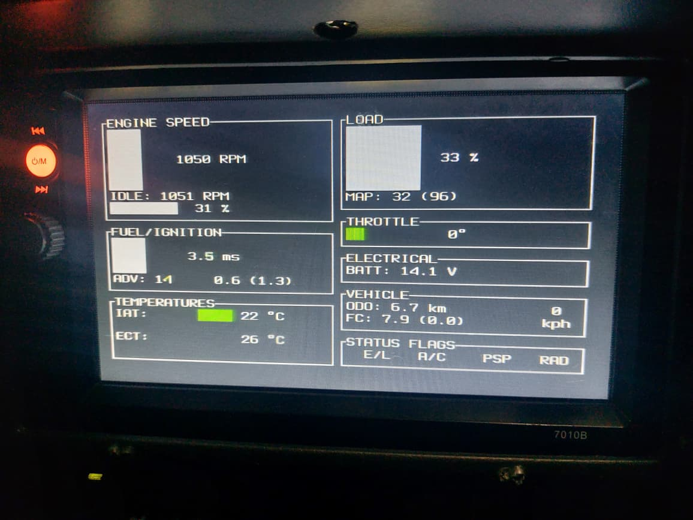

# Ratatui

You're probably familiar with Ratatui, the popular Rust library for building cool terminal user interfaces (TUIs). Many developers create impressive TUI applications using this crate. But you might wonder why we're discussing a TUI library in an embedded Rust book.

The answer is [Mousefood](https://github.com/j-g00da/mousefood).  It is an embedded-graphics backend that brings Ratatui to microcontrollers. This means you can run Ratatui anywhere you can use embedded-graphics (e.g. TFT Dispaly, e-paper and other displays).

## Why Use Ratatui in Embedded Systems?

Ratatui makes building embedded interfaces much easier and faster than writing from scratch. You get ready-made widgets like charts, tables, and progress bars without the complex drawing code.

## Learn Ratatui Basics  

If you're new to Ratatui, take a quick look at the official website at [https://ratatui.rs/](https://ratatui.rs/). It has clear documentation and beginner-friendly tutorials that walk you through creating simple TUI applications like a JSON editor.  Understanding Ratatui's core concepts will help you adapt them for embedded displays.

## Projects Using Ratatui in Embedded Systems

Here are some interesting projects that use Ratatui in embedded systems:

### [Tuitar](https://github.com/orhun/tuitar)

Tuitar is a guitar training tool created by Orhun Parmaksız that runs standalone on ESP32 hardware, offering real-time visualizations from audio input for tuning guitars and other instruments. 

Tuitar can track the notes you play on your guitar in real-time and display them on a virtual fretboard.

### [Car Display: Suzuki Serial Data Line (SDL) viewer in rust](https://github.com/thatdevsherry/suzui-rs)

### [A modern phone OS for ESP32 CYD](https://github.com/Julien-cpsn/Phone-OS)

