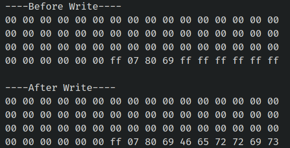

## Changing the Authentication Key

Let's change the authentication key (KeyA) for sector 1. By default, it is set to `FF FF FF FF FF FF`. We'll update it to `52 75 73 74 65 64` which is hex for "Rusted." To do this, we need to modify the trailer block (block 3) of sector 1 while leaving the rest of the sector untouched.

Before proceeding, it is a good idea to verify the current contents of this block. Run the [Dump Memory](./dump-memory.md) or [Read Data](./read-data.md) program to check.

<div class="alert-box alert-box-info">
    <span class="icon"><i class="fa fa-info"></i></span>
    <div class="alert-content">
        <b class="alert-title">Default Keys</b>
        <p>The MIFARE Classic 1K card is pre-configured with the default key FF FF FF FF FF FF for both KeyA and KeyB.  When reading the trailer block, KeyA values are returned as all zeros (00 00 00 00 00 00), while KeyB returned as it is.</p>
    </div>
</div>

We’ll also modify the KeyB contents to verify that the write was successful. We'll set KeyB to the hex bytes of "Ferris" (46 65 72 72 69 73).

Before writing, the access bytes and KeyB values in your block should mostly match what I have, but double-checking is always better than guessing.

Here's the plan:  
1. In the program, we hardcode the default key (`FF FF FF FF FF FF`) into a variable named `current_key`.  
2. Set the `new_key` to `Rusted` (in hex bytes). This is necessary to print the block content after writing; otherwise, we'll get an auth error.
3. The program will print the block's contents both before and after writing.

Once the key is updated, bring the tag nearby again. You will likely see an "Auth failed" error. If you're wondering why, congrats-you figured it out! The new key was successfully written, so the hardcoded `current_key` no longer works. To verify, modify the `read-data` program to use the new key (`Rusted`) and try again.

### Key and Data
The DATA array contains the new KeyA ("Rusted" in hex), access bits, and KeyB ("Ferris" in hex). The current_key is set to the default FF FF FF FF FF FF, and new_key is the first 6 bytes of DATA, which is "Rusted".
 
```rust
let target_sector = 1;
let rel_block = 3; //relative block within the sector (4th block within the sector 1)
const DATA: [u8; 16] = [
    0x52, 0x75, 0x73, 0x74, 0x65, 0x64, // Key A: "Rusted"
    0xFF, 0x07, 0x80, 0x69, // Access bits and trailer byte
    0x46, 0x65, 0x72, 0x72, 0x69, 0x73, // Key B: "Ferris"
];
let current_key = &[0xFF; 6];
let new_key: &[u8; 6] = &DATA[..6].try_into().unwrap(); // First 6 bytes of the block

```

### Write Block function
We have slighly modified the write_block function to accept key as argument. 

```rust
fn write_block<E, COMM: mfrc522::comm::Interface<Error = E>>(
    uid: &mfrc522::Uid,
    sector: u8,
    rel_block: u8,
    data: [u8; 16],
    rfid: &mut Mfrc522<COMM, mfrc522::Initialized>,
    auth_key: &[u8; 6], //additional argument for the auth key
) {
    let block_offset = sector * 4;
    let abs_block = block_offset + rel_block;

    rfid.mf_authenticate(uid, block_offset, auth_key)
        .map_err(|_| "Auth failed")
        .unwrap();

    rfid.mf_write(abs_block, data)
        .map_err(|_| "Write failed")
        .unwrap();
}
```

### Read Sector function
We have done similar modification for the read_sector function also.

```rust
fn read_sector<E, COMM: mfrc522::comm::Interface<Error = E>>(
    uid: &mfrc522::Uid,
    sector: u8,
    rfid: &mut Mfrc522<COMM, mfrc522::Initialized>,
    auth_key: &[u8; 6], //additional argument for the auth key
) {
    let block_offset = sector * 4;
    rfid.mf_authenticate(uid, block_offset, auth_key)
        .map_err(|_| "Auth failed")
        .unwrap();

    for abs_block in block_offset..block_offset + 4 {
        let data = rfid.mf_read(abs_block).map_err(|_| "Read failed").unwrap();
        print_hex_bytes(&data);
    }
}
```

### The main loop
There's nothing new in the main loop. All the read and write functions are ones you've already seen. We're just printing the sector content before and after changing the key.
 
```rust
loop {
    if let Ok(atqa) = rfid.reqa() {
        println!("Got atqa");
        Timer::after(Duration::from_millis(50)).await;
        if let Ok(uid) = rfid.select(&atqa) {
            println!("\r\n----Before Write----");
            read_sector(&uid, target_sector, &mut rfid, current_key);

            write_block(&uid, target_sector, rel_block, DATA, &mut rfid, current_key);

            println!("\r\n----After Write----");
            read_sector(&uid, target_sector, &mut rfid, new_key);
            rfid.hlta().unwrap();
            rfid.stop_crypto1().unwrap();
        }
    }
}
```


## Clone the existing project
You can also clone (or refer) project I created and navigate to the `rfid-change-key` folder.

```sh
git clone https://github.com/ImplFerris/esp32-projects
cd esp32-projects/rfid-change-key
```

## Output
As you can see in the output, when you run the program, it will display the contents of the target block before and after writing. After we change the key, bringing the tag back to the reader will result in an "auth failed" message because the current_key has been changed; The new key is 52 75 73 74 65 64 (Rusted).
 


You can also modify the read data program we used earlier with the new key to verify it.

**Note:** If you're wondering why Key A is not being shown, as we explained earlier, you cannot read the Key A value if you use it for authentication. Refer to the [Access Bits](./access-bits.md) chapter for more details.


## The Full code

```rust
#![no_std]
#![no_main]
#![deny(
    clippy::mem_forget,
    reason = "mem::forget is generally not safe to do with esp_hal types, especially those \
    holding buffers for the duration of a data transfer."
)]

use defmt::info;
use embassy_executor::Spawner;
use embassy_time::{Duration, Timer};
use esp_hal::clock::CpuClock;
use esp_hal::timer::timg::TimerGroup;
use esp_println as _;

// SPI
use esp_hal::gpio::{Level, Output, OutputConfig};
use esp_hal::spi;
use esp_hal::spi::master::Spi;
use esp_hal::time::Rate;

// RFID Reader
use embedded_hal_bus::spi::ExclusiveDevice;
use esp_hal::delay::Delay;
use mfrc522::Mfrc522;
use mfrc522::comm::blocking::spi::SpiInterface;

use esp_println::{self as _, print, println};

#[panic_handler]
fn panic(_: &core::panic::PanicInfo) -> ! {
    loop {}
}

// This creates a default app-descriptor required by the esp-idf bootloader.
// For more information see: <https://docs.espressif.com/projects/esp-idf/en/stable/esp32/api-reference/system/app_image_format.html#application-description>
esp_bootloader_esp_idf::esp_app_desc!();

#[esp_rtos::main]
async fn main(spawner: Spawner) -> ! {
    // generator version: 1.0.0

    let config = esp_hal::Config::default().with_cpu_clock(CpuClock::max());
    let peripherals = esp_hal::init(config);

    let timg0 = TimerGroup::new(peripherals.TIMG0);
    esp_rtos::start(timg0.timer0);

    info!("Embassy initialized!");

    let _ = spawner;

    let spi_bus = Spi::new(
        peripherals.SPI2,
        spi::master::Config::default()
            .with_frequency(Rate::from_mhz(5))
            .with_mode(spi::Mode::_0),
    )
    .unwrap()
    .with_sck(peripherals.GPIO18)
    .with_mosi(peripherals.GPIO23)
    .with_miso(peripherals.GPIO19)
    .into_async();

    let sd_cs = Output::new(peripherals.GPIO5, Level::High, OutputConfig::default());

    let delay = Delay::new();
    let spi_dev = ExclusiveDevice::new(spi_bus, sd_cs, delay).unwrap();

    let spi_interface = SpiInterface::new(spi_dev);
    let mut rfid = Mfrc522::new(spi_interface).init().unwrap();

    let target_sector = 1;
    let rel_block = 3; //relative block within the sector (4th block within the sector 1)
    const DATA: [u8; 16] = [
        0x52, 0x75, 0x73, 0x74, 0x65, 0x64, // Key A: "Rusted"
        0xFF, 0x07, 0x80, 0x69, // Access bits and trailer byte
        0x46, 0x65, 0x72, 0x72, 0x69, 0x73, // Key B: "Ferris"
    ];
    let current_key = &[0xFF; 6];
    // reset to 0xFF, if you want
    // const DATA: [u8; 16] = [
    //     0xFF, 0xFF, 0xFF, 0xFF, 0xFF, 0xFF, // Key A: "Rusted"
    //     0xFF, 0x07, 0x80, 0x69, // Access bits and trailer byte
    //     0xFF, 0xFF, 0xFF, 0xFF, 0xFF, 0xFF, // Key B: "Ferris"
    // ];
    // let current_key = &[0x52, 0x75, 0x73, 0x74, 0x65, 0x64];
    let new_key: &[u8; 6] = &DATA[..6].try_into().unwrap(); // First 6 bytes of the block

    loop {
        if let Ok(atqa) = rfid.reqa() {
            println!("Got atqa");
            Timer::after(Duration::from_millis(50)).await;
            if let Ok(uid) = rfid.select(&atqa) {
                println!("\r\n----Before Write----");
                read_sector(&uid, target_sector, &mut rfid, current_key);

                write_block(&uid, target_sector, rel_block, DATA, &mut rfid, current_key);

                println!("\r\n----After Write----");
                read_sector(&uid, target_sector, &mut rfid, new_key);
                rfid.hlta().unwrap();
                rfid.stop_crypto1().unwrap();
            }
        }
    }
}

fn write_block<E, COMM: mfrc522::comm::Interface<Error = E>>(
    uid: &mfrc522::Uid,
    sector: u8,
    rel_block: u8,
    data: [u8; 16],
    rfid: &mut Mfrc522<COMM, mfrc522::Initialized>,
    auth_key: &[u8; 6], //additional argument for the auth key
) {
    let block_offset = sector * 4;
    let abs_block = block_offset + rel_block;

    rfid.mf_authenticate(uid, block_offset, auth_key)
        .map_err(|_| "Auth failed")
        .unwrap();

    rfid.mf_write(abs_block, data)
        .map_err(|_| "Write failed")
        .unwrap();
}

fn read_sector<E, COMM: mfrc522::comm::Interface<Error = E>>(
    uid: &mfrc522::Uid,
    sector: u8,
    rfid: &mut Mfrc522<COMM, mfrc522::Initialized>,
    auth_key: &[u8; 6], //additional argument for the auth key
) {
    let block_offset = sector * 4;
    rfid.mf_authenticate(uid, block_offset, auth_key)
        .map_err(|_| "Auth failed")
        .unwrap();

    for abs_block in block_offset..block_offset + 4 {
        let data = rfid.mf_read(abs_block).map_err(|_| "Read failed").unwrap();
        print_hex_bytes(&data);
    }
}

fn print_hex_bytes(data: &[u8]) {
    for &b in data.iter() {
        print!("{:02x} ", b);
    }
    println!("");
}
```
