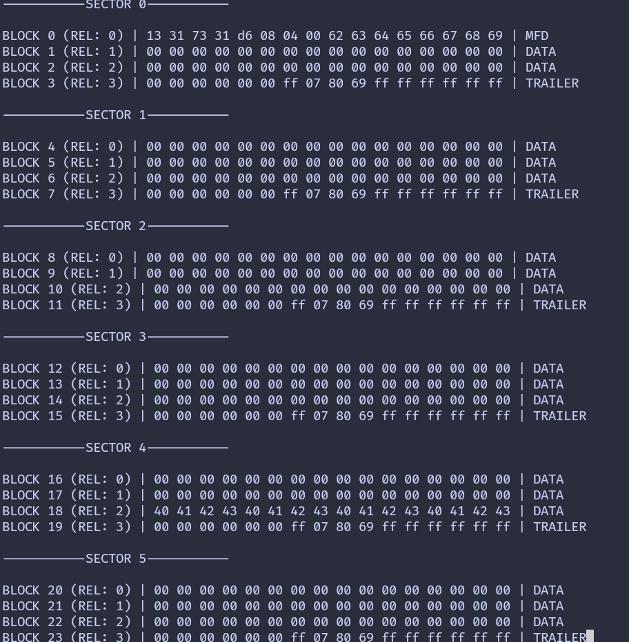

## Dump Entire Memory

You've learned how to read the data from each block of the first sector(sector 0) by authenticating into it. Now, we will loop through each sector. Re-Authentication is required every time we move to a new sector. For each sector, we will display the 16-byte data from every 4 blocks.

To make it clearer, we'll add some formatting and labels, indicating which sector and block we're referring to (both absolute and relative block numbers to the sector), as well as whether the block is a sector trailer or a data block.

> You can either work on the same project we created in the previous chapter or create a new project, follow the same steps, and then proceed with these instructions.

### Loop through the sector

We will create a separate function to loop through all 16 sectors (sectors 0 to 15), read all the blocks within each sector, and print their data.
 
```rust
fn dump_memory<E, COMM: mfrc522::comm::Interface<Error = E>>(
    uid: &mfrc522::Uid,
    rfid: &mut Mfrc522<COMM, mfrc522::Initialized>,
) {
    for sector in 0..16 {
        // Printing the Sector number
        println!("\n\n-----------SECTOR {}-----------", sector);
        read_sector(uid, sector, rfid);
    }
}
```

### Labels

The `read_sector` function follows the same logic as before, but with added formatting and labels. It now prints the absolute block number, the block number relative to the sector, and labels for the manufacturer data (MFD) block and sector trailer blocks.

```rust
fn read_sector<E, COMM: mfrc522::comm::Interface<Error = E>>(
    uid: &mfrc522::Uid,
    sector: u8,
    rfid: &mut Mfrc522<COMM, mfrc522::Initialized>,
) {
    const AUTH_KEY: [u8; 6] = [0xFF; 6];

    let block_offset = sector * 4;
    rfid.mf_authenticate(uid, block_offset, &AUTH_KEY)
        .map_err(|_| "Auth failed")
        .unwrap();

    for abs_block in block_offset..block_offset + 4 {
        let rel_block = abs_block - block_offset;
        let data = rfid.mf_read(abs_block).map_err(|_| "Read failed").unwrap();

        // Prining the Block absolute and relative numbers
        print!("\nBLOCK {} (REL: {}) | ", abs_block, rel_block);
        print_hex_bytes(&data);

        // Printing block type
        let block_type = get_block_type(sector, rel_block);
        print!("| {} ", block_type);
    }
}
```

We will create a small helper function to determine the block type based on the sector and its relative block number.
```rust
const fn get_block_type(sector: u8, rel_block: u8) -> &'static str {
    match rel_block {
        0 if sector == 0 => "MFD",
        3 => "TRAILER",
        _ => "DATA",
    }
}
```

### The main loop 
There isn't much change in the main loop. We just call the `dump_memory` function instead of `read_sector`.

```rust
loop {
    if let Ok(atqa) = rfid.reqa() {
        println!("Got atqa");
        Timer::after(Duration::from_millis(50)).await;
        if let Ok(uid) = rfid.select(&atqa) {
            dump_memory(&uid, &mut rfid);
            rfid.hlta().unwrap();
            rfid.stop_crypto1().unwrap();
        }
    }
}
```


## Clone the existing project
You can also clone (or refer) project I created and navigate to the `rfid-dump` folder.

```sh
git clone https://github.com/ImplFerris/esp32-projects
cd esp32-projects/rfid-dump
```


## Dump
When you run the program and bring your tag or key fob close, you should see output like this. If you notice the 0x40..0x43 bytes in the block 18 (the block 2 of the sector 4) and wonder why it's there; good catch! That's the custom data I wrote to the tag.



The image shows only the first 5 sectors. When you run the program, you should see data from all 16 sectors.

## Full code

```rust
#![no_std]
#![no_main]
#![deny(
    clippy::mem_forget,
    reason = "mem::forget is generally not safe to do with esp_hal types, especially those \
    holding buffers for the duration of a data transfer."
)]

use defmt::info;
use embassy_executor::Spawner;
use embassy_time::{Duration, Timer};
use esp_hal::clock::CpuClock;
use esp_hal::timer::timg::TimerGroup;
use esp_println as _;

// SPI
use esp_hal::gpio::{Level, Output, OutputConfig};
use esp_hal::spi;
use esp_hal::spi::master::Spi;
use esp_hal::time::Rate;

// RFID Reader
use embedded_hal_bus::spi::ExclusiveDevice;
use esp_hal::delay::Delay;
use mfrc522::Mfrc522;
use mfrc522::comm::blocking::spi::SpiInterface;

use esp_println::{self as _, print, println};

#[panic_handler]
fn panic(_: &core::panic::PanicInfo) -> ! {
    loop {}
}

// This creates a default app-descriptor required by the esp-idf bootloader.
// For more information see: <https://docs.espressif.com/projects/esp-idf/en/stable/esp32/api-reference/system/app_image_format.html#application-description>
esp_bootloader_esp_idf::esp_app_desc!();

#[esp_rtos::main]
async fn main(spawner: Spawner) -> ! {
    // generator version: 1.0.0

    let config = esp_hal::Config::default().with_cpu_clock(CpuClock::max());
    let peripherals = esp_hal::init(config);

    let timg0 = TimerGroup::new(peripherals.TIMG0);
    esp_rtos::start(timg0.timer0);

    info!("Embassy initialized!");

    // TODO: Spawn some tasks
    let _ = spawner;

    let spi_bus = Spi::new(
        peripherals.SPI2,
        spi::master::Config::default()
            .with_frequency(Rate::from_mhz(5))
            .with_mode(spi::Mode::_0),
    )
    .unwrap()
    .with_sck(peripherals.GPIO18)
    .with_mosi(peripherals.GPIO23)
    .with_miso(peripherals.GPIO19)
    .into_async();

    let sd_cs = Output::new(peripherals.GPIO5, Level::High, OutputConfig::default());

    let delay = Delay::new();
    let spi_dev = ExclusiveDevice::new(spi_bus, sd_cs, delay).unwrap();

    let spi_interface = SpiInterface::new(spi_dev);
    let mut rfid = Mfrc522::new(spi_interface).init().unwrap();

    loop {
        if let Ok(atqa) = rfid.reqa() {
            println!("Got atqa");
            Timer::after(Duration::from_millis(50)).await;
            if let Ok(uid) = rfid.select(&atqa) {
                dump_memory(&uid, &mut rfid);
                rfid.hlta().unwrap();
                rfid.stop_crypto1().unwrap();
            }
        }
    }
}

fn read_sector<E, COMM: mfrc522::comm::Interface<Error = E>>(
    uid: &mfrc522::Uid,
    sector: u8,
    rfid: &mut Mfrc522<COMM, mfrc522::Initialized>,
) {
    const AUTH_KEY: [u8; 6] = [0xFF; 6];

    let block_offset = sector * 4;
    rfid.mf_authenticate(uid, block_offset, &AUTH_KEY)
        .map_err(|_| "Auth failed")
        .unwrap();

    for abs_block in block_offset..block_offset + 4 {
        let rel_block = abs_block - block_offset;
        let data = rfid.mf_read(abs_block).map_err(|_| "Read failed").unwrap();

        // Prining the Block absolute and relative numbers
        print!("\nBLOCK {} (REL: {}) | ", abs_block, rel_block);
        print_hex_bytes(&data);

        // Printing block type
        let block_type = get_block_type(sector, rel_block);
        print!("| {} ", block_type);
    }
}

fn print_hex_bytes(data: &[u8]) {
    for &b in data.iter() {
        print!("{:02x} ", b);
    }
}

const fn get_block_type(sector: u8, rel_block: u8) -> &'static str {
    match rel_block {
        0 if sector == 0 => "MFD",
        3 => "TRAILER",
        _ => "DATA",
    }
}

fn dump_memory<E, COMM: mfrc522::comm::Interface<Error = E>>(
    uid: &mfrc522::Uid,
    rfid: &mut Mfrc522<COMM, mfrc522::Initialized>,
) {
    for sector in 0..16 {
        // Printing the Sector number
        println!("\n\n-----------SECTOR {}-----------", sector);

        read_sector(uid, sector, rfid);
    }
}
```
