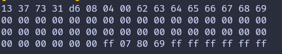

# Read the data

In this section, we'll read all the blocks from the first sector (sector 0). As we mentioned earlier, to read or write to a specific block on the RFID tag, we first need to authenticate with the corresponding sector.

## Authentication
Most tags come with a default key, typically 0xFF repeated six times. You may need to check the documentation to find the default key or try other common keys. For the RFID reader we are using, the default key is 0xFF repeated six times.

For authentication, we need:
- The tag's UID (obtained using the REQA and Select commands).
- The block number within the sector.
- The key (hardcoded in this case). 

## Read the block
Before reading data from a block, we must first authenticate to the block. If the read operation is successful, the function returns 16 bytes of data from the block. The first sector (sector 0) consists of 4 blocks, with absolute block numbers ranging from 0 to 3. For higher sectors, the absolute block numbers increase accordingly (e.g., for sector 1, the blocks are 4, 5, 6, 7).

```rust
fn read_sector<E, COMM: mfrc522::comm::Interface<Error = E>>(
    uid: &mfrc522::Uid,
    sector: u8,
    rfid: &mut Mfrc522<COMM, mfrc522::Initialized>,
) {
    const AUTH_KEY: [u8; 6] = [0xFF; 6];

    let block_offset = sector * 4;
    rfid.mf_authenticate(uid, block_offset, &AUTH_KEY)
        .map_err(|_| "Auth failed")
        .unwrap();

    for abs_block in block_offset..block_offset + 4 {
        let data = rfid.mf_read(abs_block).map_err(|_| "Read failed").unwrap();
        print_hex_bytes(&data);
    }
}
```
In this function, we hardcode the authentication key as a byte array with 0xFF values. Next, we calculate the block offset by multiplying the selected sector by 4. For example, if we select sector 2, multiplying by 4 gives a block offset of 8. We then pass the UID, block offset, and authentication key to authenticate access to the sector.

Once authentication is successful, we loop through the 4 blocks within the sector starting from the block offset. For each block, we read the data and print its content as a hex string.

 
## The main loop

In the main loop, after detecting an RFID tag (i.e., receiving the ATQA) and selecting the tag for further communication, we call the read_sector function. Here, we specify sector 0 for reading. Once the block data is read, we will send the HLTA and stop_crypto1 commands to put the card into the HALT state.

```rust
let sector_num = 0;
loop {
    if let Ok(atqa) = rfid.reqa() {
        println!("Got atqa");
        Timer::after(Duration::from_millis(50)).await;
        if let Ok(uid) = rfid.select(&atqa) {
            println!("Reading sector: {}", sector_num);
            read_sector(&uid, sector_num, &mut rfid);
            rfid.hlta().unwrap();
            rfid.stop_crypto1().unwrap();
        }
    }
}
```


## Clone the existing project
You can also clone (or refer) project I created and navigate to the `rfid-read` folder.

```sh
git clone https://github.com/ImplFerris/esp32-projects
cd esp32-projects/rfid-read
```

## Print first sector
Bring the RFID tag close to the reader, and the system console will display the data bytes read from the blocks of the first sector (sector 0).



Where it shows "13 73 73 31", it will display the UID of your RFID tag.


## Full Code

```rust
#![no_std]
#![no_main]

use embassy_executor::Spawner;
use embassy_time::{Duration, Timer};
use embedded_hal_bus::spi::ExclusiveDevice;
use esp_backtrace as _;
use esp_hal::{
    delay::Delay,
    gpio::{Level, Output},
    prelude::*,
    spi::{
        master::{Config, Spi},
        SpiMode,
    },
};
use esp_println::{print, println};
use log::info;
use mfrc522::{comm::blocking::spi::SpiInterface, Mfrc522};

#[main]
async fn main(_spawner: Spawner) {
    let peripherals = esp_hal::init({
        let mut config = esp_hal::Config::default();
        config.cpu_clock = CpuClock::max();
        config
    });

    esp_println::logger::init_logger_from_env();

    let timer0 = esp_hal::timer::timg::TimerGroup::new(peripherals.TIMG1);
    esp_hal_embassy::init(timer0.timer0);

    info!("Embassy initialized!");
    let delay = Delay::new();

    let spi = Spi::new_with_config(
        peripherals.SPI2,
        Config {
            frequency: 5.MHz(),
            mode: SpiMode::Mode0,
            ..Config::default()
        },
    )
    .with_sck(peripherals.GPIO18)
    .with_mosi(peripherals.GPIO23)
    .with_miso(peripherals.GPIO19);
    let sd_cs = Output::new(peripherals.GPIO5, Level::High);
    let spi = ExclusiveDevice::new(spi, sd_cs, delay).unwrap();

    let spi_interface = SpiInterface::new(spi);
    let mut rfid = Mfrc522::new(spi_interface).init().unwrap();

    let sector_num = 0;
    loop {
        if let Ok(atqa) = rfid.reqa() {
            println!("Got atqa");
            Timer::after(Duration::from_millis(50)).await;
            if let Ok(uid) = rfid.select(&atqa) {
                println!("Reading sector: {}", sector_num);
                read_sector(&uid, sector_num, &mut rfid);
                rfid.hlta().unwrap();
                rfid.stop_crypto1().unwrap();
            }
        }
    }
}

fn read_sector<E, COMM: mfrc522::comm::Interface<Error = E>>(
    uid: &mfrc522::Uid,
    sector: u8,
    rfid: &mut Mfrc522<COMM, mfrc522::Initialized>,
) {
    const AUTH_KEY: [u8; 6] = [0xFF; 6];

    let block_offset = sector * 4;
    rfid.mf_authenticate(uid, block_offset, &AUTH_KEY)
        .map_err(|_| "Auth failed")
        .unwrap();

    for abs_block in block_offset..block_offset + 4 {
        let data = rfid.mf_read(abs_block).map_err(|_| "Read failed").unwrap();
        print_hex_bytes(&data);
    }
}

fn print_hex_bytes(data: &[u8]) {
    for &b in data.iter() {
        print!("{:02x} ", b);
    }
    println!();
}
```


