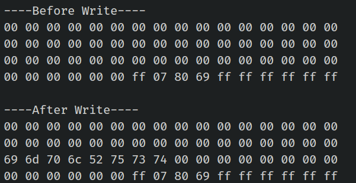

# Write Data

We will write data into block 2 of sector 4. First, we will print the data in the block before writing to it, and then again after writing. To perform the write operation, we will use the `mf_write` function from the mfrc522 crate.

<div class="alert-box alert-box-danger">
    <span class="icon"><i class="fa fa-flash"></i></span>
    <div class="alert-content">
        <b class="alert-title">Writing trailer block</b>
        <p>Accidentally writing to the wrong block and overwriting the trailer block may alter the authentication key or access bits, which could make the sector unusable.</p>
    </div>
</div>


## Create Project

Follow the same steps as before, add the dependencies and complete the base setup for the RFID component. This time, we will modify the code to write data.


## Write function

As usual, we hardcode the authentication key, calculate the block offset based on the sector, and then derive the absolute block number where we want to write the data. We authenticate the block and proceed to write the data.

```rust
fn write_block<E, COMM: mfrc522::comm::Interface<Error = E>>(
    uid: &mfrc522::Uid,
    sector: u8,
    rel_block: u8,
    data: [u8; 16],
    rfid: &mut Mfrc522<COMM, mfrc522::Initialized>,
) {
    const AUTH_KEY: [u8; 6] = [0xFF; 6];

    let block_offset = sector * 4;
    let abs_block = block_offset + rel_block;

    rfid.mf_authenticate(uid, block_offset, &AUTH_KEY)
        .map_err(|_| "Auth failed")
        .unwrap();

    rfid.mf_write(abs_block, data)
        .map_err(|_| "Write failed")
        .unwrap();
}
```

## The main loop
We will write to the 3rd block of the 4th sector (which corresponds to absolute block 18, calculated as 4x4 = 16 + 2 = 18). The data "implRust" will be written into this block. Since the block is 16 bytes, we need to pad the remaining unused bytes with null bytes (0x00).

Before and after updating the block content, we will print the contents in the loop.

```rust
let target_sector = 4;
let rel_block = 2; //relative block within the sector(3rd block within the sector)
const DATA: [u8; 16] = [
    b'i', b'm', b'p', b'l', b'R', b'u', b's', b't', // "implRust"
    0x00, 0x00, 0x00, 0x00, 0x00, 0x00, 0x00, 0x00, // Remaining bytes as 0x00
];

loop {
    if let Ok(atqa) = rfid.reqa() {
        println!("Got atqa");
        Timer::after(Duration::from_millis(50)).await;
        if let Ok(uid) = rfid.select(&atqa) {
            println!("\r\n----Before Write----");
            read_sector(&uid, target_sector, &mut rfid);

            write_block(&uid, target_sector, rel_block, DATA, &mut rfid);

            println!("\r\n----After Write----");
            read_sector(&uid, target_sector, &mut rfid);
            rfid.hlta().unwrap();
            rfid.stop_crypto1().unwrap();
        }
    }
}
```

## Clone the existing project
You can also clone (or refer) project I created and navigate to the `rfid-write` folder.

```sh
git clone https://github.com/ImplFerris/esp32-projects
cd esp32-projects/rfid-write
```

## Output
When you run the program, the output will display the hex representation of "implRust" visible in the third row.


## Full code

```rust
#![no_std]
#![no_main]
#![deny(
    clippy::mem_forget,
    reason = "mem::forget is generally not safe to do with esp_hal types, especially those \
    holding buffers for the duration of a data transfer."
)]

use defmt::info;
use embassy_executor::Spawner;
use embassy_time::{Duration, Timer};
use esp_hal::clock::CpuClock;
use esp_hal::timer::timg::TimerGroup;
use esp_println as _;

// SPI
use esp_hal::gpio::{Level, Output, OutputConfig};
use esp_hal::spi;
use esp_hal::spi::master::Spi;
use esp_hal::time::Rate;

// RFID Reader
use embedded_hal_bus::spi::ExclusiveDevice;
use esp_hal::delay::Delay;
use mfrc522::Mfrc522;
use mfrc522::comm::blocking::spi::SpiInterface;

use esp_println::{self as _, print, println};

#[panic_handler]
fn panic(_: &core::panic::PanicInfo) -> ! {
    loop {}
}

// This creates a default app-descriptor required by the esp-idf bootloader.
// For more information see: <https://docs.espressif.com/projects/esp-idf/en/stable/esp32/api-reference/system/app_image_format.html#application-description>
esp_bootloader_esp_idf::esp_app_desc!();

#[esp_rtos::main]
async fn main(spawner: Spawner) -> ! {
    // generator version: 1.0.0

    let config = esp_hal::Config::default().with_cpu_clock(CpuClock::max());
    let peripherals = esp_hal::init(config);

    let timg0 = TimerGroup::new(peripherals.TIMG0);
    esp_rtos::start(timg0.timer0);

    info!("Embassy initialized!");

    // TODO: Spawn some tasks
    let _ = spawner;

    let spi_bus = Spi::new(
        peripherals.SPI2,
        spi::master::Config::default()
            .with_frequency(Rate::from_mhz(5))
            .with_mode(spi::Mode::_0),
    )
    .unwrap()
    .with_sck(peripherals.GPIO18)
    .with_mosi(peripherals.GPIO23)
    .with_miso(peripherals.GPIO19)
    .into_async();

    let sd_cs = Output::new(peripherals.GPIO5, Level::High, OutputConfig::default());

    let delay = Delay::new();
    let spi_dev = ExclusiveDevice::new(spi_bus, sd_cs, delay).unwrap();

    let spi_interface = SpiInterface::new(spi_dev);
    let mut rfid = Mfrc522::new(spi_interface).init().unwrap();

    let target_sector = 4;
    let rel_block = 2; //relative block within the sector
    const DATA: [u8; 16] = [
        b'i', b'm', b'p', b'l', b'R', b'u', b's', b't', // "implRust"
        0x00, 0x00, 0x00, 0x00, 0x00, 0x00, 0x00, 0x00, // Remaining bytes as 0x00
    ];

    loop {
        if let Ok(atqa) = rfid.reqa() {
            println!("Got atqa");
            Timer::after(Duration::from_millis(50)).await;
            if let Ok(uid) = rfid.select(&atqa) {
                println!("\r\n----Before Write----");
                read_sector(&uid, target_sector, &mut rfid);

                write_block(&uid, target_sector, rel_block, DATA, &mut rfid);

                println!("\r\n----After Write----");
                read_sector(&uid, target_sector, &mut rfid);
                rfid.hlta().unwrap();
                rfid.stop_crypto1().unwrap();
            }
        }
    }
}

fn write_block<E, COMM: mfrc522::comm::Interface<Error = E>>(
    uid: &mfrc522::Uid,
    sector: u8,
    rel_block: u8,
    data: [u8; 16],
    rfid: &mut Mfrc522<COMM, mfrc522::Initialized>,
) {
    const AUTH_KEY: [u8; 6] = [0xFF; 6];

    let block_offset = sector * 4;
    let abs_block = block_offset + rel_block;

    rfid.mf_authenticate(uid, block_offset, &AUTH_KEY)
        .map_err(|_| "Auth failed")
        .unwrap();

    rfid.mf_write(abs_block, data)
        .map_err(|_| "Write failed")
        .unwrap();
}

fn read_sector<E, COMM: mfrc522::comm::Interface<Error = E>>(
    uid: &mfrc522::Uid,
    sector: u8,
    rfid: &mut Mfrc522<COMM, mfrc522::Initialized>,
) {
    const AUTH_KEY: [u8; 6] = [0xFF; 6];

    let block_offset = sector * 4;
    rfid.mf_authenticate(uid, block_offset, &AUTH_KEY)
        .map_err(|_| "Auth failed")
        .unwrap();

    for abs_block in block_offset..block_offset + 4 {
        let data = rfid.mf_read(abs_block).map_err(|_| "Read failed").unwrap();
        print_hex_bytes(&data);
    }
}

fn print_hex_bytes(data: &[u8]) {
    for &b in data.iter() {
        print!("{:02x} ", b);
    }
    println!("");
}
```
