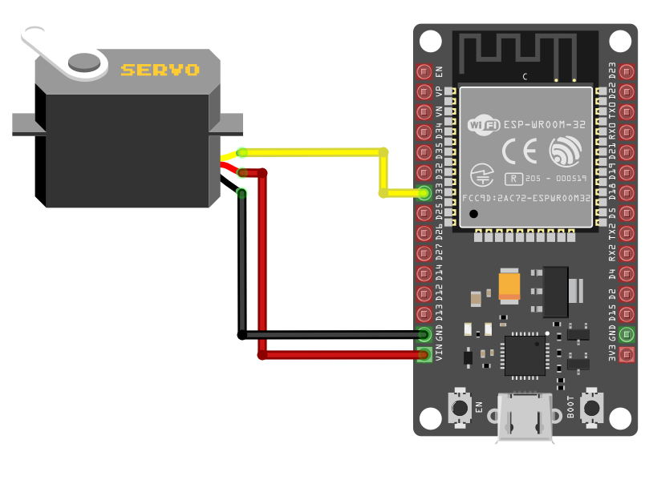

## Connection Overview
1. **Ground (GND)**: Connect the servo's GND pin (typically the **brown** wire, though it may vary) to any ground pin on the ESP32.
2. **Power (VCC)**: Connect the servo's VCC pin (usually the **red** wire) to the ESP32's 5V (Vin) power pin.
3. **Signal (PWM)**: Connect the servo's control (signal) pin to **GPIO 33** on the ESP32, configured for PWM. This is commonly the **orange** wire (may vary).

<table style="margin-bottom:20px">
  <thead>
    <tr>
      <th>ESP32 Pin</th>
      <th style="width: 250px; margin: 0 auto;">Wire</th>
      <th>Servo Motor</th>
      <th>Notes</th>
    </tr>
  </thead>
  <tbody>
    <tr>
      <td>VIN</td>
      <td style="text-align: center; vertical-align: middle; padding: 0;">
        

          

          

        

      </td>
      <td>Power (Red Wire)</td>
      <td>Supplies 5V power to the servo.</td>
    </tr>
    <tr>
      <td>GND</td>
      <td style="text-align: center; vertical-align: middle; padding: 0;">
        

          

          

        

      </td>
      <td>Ground (Brown Wire)</td>
      <td>Connects to ground.</td>
    </tr>
    <tr>
      <td>GPIO 33</td>
      <td style="text-align: center; vertical-align: middle; padding: 0;">
        

          

          

        

      </td>
      <td>Signal (Orange Wire)</td>
      <td>Receives PWM signal to control the servo's position.</td>
    </tr>
  </tbody>
</table>

