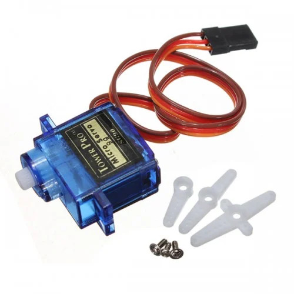

# Servo Motor

In this section, we'll connect an SG90 Micro Servo Motor to the ESP32 and control its rotation using PWM.  Before moving forward, make sure you've read the [PWM introduction](../core-concepts/pwm/index.md) section.

## Hardware Requirements
- **SG90 Micro Servo Motor**: It's an affordable servo motor designed for hobbyists. 
- **Jumper Wires**: Male-to-Male(or Female to Male depending on how you are connecting) jumper wires for connecting the ESP32 to the servo motor pins (Ground, Power, and Signal).

## Introduction to Servo Motors

Servo motors are widely used in robotics(example: arms of robots), RC vehicles, pan-tilt camera mounts, and other embedded systems. Among the most popular servo motors is the SG90, a small and lightweight servo commonly used in DIY and hobbyist projects.  The SG90 offers up to 180° of rotation.

## How does servo motors (SG90) work?

A servo motor usually has a DC motor, a control circuit, a gearbox, and a potentiometer. The DC motor is linked to the output shaft through the gearbox, which moves the servo's horn. We won't go into how the motor and gearbox work inside; that's beyond the scope of this book. If you're curious, you can research on it. All we are interested is how to rotate horn with our microcontroller.

To control the horn's position, we send a signal to the servo motor from the microcontroller (MCU) at a frequency of 50Hz, with a pulse every 20 milliseconds. By changing how long the signal stays high during each cycle (pulse width), we can control how far the horn rotates.  

For most servos (as per datasheets provided in various sources):

- 1ms pulse moves the horn to 0 degrees.
- 1.5ms pulse moves it to 90 degrees (neutral position).
- 2ms pulse moves it to 180 degrees.

### Fine-Tuning Your Servo
After banging my head for several days, I realized that not all servos follow the same pulse width patterns. Through my experiments, I found that my servo needed:

- approximately 0.5ms pulse for 0 degrees.
- approximately 1.5ms pulse for 90 degrees.
- approximately 2.5ms pulse for 180 degrees.

    <i class="fa fa-info"></i>
    

        <b class="alert-title">Pulse width and Servo's horn Position</b>
        
The servo motor holds its position until we change the pulse width. For example, if we keep sending a 1.5 ms pulse width, it will stay in the 90-degree position. When we change the pulse width to 2.0 ms, it will move to 180 degrees. However, we must allow enough time for it to reach its position.

        
Also, if you send the wrong pulse width (for example, 10 ms), it won't move at all.

    

I had to test and adjust the pulse durations to find the correct positions. If you're unsure about your servo's behavior, you can use tools like an oscilloscope to fine-tune the pulse widths or experiment with different values to find what works best.

The example in this book uses my servo's configuration. You may need to adjust the values depending on the specific servo you're working with.

