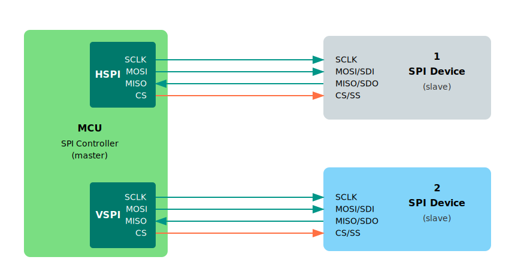

# ESP32 SPI Peripherals

The ESP32 includes four SPI controllers, but only two of them: SPI2 and SPI3 are available for general use. These are commonly known as HSPI and VSPI. The other two SPI controllers, SPI0 and SPI1, are reserved for internal usage.

The ESP32 offers flexible GPIO matrix, which allows SPI signals to be mapped to almost any GPIO pin. However, most ESP32 development boards use fixed default pins for convenience.




Here are the default SPI pin assignments for the ESP32 Devkit:

| SPI Channel | MOSI (SDI) | MISO (SDO) | SCLK    | CS      |
| ----------- | ---------- | ---------- | ------- | ------- |
| VSPI        | GPIO 23    | GPIO 19    | GPIO 18 | GPIO 5  |
| HSPI        | GPIO 13    | GPIO 12    | GPIO 14 | GPIO 15 |


## Using SPI in esp-hal

To use SPI in the esp-hal crate, we create and configure the SPI interface with the pins we want. Here is an example that uses the SPI2 bus. 

```rust
use esp_hal::spi::master::Config as SpiConfig;
use esp_hal::spi::master::Spi;
use esp_hal::spi::Mode as SpiMode;

// Initialize SPI
let spi_bus = Spi::new(
    peripherals.SPI2,
    SpiConfig::default()
        .with_frequency(Rate::from_mhz(60))
        .with_mode(SpiMode::_0),
)
.unwrap()
//CLK
.with_sck(peripherals.GPIO18)
//DIN
.with_mosi(peripherals.GPIO23);
let cs = Output::new(peripherals.GPIO15, Level::Low, OutputConfig::default());
```

## Example Driver Usage

Now that we have the SPI interface set up, let's use it to talk to an SD card using the embedded_sdmmc crate. We will use ExclusiveDevice from the embedded-hal-bus crate.

```rust
use embedded_hal_bus::spi::ExclusiveDevice;
use embedded_sdmmc::SdCard;
use esp_hal::delay::Delay;

//  Gets exclusive access to the SPI bus (not shared).
let spi_dev = ExclusiveDevice::new(spi_bus, cs, Delay).unwrap();

// Initialize the SD Card driver with SPI Device
let sdcard = SdCard::new(spi_dev, Delay);
```
