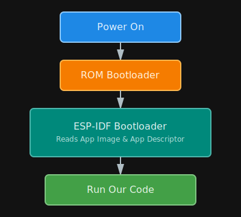

# Application Startup Flow

Before we get into the flashing part, there's one more line we need to add to our code. To understand why, let's look at what happens when our microcontroller powers up. On Espressif chips, our program isn't the first thing to run. Two bootloaders execute before our application even starts. 



The First Stage Bootloader is burned into the chip's ROM during manufacturing which you can't change. The Second Stage Bootloader is what actually loads your application and sets up the memory. The standard second stage bootloader used is the ESP-IDF Bootloader. 

By default, when you flash your program with `espflash`, it automatically includes a pre-compiled ESP-IDF bootloader built with default settings, so you don't need to build or configure it yourself.

## Application Descriptor

The ESP-IDF bootloader reads a section called the "Application Descriptor" during the boot process to validate your firmware. This Application Descriptor contains metadata about your application: version information, project name, compile time and date, ESP-IDF version, and a SHA256 hash of the application ELF file.

We don't need to create this descriptor ourselves. You can add the following crate:

```toml
esp-bootloader-esp-idf = { version = "0.4.0", features = ["esp32"] }
```

Then add this macro to your `main.rs` file:

```rust
esp_bootloader_esp_idf::esp_app_desc!();
```

This macro automatically generates the application descriptor structure that the ESP-IDF bootloader expects to find in every firmware image.
