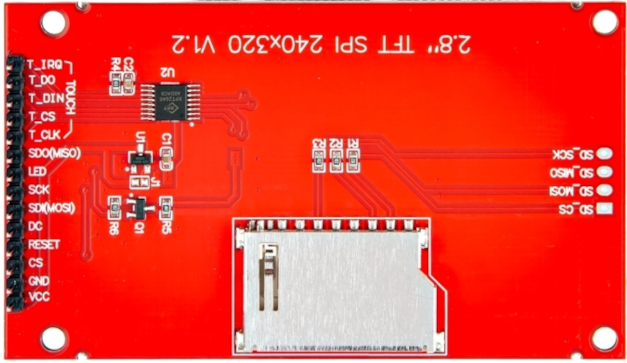

# Connect ESP32 with TFT Display

In this section, we will look at the pinout of the TFT display module and see how to connect it to the ESP32. If you notice carefully, it is very similar to the e-ink display module. That's because both displays use SPI (Serial Peripheral Interface) for communication, and they share common control lines like CS, DC, RESET, MOSI, and SCK. This means that once you understand how to wire and drive one SPI-based display, switching to another becomes much easier.

## TFT Display Pinout

- **VCC**: Power supply (3.3V or 5V). This is the main power supply for the entire display module. It powers the display controller (e.g., ILI9341) and other parts.
- **GND**: Ground  
- **CS**: Chip Select. This tells the display when it should listen to SPI commands. Keep it low (active) when sending data.
- **RESET**: Resets the display. Useful during startup to make sure the display starts in a known state.
- **DC**: Data/Command control pin. Set high to send data, low to send commands. Used to switch between writing commands and pixel data.
- **SDI (MOSI)**: Master Out Slave In. This is the SPI data line from the microcontroller to the display. Used to send pixel data and commands.
- **SCK**: Serial Clock. SPI clock signal from the microcontroller. It synchronizes the data being sent.
- **LED**: This pin is specifically for the backlight (LED panel) of the display. It controls how bright the screen appears. If you want the backlight always on, just connect this to 3.3V. If you want to control brightness (e.g., dim or turn off), you can connect it to a PWM-capable GPIO pin from your microcontroller.
- **SDO (MISO)**: Master In Slave Out. SPI read line from the display to the microcontroller. Not always used, but some displays support reading display memory or status.

### Touch Controller Pinout

If your TFT display includes a resistive touchscreen, it likely uses a touch controller chip like the **XPT2046**. These touch pins are separate from the display pins and are also connected over SPI. You only need to connect these pins if you want to use the touch functionality.

- **T_CLK**: Touch screen SPI bus clock pin
- **T_CS**: Touch screen chip select control pin
- **T_DIN**: Touch screen SPI write data pin (MOSI)
- **T_DO**: Touch screen SPI read data pin (MISO)
- **T_IRQ**: Touch screen interrupt detection pin

If you do not need touch input or your module does not have a touch panel, you can leave these pins unconnected.

## Connecting TFT display with ESP32

 

<table style="margin-bottom:20px">
  <thead>
    <tr>
      <th>TFT Display Pin</th>
      <th style="width: 250px; margin: 0 auto;">Wire</th>
      <th>ESP32 Pin</th>
    </tr>
  </thead>
  <tbody>
    <tr>
      <td>VCC</td>
      <td style="text-align: center; vertical-align: middle; padding: 0;">
        

          

          

        

      </td>
      <td>Vin</td>
    </tr>
    <tr>
      <td>GND</td>
      <td style="text-align: center; vertical-align: middle; padding: 0;">
        

          

          

        

      </td>
      <td>GND</td>
    </tr>
    <tr>
      <td>CS</td>
      <td style="text-align: center; vertical-align: middle; padding: 0;">
        

          

          

        

      </td>
      <td>GPIO15</td>
    </tr>
    <tr>
      <td>RESET</td>
      <td style="text-align: center; vertical-align: middle; padding: 0;">
        

          

          

        

      </td>
      <td>GPIO4</td>
    </tr>
    <tr>
      <td>DC</td>
      <td style="text-align: center; vertical-align: middle; padding: 0;">
        

          

          

        

      </td>
      <td>GPIO2</td>
    </tr>
    <tr>
      <td>SDI (MOSI)</td>
      <td style="text-align: center; vertical-align: middle; padding: 0;">
        

          

          

        

      </td>
      <td>GPIO23</td>
    </tr>
    <tr>
      <td>SCK (CLK)</td>
      <td style="text-align: center; vertical-align: middle; padding: 0;">
        

          

          

        

      </td>
      <td>GPIO18</td>
    </tr>
    <tr>
      <td>LED</td>
      <td style="text-align: center; vertical-align: middle; padding: 0;">
        

          

          

        

      </td>
      <td>3.3V (or PWM pin for brightness control)</td>
    </tr>
  </tbody>
</table>
