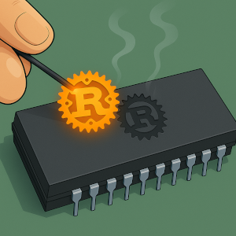

# Draw image on TFT Display using ESP32 and Rust

Let's draw an image on the TFT Display. We can achieve this using the embedded-graphics crate, and optionally, the tinybmp crate.

We've already explored the tinybmp crate in the OLED module section. It allows us to load a BMP file and display it on the screen. Alternatively, you can use a raw byte array of the image to achieve the same result.

The crate requires the image to be in BMP format. If your image is in another format, you will need to convert it to BMP.

I'm using a nice image I found online, though I'm not sure who the original creator is to give proper credit. You can download the image from [here](./images/embedded-rust.bmp). Feel free to use a different image, but make sure to convert it to BMP format.




## Generate project using esp-generate
To create the project, use the `esp-generate` command. Run the following:

```sh
esp-generate --chip esp32 tft-display-image
```

This will open a screen asking you to select options. 

- First, select the option "Enable unstable HAL features."

Just save it by pressing "s" in the keyboard.

## Update cargo.toml

```toml
embedded-hal-bus = { version = "0.1" }
display-interface-spi = "0.5"
ili9341 = "0.6.0"
embedded-graphics = "0.8.1"

tinybmp = "0.6.0"
```

We've already covered the details of the other crates, as well as the basic setup for the SPI and display module code.  So, we won't go over those details again. Instead, let's jump straight into displaying an image after clearing the screen.

## Black background

Instead of using a white background, we'll fill the background with black for this project. 

```rust
display.clear(Rgb565::BLACK).unwrap();
```

## Display the image

Place the embedded-rust.bmp file inside the project root folder. The code is pretty straightforward: load the image as bytes and pass it to the from_slice function of the Bmp. Then, you can use it with the Image.

```rust
let bmp_data = include_bytes!("../../embedded-rust.bmp");
let bmp = Bmp::from_slice(bmp_data).unwrap();

let image = Image::new(&bmp, Point::new(10, 0));
image.draw(&mut display).unwrap();

```

## Clone the existing project
You can clone (or refer) project I created and navigate to the `tft-display-image` folder.

```sh
git clone https://github.com/ImplFerris/esp32-projects
cd esp32-projects/tft-display-image/
```

## The full code

```rust
#![no_std]
#![no_main]

// Usual imports
use esp_hal::clock::CpuClock;
use esp_hal::main;
use esp_hal::time::{Duration, Instant};
use esp_println as _;

// Embedded Grpahics related
use embedded_graphics::image::Image;
use embedded_graphics::pixelcolor::Rgb565;
use embedded_graphics::prelude::*;

// For loading bmp image
use tinybmp::Bmp;

// ESP32 SPI + Display Driver bridge
use display_interface_spi::SPIInterface;
use embedded_hal_bus::spi::ExclusiveDevice;
use esp_hal::delay::Delay;
use esp_hal::spi::master::Config as SpiConfig;
use esp_hal::spi::master::Spi;
use esp_hal::spi::Mode as SpiMode;
use esp_hal::time::Rate; // For specifying SPI frequency
use ili9341::{DisplaySize240x320, Ili9341, Orientation};

// For managing GPIO state
use esp_hal::gpio::{Level, Output, OutputConfig};

#[panic_handler]
fn panic(_: &core::panic::PanicInfo) -> ! {
    loop {}
}

#[main]
fn main() -> ! {
    let config = esp_hal::Config::default().with_cpu_clock(CpuClock::max());
    let peripherals = esp_hal::init(config);

    // Initialize SPI
    let spi = Spi::new(
        peripherals.SPI2,
        SpiConfig::default()
            .with_frequency(Rate::from_mhz(60))
            .with_mode(SpiMode::_0),
    )
    .unwrap()
    //CLK
    .with_sck(peripherals.GPIO18)
    //DIN
    .with_mosi(peripherals.GPIO23);
    let cs = Output::new(peripherals.GPIO15, Level::Low, OutputConfig::default());
    let dc = Output::new(peripherals.GPIO2, Level::Low, OutputConfig::default());
    let reset = Output::new(peripherals.GPIO4, Level::Low, OutputConfig::default());

    let spi_dev = ExclusiveDevice::new_no_delay(spi, cs);
    let interface = SPIInterface::new(spi_dev, dc);

    let mut display = Ili9341::new(
        interface,
        reset,
        &mut Delay::new(),
        Orientation::Landscape,
        DisplaySize240x320,
    )
    .unwrap();
    display.clear(Rgb565::BLACK).unwrap();

    let bmp_data = include_bytes!("../../embedded-rust.bmp");
    let bmp = Bmp::from_slice(bmp_data).unwrap();

    let image = Image::new(&bmp, Point::new(10, 0));
    image.draw(&mut display).unwrap();

    loop {
        let delay_start = Instant::now();
        while delay_start.elapsed() < Duration::from_millis(5000) {}
    }
}
```
