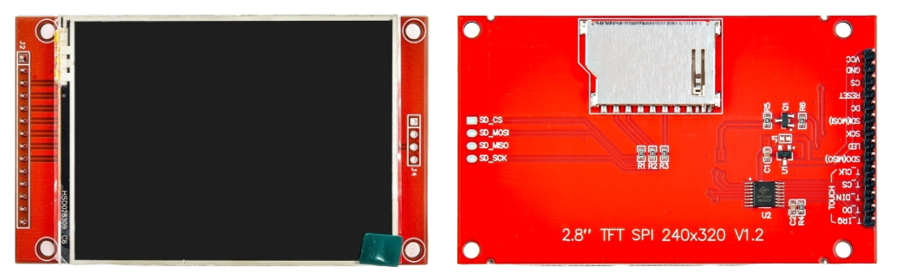

# TFT Display

In this chapter, we will learn how to work with a TFT Display. TFT stands for Thin-Film Transistor, which is a type of LCD (Liquid Crystal Display) that gives us vibrant colors, clear images, and fast refresh rates. Compared to simple text-based displays like 16x2 LCDs or monochrome OLEDs, TFT displays allow us to show full-color graphics, shapes, images, and even touch-based user interfaces.

## What Is a TFT Display?

A TFT display is made up of thousands of tiny pixels arranged in a grid. Each pixel can show different colors, allowing us to draw anything we want on the screen. The display includes a controller chip to understand the data coming from our microcontroller and to refresh the screen accordingly.

TFT displays are very common in mobile phones, smartwatches, and handheld gadgets. In embedded systems, they are used to build dashboards, games, control panels, and more.

## Varieties of TFT Displays

TFT modules come in different sizes, resolutions, and communication types. Here are a few common differences:

- Size: Ranges from 1.3 inches to 7 inches or more.

- Resolution: From 128×160 to 800×480 and beyond.

- Interface Type:   TFT displays offer different ways to connect to a microcontroller. The SPI interface is simple and uses fewer pins, but it is slower. The parallel interface is faster but needs more pins. Bigger displays often use an RGB (TTL) interface, which is very fast but needs a special controller to work.

## Our Display: 2.8-Inch SPI Touchscreen

In this project, we will use a 2.8-inch TFT display module with a resolution of 240×320 pixels. It uses the SPI interface, which allows us to connect it to a microcontroller using just a few pins.

This module also includes a resistive touchscreen, which lets us detect touches by measuring pressure on the screen. We will focus first on drawing to the display.

## Display Driver (Controller Chip)

Every TFT display has a controller chip that takes care of drawing pixels on the screen.  In our case, the display uses the ILI9341 chip. We send commands to this chip, and it handles tasks like updating the screen, drawing shapes, filling colors, and more.

The ILI9341 controller is most commonly used in 2.4" and 2.8" TFT displays, and sometimes in 3.2" displays. If your screen uses the same ILI9341 chip, it will work with the same code and examples in this tutorial. 

You can also use displays with other driver chips (like ST7735, ILI9225, ILI9486), but those will need different Rust crates or setup instructions.  So, it's important to check the controller chip used in your display before buying, to make sure it's compatible with the tutorial.

## Touch Controller

Some TFT displays (like the one we're using here) also come with a resistive touchscreen on top of the screen. In these displays, touch functionality is handled by a separate chip called XPT2046.

This chip reads the X and Y position when you touch the screen and sends that data over SPI. It works independently from the display driver (ILI9341).

## Datasheet

- [Datasheet for the ILI9341](https://cdn-shop.adafruit.com/datasheets/ILI9341.pdf).
- [Datasheet for the XPT2046](https://grobotronics.com/images/datasheets/xpt2046-datasheet.pdf)
