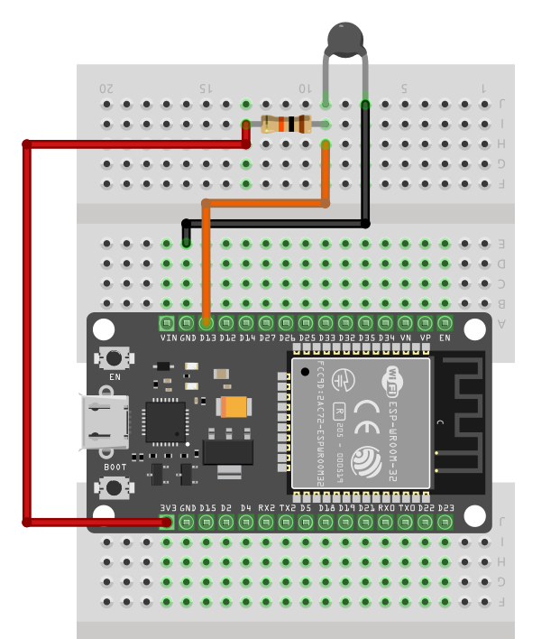

# Circuit - Connecting ESP32 with Thermistor

1. One side of the Thermistor is connected to `GND`.
2. The other side of the Thermistor is connected to `GPIO13` which is ADC2 pin of ESP32
3. A 10kΩ resistor is connected in series with the Thermistor to create a voltage divider between the Thermistor and `3.3v`. So connect one side of the resistor to the `3.3V` and other one to `GPIO13`

