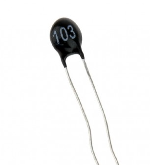

# Thermistor

In this section, we'll be using a thermistor with the ESP32.  A thermistor is a variable resistor that changes its resistance based on the temperature. The amount of change in resistance depends on its composition.  The term comes from combining "thermal" and "resistor.". 

Thermistors are used to measure temperature or protect circuits in many places. They help measure oil and coolant temperatures in vehicles, and they are also used in medical equipment. In home automation, thermistors are found in smart thermostats to control heating and cooling, keeping the temperature just right.  We will use the thermistor to measure the room temperature and display the result.

Thermistors are categorized into two types:
- NTC (Negative Temperature Coefficient): 
    - Resistance decreases as temperature increases. 
    - They are primarily used for temperature sensing and inrush current limiting.
    - We'll be using the NTC thermistor to measure temperature in our exercise.

- PTC (Positive Temperature Coefficient): 
    - Resistance increases as temperature rises.
    - They primarily protect against overcurrent and overtemperature conditions as resettable fuses and are commonly used in air conditioners, medical devices, battery chargers, and welding equipment.

## Hardware Requirements

- NTC 103 Thermistor: 10K OHM, 5mm epoxy coated disc
- 10kΩ Resistor: Used with the thermistor to form a voltage divider 

## How does it work?

We will create a voltage divider using the NTC thermistor and a known resistor (10kΩ). As the temperature increases, the thermistor's resistance decreases. We will then calculate the temperature from this resistance. In the next chapter, we will show you a simulation of the thermistor in the voltage divider and the voltage it produces.

However, you cannot measure the thermistor's resistance directly when it's connected to the microcontroller. Instead, you will get the voltage output from the voltage divider, which is sent to the ADC pin of the microcontroller. This voltage is read as an ADC value (see the [ADC chapter](../core-concepts/adc/index.md) for more details). We will then use formulas to calculate the resistance from the ADC value.

## Reference
- [Thermistor Basics](https://www.teamwavelength.com/thermistor-basics/)
- [Thermistors](https://www.electronics-tutorials.ws/io/thermistors.html)
