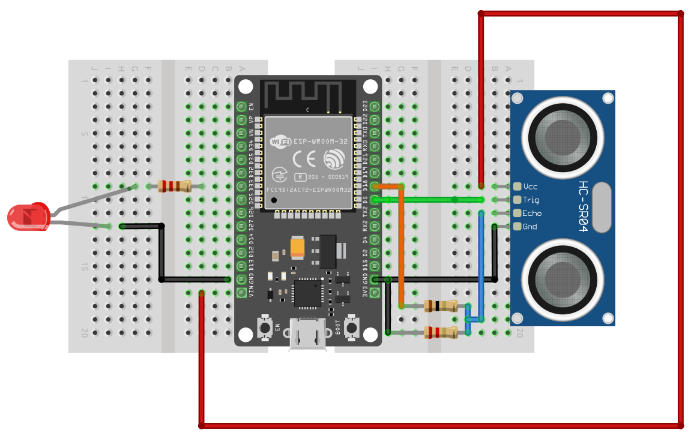

## Connecting HC-SR04 ultrasonic sensor with ESP32

### Why We Need a Voltage Divider?

You can skip this, if you have HC-SR04+ which accepts 3.3V power supply also.

Before diving into the connection, You should familiarize yourself with the concept of a voltage divider; You can refer to [this chapter](../core-concepts/voltage-divider.md). As we mentioned earlier, we need to power the module using a 5V power supply, which can be supplied through the Vin pin of the ESP32. The module sends back the signal through the Echo pin. However, the ESP32 is only around 3.6V tolerant on its GPIO pins, so we need to reduce the voltage using a voltage divider between the Echo pin and the ESP32's GPIO pin.

To make this work, you'll need two resistors with different values, ensuring the output voltage is approximately 3.3V. For example, you can use a 1kΩ resistor as R1 and a 2kΩ resistor as R2, which will bring the voltage down to around 3.3V.

If you want to experiment with different resistor values, you can use the [Falstd website](https://www.falstad.com/circuit/) with this [voltage-divider circuit text file](./voltage-divider-hc-sr04.txt). It allows you to modify the values of R1 and R2 to see what voltage each combination will output. This way, you can create the voltage divider with the resistors you have on hand.

## Circuit for HC-SR04

<table>
  <thead>
    <tr>
      <th>ESP32 Pin</th>
      <th style="height: 4px; width: 250px; margin: 0 auto;">Wire</th>
      <th>HC-SR04 Pin</th>
    </tr>
  </thead>
  <tbody>
    <tr>
      <td>5V</td>
      <td style="text-align: center; vertical-align: middle; padding: 0;">
        

          

          

        

      </td>
      <td>VCC</td>
    </tr>
    <tr>
      <td>GPIO 5</td>
      <td style="text-align: center; vertical-align: middle; padding: 0;">
        

          

          

        

      </td>
      <td>Trig</td>
    </tr>
    <tr>
      <td>GPIO 18</td>
      <td style="text-align: center; vertical-align: middle; padding: 0;">
        

          

          

        

      </td>
      <td>Echo (via voltage divider)</td>
    </tr>
    <tr>
      <td>GND</td>
      <td style="text-align: center; vertical-align: middle; padding: 0;">
        

          

          

        

      </td>
      <td>GND</td>
    </tr>
  </tbody>
</table>

- **VCC**: Connect the VCC pin on the HC-SR04 to the Vin pin on the ESP32. If you are using HC-SR04+, use 3.3V pin on the ESP32.
- **Trig**: Connect to GPIO 5 on the ESP32.
- **Echo**: Connect the Echo pin on the HC-SR04 to GPIO 18 through a voltage divider (1kΩ resistor between Echo and GPIO 18, and 2kΩ resistor between GPIO 18 and GND; means the GPIO 18 basically goes in the middle).  I believe this will be easier to understand with the circuit diagram. 
- **GND**: Connect the GND pin on the HC-SR04 to the GND pin on the ESP32.

## Circuit for LED

You have to connect the anode (long leg) of the LED to GPIO 33, as in the [External LED setup](../led/external-led.md); through the resistor (eg: 330 Ohm resistor) to avoid damaging the LED. And the cathode of the LED(short leg) to Ground. 

<table>
  <thead>
    <tr>
      <th>ESP32 Pin</th>
      <th style="width: 250px; margin: 0 auto;">Wire</th>
      <th>Component</th>
    </tr>
  </thead>
  <tbody>
    <tr>
      <td>GPIO 33</td>
      <td style="text-align: center; vertical-align: middle; padding: 0;">
        

          

          

        

      </td>
      <td>Resistor</td>
    </tr>
    <tr>
      <td>Resistor</td>
      <td style="text-align: center; vertical-align: middle; padding: 0;">
        

          

          

        

      </td>
      <td>Anode (long leg) of LED</td>
    </tr>
    <tr>
      <td>GND</td>
      <td style="text-align: center; vertical-align: middle; padding: 0;">
        

          

          

        

      </td>
      <td>Cathode (short leg) of LED</td>
    </tr>
  </tbody>
</table>

## Circuit Diagram

I have provided circuit diagrams both with and without a breadboard. To be honest, the breadboard version was a bit confusing when I drew it. If you still find it unclear, please create an issue in the GitHub repository and describe the confusing parts. I'll do my best to improve it. 

**Diagram without breadboard**:

**Diagram with breadboard**:

